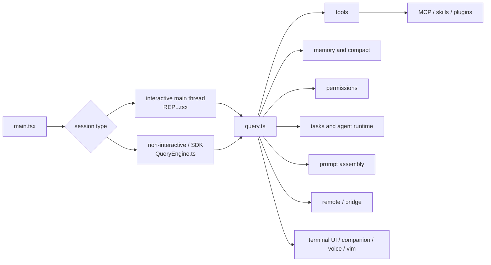

[简体中文](./ARCHITECTURE.md) | [English](./ARCHITECTURE.en.md)

# Claude Code Architecture Overview

This page gives a source-backed map before you dive into module details.

You can read it as three things:

- one main execution chain
- several systems attached around that chain
- a set of conditional branches that can change behavior

## The Main Chain The Current Source Supports

In the current public mirror, the most stable entry paths are:

- interactive main thread:
  - `main.tsx -> REPL.tsx -> query.ts`
- non-interactive / SDK path:
  - `main.tsx -> QueryEngine.ts -> query.ts`

Both paths connect to the same core subsystems:

- tools
- permissions
- memory
- compaction
- tasks
- MCP
- prompt assembly

## Key Entry Files

The source paths you can open directly in this repository live under:

- `_upstream/claude-code-sourcemap/restored-src/src/main.tsx`
- `_upstream/claude-code-sourcemap/restored-src/src/screens/REPL.tsx`
- `_upstream/claude-code-sourcemap/restored-src/src/QueryEngine.ts`
- `_upstream/claude-code-sourcemap/restored-src/src/query.ts`
- `_upstream/claude-code-sourcemap/restored-src/src/Tool.ts`
- `_upstream/claude-code-sourcemap/restored-src/src/tools.ts`

## One Diagram For The Whole Chain

## What Each Layer Handles

### Startup And Wiring

`main.tsx` prepares session startup, including settings, models, MCP, skills, plugins, and the permission context.

### Interactive Main Thread

`REPL.tsx` is responsible for:

- building the live tool pool
- fetching user and system context
- assembling the interactive system prompt
- entering `query()`

### Non-Interactive / SDK Path

`QueryEngine.ts` is responsible for:

- fetching prompt parts
- processing input
- recording transcript state
- assembling the non-interactive system prompt
- entering `query()`

### Query Loop

`query.ts` controls how a turn continues, including:

- tool execution
- context shaping
- compaction
- attachment injection
- stop and continuation conditions

### Tool Contract And Tool Pool

`Tool.ts` defines the shared tool contract, and `tools.ts` defines how built-in tools, MCP tools, and the final tool pool are assembled.

## Boundary Notes For This Page

- the interactive main thread and the non-interactive path are not the same entry
- the tool pool changes with deny rules, feature gates, and runtime state
- prompt assembly has conditional branches and should not be written as a single fixed pipeline
- `SYSTEM_PROMPT_DYNAMIC_BOUNDARY` is a conditional boundary marker
- `remote/`, `bridge/`, and `connectRemoteControl()` still require conservative wording

## Where To Go Next

- for module-by-module reading:
  - [MODULES/README.en.md](./MODULES/README.en.md)
- for prompt assembly details:
  - [PROMPTS/README.en.md](./PROMPTS/README.en.md)
- for gate-focused reading:
  - [FEATURE-FLAGS/README.en.md](./FEATURE-FLAGS/README.en.md)
