[简体中文](./ARCHITECTURE.md) | [English](./ARCHITECTURE.en.md)

# Claude Code 全局架构总览

这一页先给出一张可追源码的总图。

你可以先把它理解成三件事：

- 一条主执行链
- 一组围绕主链运行的系统
- 一批会改写路径的条件分支

## 源码当前能确认的主链

在当前公开镜像里，最稳定的入口链有两条：

- 交互式主线程：
  - `main.tsx -> REPL.tsx -> query.ts`
- 非交互 / SDK 路径：
  - `main.tsx -> QueryEngine.ts -> query.ts`

这两条路径都会接到同一组核心系统：

- tools
- permissions
- memory
- compact
- tasks
- MCP
- prompt assembly

## 关键入口文件

当前仓库里可直接复核的源码路径位于：

- `_upstream/claude-code-sourcemap/restored-src/src/main.tsx`
- `_upstream/claude-code-sourcemap/restored-src/src/screens/REPL.tsx`
- `_upstream/claude-code-sourcemap/restored-src/src/QueryEngine.ts`
- `_upstream/claude-code-sourcemap/restored-src/src/query.ts`
- `_upstream/claude-code-sourcemap/restored-src/src/Tool.ts`
- `_upstream/claude-code-sourcemap/restored-src/src/tools.ts`

## 一张图看总链

```mermaid
flowchart LR
    A[main.tsx] --> B{session type}
    B --> C[interactive main thread<br/>REPL.tsx]
    B --> D[non-interactive / SDK<br/>QueryEngine.ts]
    C --> E[query.ts]
    D --> E
    E --> F[tools]
    E --> G[memory and compact]
    E --> H[permissions]
    E --> I[tasks and agent runtime]
    E --> J[prompt assembly]
    F --> K[MCP / skills / plugins]
    E --> L[remote / bridge]
    E --> M[terminal UI / companion / voice / vim]
```

## 这几个层分别在做什么

### 启动与装配

`main.tsx` 负责会话启动前的准备，包括设置、模型、MCP、skills、plugins、permission context 等。

### 交互式主线程

`REPL.tsx` 负责：

- 现算工具池
- 读取用户上下文与系统上下文
- 组装交互式 system prompt
- 进入 `query()`

### 非交互 / SDK 路径

`QueryEngine.ts` 负责：

- 获取 prompt parts
- 处理输入
- 记录 transcript
- 组装 non-interactive system prompt
- 进入 `query()`

### Query loop

`query.ts` 负责一轮会话如何继续，包括：

- 工具调用
- context shaping
- compact
- attachment 注入
- 停止条件与续跑条件

### 工具协议与工具池

`Tool.ts` 定义统一的工具协议，`tools.ts` 负责 built-in tools、MCP tools 与最终工具池的组合方式。

## 阅读这张图时要保留的边界

- 交互式主线程和非交互路径不是同一个入口
- tool pool 会受 deny rules、feature gate、运行时状态影响
- prompt 组装有条件分支，不能写成唯一固定流程
- `SYSTEM_PROMPT_DYNAMIC_BOUNDARY` 是条件插入的边界标记
- `remote/`、`bridge/`、`connectRemoteControl()` 相关内容要继续保守书写

## 下一步看哪里

- 想按模块继续读：
  - [MODULES/README.md](./MODULES/README.md)
- 想单独看 prompt 装配：
  - [PROMPTS/README.md](./PROMPTS/README.md)
- 想单独看 gate：
  - [FEATURE-FLAGS/README.md](./FEATURE-FLAGS/README.md)
