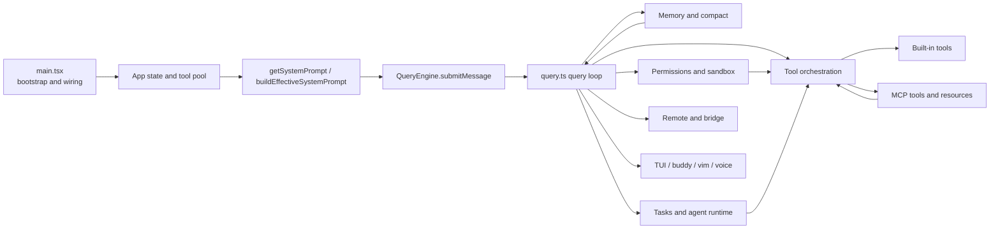
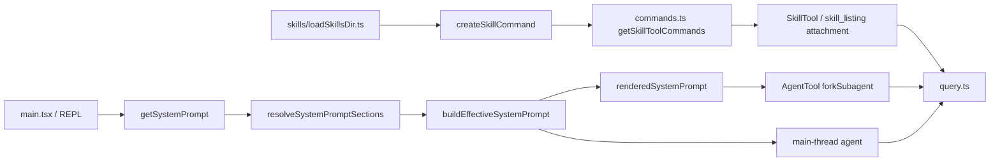
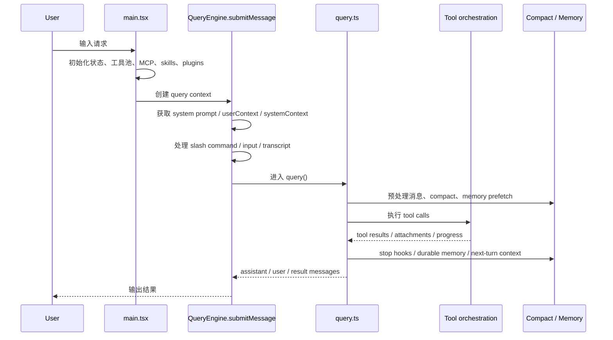

# Claude Code 全局架构图

这一页先回答一个更具体的问题：**Claude Code 的差异，不在某一个功能点，而在一条完整的运行链。**

如果只看表面，会觉得它像“能调工具的 CLI”。  
但从 `ChinaSiro/claude-code-sourcemap` 的公开镜像来看，真正重要的是这些部分已经被接成一个持续运行的系统：

- 启动层先把状态、工具、MCP、skills、plugins、permission context 装好
- `QueryEngine` 负责一轮输入怎样变成一次完整 query
- `query.ts` 负责真正的循环，包括 compact、tool execution、attachment 回挂、stop hook 和继续下一轮
- tools、memory、permissions、remote/bridge 并不是旁支，而是这条主链上的常驻节点

## 一张图看总链路

## Prompt 与技能如何挂到主链上

## 主执行链路

## 关键入口

建议先盯住下面 5 个入口文件：

- `restored-src/src/main.tsx`
- `restored-src/src/QueryEngine.ts`
- `restored-src/src/query.ts`
- `restored-src/src/Tool.ts`
- `restored-src/src/tools.ts`

为什么是这 5 个：

- `main.tsx` 决定运行前准备了什么
- `QueryEngine.ts` 决定“一轮”是怎么进来的
- `query.ts` 决定“这一轮如何继续下去”
- `Tool.ts` 定义统一 tool contract
- `tools.ts` 决定有哪些 tool 真正进入 prompt 和运行时

## 已确认的分层

### 1. 启动与装配层

这层主要落在 `restored-src/src/main.tsx`。

从文件顶部 imports 和初始化逻辑可以确认，启动阶段不只是读取 CLI 参数，还会提前准备很多运行时部件，例如：

- bootstrap state
- MCP config / official registry / client preload
- plugins 与 bundled skills 初始化
- permission mode 与 tool permission context
- remote session 与 bridge 相关准备
- telemetry / growthbook / model capability / settings cache

这也是为什么 `main.tsx` 会非常大：它承担了“把一个会话跑起来”的装配职责，而不是只做参数分发。

### 2. Turn 级协调层

这层主要落在 `restored-src/src/QueryEngine.ts`。

可以直接从 `submitMessage()` 看出，它负责：

- 读取当前 `QueryEngineConfig`
- 调 `fetchSystemPromptParts()` 取得 `defaultSystemPrompt`、`userContext`、`systemContext`
- 结合 `customSystemPrompt`、`appendSystemPrompt` 和 memory mechanics 组装最终 `systemPrompt`
- 调 `processUserInput()` 处理用户输入和 slash command
- 记录 transcript
- 加载技能与插件缓存
- 调 `query()` 进入真正的主循环

也就是说，`QueryEngine` 不是“模型请求包装器”，而是 turn 级的协调器。

### 3. Query loop 层

这层主要落在 `restored-src/src/query.ts`。

`query()` 和内部的 `queryLoop()` 负责真正的循环推进。公开源码里可以直接看到几件关键事情按顺序发生：

1. 先从已有消息里取出 compact boundary 之后的可用消息
2. 应用 tool result budget、snip、microcompact、context collapse、autocompact
3. 生成本轮可执行的 tool use
4. 运行 tools，并把结果重新变成 user/attachment/progress message
5. 注入 queued commands、memory attachments、skill discovery attachments
6. 处理 stop hooks、token budget continuation、max turns 等退出条件
7. 如果还有后续工作，就把新消息带入下一轮

这部分是 Claude Code 最值得反复读的地方，因为很多“为什么它不像一次性问答工具”的答案都在这里。

### 4. Tool contract 与 tool pool 层

这层主要落在：

- `restored-src/src/Tool.ts`
- `restored-src/src/tools.ts`

`Tool.ts` 定义的是统一 contract，包括：

- tool 输入 schema
- `call()`
- `description()`
- `checkPermissions()`
- `renderToolUseMessage()` / `renderToolResultMessage()`
- MCP metadata
- concurrency / read-only / destructive 等行为属性
- `ToolUseContext`

`tools.ts` 则负责：

- 构建 built-in tool 列表
- 根据 simple mode / REPL mode / feature gate 做筛选
- 根据 deny rules 过滤工具
- 把 MCP tools 和 built-in tools 组装成最终 tool pool

这意味着“工具”在 Claude Code 里不是一个松散数组，而是一套强约束接口。

### 5. 持久上下文层

这层主要落在：

- `restored-src/src/memdir/`
- `restored-src/src/services/SessionMemory/`
- `restored-src/src/services/extractMemories/`
- `restored-src/src/services/compact/`

可以确认的事情有两件：

- memory 不只是一段 prompt 文本，它有明确目录、文件和后台提炼流程
- compact 也不是简单摘要，它会在 compact 后重新注入一些上下文和附件，尽量保证会话还能继续

### 6. 权限与信任层

这层主要落在：

- `restored-src/src/utils/permissions/`
- `restored-src/src/components/permissions/`

从目录规模和命名就能直接看出，这部分不是单一弹窗，而是：

- 规则解析
- mode setup
- classifier
- filesystem/path validation
- UI 请求组件

一起工作。

### 7. 外部连接层

这层主要落在：

- `restored-src/src/services/mcp/`
- `restored-src/src/remote/`
- `restored-src/src/bridge/`

它们分别解决不同问题：

- `services/mcp/` 负责外部 MCP server 接入、连接、工具和资源暴露
- `remote/` 负责远程会话对象和适配
- `bridge/` 负责桥接运行时、session runner、transport 和 permission callback

### 8. Prompt 与命令注入层

这层主要落在：

- `restored-src/src/constants/prompts.ts`
- `restored-src/src/constants/systemPromptSections.ts`
- `restored-src/src/utils/systemPrompt.ts`
- `restored-src/src/skills/loadSkillsDir.ts`
- `restored-src/src/commands.ts`

现在可以更明确地说：

- 默认主 prompt 不是一段固定长文本，而是一组 section
- section 的缓存边界在源码里是显式声明的
- `buildEffectiveSystemPrompt()` 才负责交互式主线程的最终优先级装配
- skill 不是“额外文档”，而是先变成 `Command`，再通过 `getSkillToolCommands()` 与 attachment 进入模型可见面

## 为什么这套分层重要

如果只看产品表面，很容易把 Claude Code 理解成：

- 一个能跑命令的 LLM CLI
- 一个带 prompt engineering 的 coding agent

但源码里的结构说明，它更像是：

- 一个带长生命周期状态的 query runtime
- 一个统一 tool contract 驱动的执行系统
- 一个把 memory、compact、permissions、MCP、task runtime 接在一起的会话引擎

也正因为这些部分被接在一起，它才会表现出比较强的连续性、自治性和扩展性。

## 推荐阅读顺序

第一次阅读建议按下面顺序走：

1. `restored-src/src/main.tsx`
2. `restored-src/src/QueryEngine.ts`
3. `restored-src/src/query.ts`
4. `restored-src/src/Tool.ts`
5. `restored-src/src/tools.ts`
6. `MODULES/01-agent-loop-and-teams`
7. `MODULES/03-persistent-memory-system`
8. `MODULES/05-tools-mcp-skills-and-plugins`
9. `MODULES/06-permissions-sandbox-and-trust`
10. `MODULES/04-buddy-voice-vim-and-terminal-ui`
11. `MODULES/08-prompts-config-and-other-moats`
12. `PROMPTS/`

## 仍待确认

以下点在当前公开镜像里有代码线索，但不建议在文档里写成过重结论：

- `KAIROS` 的完整产品语义
- `Buddy` 是否等价于某个公开命名功能
- `voice/` 在公开镜像中的完整能力范围
- coordinator mode 在不同构建形态下的完整暴露方式

这些内容后续只在“有代码线索，但不能过度下结论”的边界内写。
