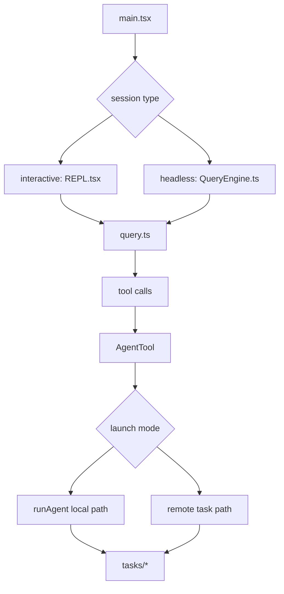
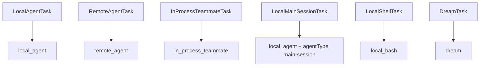

[简体中文](./README.md) | [English](./README.en.md)

# Deep Dive: Agent Loop And Teams

This chapter explains how Claude Code places the main thread, child agents, background work, and teammate execution inside one runtime structure.

The public source mirror directly supports these points:

- the interactive entry path is `main.tsx -> REPL.tsx -> query.ts`
- the headless and SDK entry path is `main.tsx -> QueryEngine.ts -> query.ts`
- `AgentTool` selects launch paths, while `runAgent()` executes child sessions
- `tasks/*` gives `local_agent`, `remote_agent`, `local_bash`, `in_process_teammate`, `dream`, and backgrounded main sessions one shared task layer

## What This Layer Does

This layer owns four jobs:

1. establishing the interactive and headless entry paths
2. turning child-agent dispatch into a formal tool path
3. threading fork, resume, backgrounding, and remote launch through one child-session execution chain
4. giving multiple background objects a unified task representation

## Key Files

### Entrypoints And Turn Loop

- `_upstream/claude-code-sourcemap/restored-src/src/main.tsx`
- `_upstream/claude-code-sourcemap/restored-src/src/screens/REPL.tsx`
- `_upstream/claude-code-sourcemap/restored-src/src/QueryEngine.ts`
- `_upstream/claude-code-sourcemap/restored-src/src/query.ts`

### Child-Agent Orchestration

- `_upstream/claude-code-sourcemap/restored-src/src/tools/AgentTool/AgentTool.tsx`
- `_upstream/claude-code-sourcemap/restored-src/src/tools/AgentTool/runAgent.ts`
- `_upstream/claude-code-sourcemap/restored-src/src/tools/AgentTool/forkSubagent.ts`
- `_upstream/claude-code-sourcemap/restored-src/src/tools/AgentTool/resumeAgent.ts`

### Task Representation

- `_upstream/claude-code-sourcemap/restored-src/src/tasks/LocalAgentTask/LocalAgentTask.tsx`
- `_upstream/claude-code-sourcemap/restored-src/src/tasks/RemoteAgentTask/RemoteAgentTask.tsx`
- `_upstream/claude-code-sourcemap/restored-src/src/tasks/LocalMainSessionTask.ts`
- `_upstream/claude-code-sourcemap/restored-src/src/tasks/InProcessTeammateTask/InProcessTeammateTask.tsx`
- `_upstream/claude-code-sourcemap/restored-src/src/tasks/types.ts`

## Source-Backed Walkthrough

### 1. `REPL.tsx` is the interactive assembly site

`main.tsx` handles startup, mode routing, plugin setup, and tool preparation. `REPL.tsx` assembles the interactive system prompt, merges the tool pool, manages input, and calls `query()`. `QueryEngine.ts` provides the same turn orchestration for headless and SDK usage. `query.ts` owns the actual turn loop and tool-execution cadence.

That split matters because:

- the “main loop” is not only `QueryEngine.ts`
- any public description of the interactive runtime needs to include `REPL.tsx`

### 2. `AgentTool` is the orchestration layer

`AgentTool.call()` parses inputs such as `subagent_type`, `team_name`, `run_in_background`, `isolation`, and `cwd`, then routes into local, remote, worktree, fork, or teammate launch paths. It also checks `requiredMcpServers` and wraps the execution result back into a tool result.

`AgentTool.isReadOnly()` returns `true`. In this file, that means permission enforcement is delegated to the underlying tools. It does not mean the child agent is incapable of editing files.

### 3. The fork path is a synthetic path, not an ordinary agent entry

`forkSubagent.ts` defines `FORK_AGENT`. It is not registered like a normal agent definition file. In the current source, the fork path activates when the fork gate is on and `subagent_type` is omitted.

The source keeps several inheritance properties explicit:

- `model: 'inherit'`
- reuse of the parent `renderedSystemPrompt`
- reuse of the parent’s exact tool pool
- reuse of the parent’s `thinkingConfig`
- fork-prefix reconstruction through `buildForkedMessages()`

The conservative wording needs to stay: fork workers inherit the model and the parent’s rendered system prompt bytes. That conclusion is grounded in `FORK_AGENT`, the `useExactTools` branch in `runAgent()`, and the resume logic in `resumeAgent.ts`.

### 4. Ordinary subagents and fork workers inherit context differently

Ordinary subagents use the selected agent definition, the resolved agent model, and a fresh child prompt setup. Fork workers reuse the parent’s rendered prompt bytes, tool pool, and thinking configuration. These are different inheritance contracts and should stay distinct in the docs.

Ordinary subagents are “run according to an agent definition.” Fork workers are “continue from a parent execution prefix with scoped follow-up work.”

### 5. `runAgent()` executes the child session

`runAgent()` creates a child `ToolUseContext`, resolves the agent tool set, preloads skills, attaches agent-specific MCP servers, records sidechain transcript data, and then calls `query()`.

The visible source also confirms:

- fork workers inherit the parent thinking configuration
- ordinary subagents default thinking to disabled to control cost

### 6. The task layer unifies multiple background objects

`tasks/types.ts` currently declares:

- `LocalAgentTaskState`
- `RemoteAgentTaskState`
- `InProcessTeammateTaskState`
- `LocalShellTaskState`
- `DreamTaskState`
- plus `LocalWorkflowTaskState` and `MonitorMcpTaskState` as type references in the current readable mirror

`LocalMainSessionTask.ts` also places backgrounded main-session work into `local_agent`, distinguished by `agentType: 'main-session'`. Public documentation should say that directly instead of inventing a separate task type for it.

### 7. Backgrounding is a lifecycle state, not a new task type

Local agents, backgrounded main sessions, and shell tasks can all enter a backgrounded lifecycle. `isBackgrounded` describes that lifecycle state. It is not a separate task type.

`LocalMainSessionTask.startBackgroundSession()` launches an independent `query()` call in the background and keeps appending transcript output to task storage. `LocalAgentTask` tracks tool counts, token counts, and recent activity. The UI and SDK both read that shared task state for live progress.

## Runtime Chain

## Task Layer

## Conservative Boundaries

- `requiredMcpServers` checks are visible in runtime code. Broader stability guarantees for custom-agent authoring are outside this page.
- `tasks/types.ts` still references `LocalWorkflowTask` and `MonitorMcpTask`. The current readable mirror does not expose their full implementations.
- `resumeAgent.ts` confirms the resume path for child agents. The higher-level trigger that decides when to resume should remain unspecified here.

## Read Next

- overview: [../README.en.md](../README.en.md)
- quick guide: [../SIMPLE/README.en.md](../SIMPLE/README.en.md)
- short comparison: [../comparison.en.md](../comparison.en.md)
