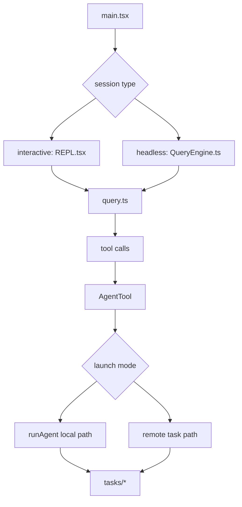
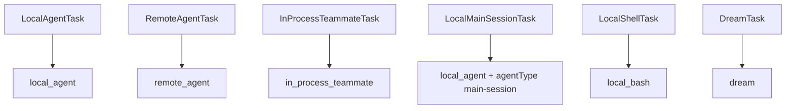

[简体中文](./README.md) | [English](./README.en.md)

# 深度拆解：Agent Loop And Teams

本章说明 Claude Code 如何把主线程、子 agent、后台任务和 teammate 统一到同一套运行时结构。

公开镜像可以直接支持以下结论：

- 交互式入口主链是 `main.tsx -> REPL.tsx -> query.ts`
- 无头与 SDK 入口主链是 `main.tsx -> QueryEngine.ts -> query.ts`
- `AgentTool` 负责选择启动路径，`runAgent()` 负责执行子会话
- `tasks/*` 统一表示 `local_agent`、`remote_agent`、`local_bash`、`in_process_teammate`、`dream` 与主会话后台任务

## 这部分负责什么

这一层负责四件事：

1. 建立交互式与无头两条会话入口
2. 把子 agent 调度做成正式工具调用
3. 把 fork、resume、后台化和远端运行接进同一套子会话执行链
4. 把多种后台对象压到统一任务表示层

## 关键文件

### 主入口与回合循环

- `_upstream/claude-code-sourcemap/restored-src/src/main.tsx`
- `_upstream/claude-code-sourcemap/restored-src/src/screens/REPL.tsx`
- `_upstream/claude-code-sourcemap/restored-src/src/QueryEngine.ts`
- `_upstream/claude-code-sourcemap/restored-src/src/query.ts`

### 子 agent 编排

- `_upstream/claude-code-sourcemap/restored-src/src/tools/AgentTool/AgentTool.tsx`
- `_upstream/claude-code-sourcemap/restored-src/src/tools/AgentTool/runAgent.ts`
- `_upstream/claude-code-sourcemap/restored-src/src/tools/AgentTool/forkSubagent.ts`
- `_upstream/claude-code-sourcemap/restored-src/src/tools/AgentTool/resumeAgent.ts`

### 任务表示层

- `_upstream/claude-code-sourcemap/restored-src/src/tasks/LocalAgentTask/LocalAgentTask.tsx`
- `_upstream/claude-code-sourcemap/restored-src/src/tasks/RemoteAgentTask/RemoteAgentTask.tsx`
- `_upstream/claude-code-sourcemap/restored-src/src/tasks/LocalMainSessionTask.ts`
- `_upstream/claude-code-sourcemap/restored-src/src/tasks/InProcessTeammateTask/InProcessTeammateTask.tsx`
- `_upstream/claude-code-sourcemap/restored-src/src/tasks/types.ts`

## 源码主线

### 1. `REPL.tsx` 是交互式主会话装配点

`main.tsx` 负责启动、模式分流、插件与工具预备装配。`REPL.tsx` 负责交互式输入、系统提示词装配、工具池合并和 `query()` 调用。`QueryEngine.ts` 负责无头与 SDK 场景的同类 orchestration。`query.ts` 负责真正的回合循环与工具执行节奏。

这条结构说明两件事：

- “主循环”需要覆盖 `REPL.tsx -> query.ts` 与 `QueryEngine.ts -> query.ts` 这两条入口链
- 交互式阅读必须把 `REPL.tsx` 放到入口位置

### 2. `AgentTool` 是编排层

`AgentTool.call()` 负责解析 `subagent_type`、`team_name`、`run_in_background`、`isolation`、`cwd` 等输入，再决定走本地、远端、worktree、fork 或 teammate 分支。它还会检查 `requiredMcpServers`，并把运行结果重新包装成工具结果。

`AgentTool.isReadOnly()` 返回 `true`。这个返回值表示权限判定继续下沉到底层工具。这个返回值不代表子 agent 不会修改文件。

### 3. fork 路径是单独的合成分支

`forkSubagent.ts` 定义了 `FORK_AGENT`。它不是一个普通 agent 文件条目。当前源码要求在 fork gate 打开时省略 `subagent_type` 才会触发这条路径。

fork 路径保留几项关键继承关系：

- `model: 'inherit'`
- 复用父会话的 `renderedSystemPrompt`
- 复用父会话的精确工具池
- 复用父会话的 `thinkingConfig`
- 通过 `buildForkedMessages()` 重建 fork 前缀

公开文档需要保留保守表述：fork worker 继承模型与父级系统提示词渲染结果。这个结论来自 `FORK_AGENT`、`runAgent()` 的 `useExactTools` 分支，以及 `resumeAgent.ts` 的恢复逻辑。

### 4. 普通 subagent 与 fork worker 的上下文继承不同

普通 subagent 使用选定 agent 的系统提示词和解析后的模型设置。fork worker 直接复用父级渲染后的系统提示词字节、工具池和 thinking 配置。两条路径的目标不同，文档需要分开写。

普通 subagent 的关注点是“按 agent 定义执行”。fork worker 的关注点是“复制父会话执行前缀并继续做局部工作”。

### 5. `runAgent()` 负责真正执行子会话

`runAgent()` 会创建子会话上下文、解析 agent 可用工具、预加载 skills、追加 agent 自己声明的 MCP server、记录 sidechain transcript，然后调用 `query()`。

源码还能确认两件事：

- fork worker 的 `thinkingConfig` 继承父级
- 普通 subagent 默认关闭 thinking 以控制成本

### 6. 任务表示层统一了多种后台对象

`tasks/types.ts` 当前声明了以下任务类型：

- `LocalAgentTaskState`
- `RemoteAgentTaskState`
- `InProcessTeammateTaskState`
- `LocalShellTaskState`
- `DreamTaskState`
- 以及当前镜像只看到类型引用的 `LocalWorkflowTaskState`、`MonitorMcpTaskState`

`LocalMainSessionTask.ts` 还把主会话后台任务放进 `local_agent`，并通过 `agentType: 'main-session'` 区分。这一点需要明确写出来，避免把主会话后台化误写成另一种 task type。

### 7. 后台化是生命周期状态，不是新 task 类型

本地 agent、主会话后台任务和 shell 任务都可以进入后台。`isBackgrounded` 描述生命周期状态。它不是新的任务类型。

`LocalMainSessionTask.startBackgroundSession()` 直接在后台启动一条新的 `query()` 调用，并把输出持续写进任务 transcript。`LocalAgentTask` 也会跟踪工具数、token 数和最近活动。UI 与 SDK 都从这层任务状态拿增量信息。

## 一张图看运行链

## 一张图看任务层

## 保守边界

- `requiredMcpServers` 的运行时检查可以确认。自定义 agent frontmatter 的公开稳定性不在这页写死。
- `tasks/types.ts` 里还有 `LocalWorkflowTask` 与 `MonitorMcpTask` 类型引用。当前可读镜像没有给出完整实现。文档保留“当前镜像未完整覆盖全部 task 实现”的边界。
- fork 子会话的恢复路径可以确认到 `resumeAgent.ts`。谁在更高层触发恢复，这一页不写死。

## 继续阅读

- 概览：[../README.md](../README.md)
- 快速版：[../SIMPLE/README.md](../SIMPLE/README.md)
- 轻量比较：[../comparison.md](../comparison.md)
