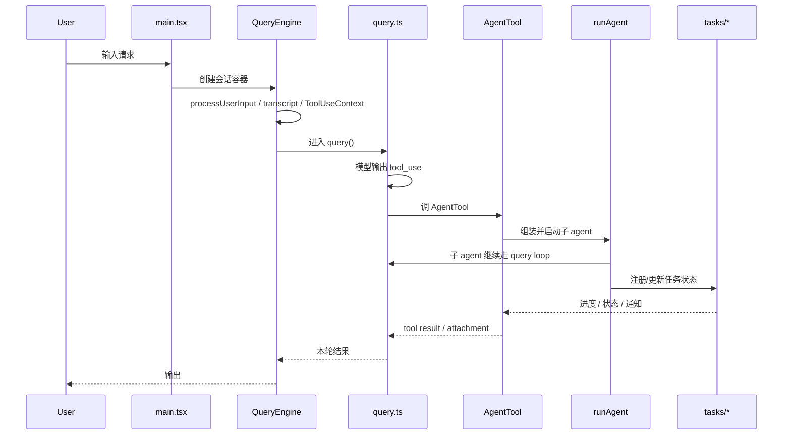
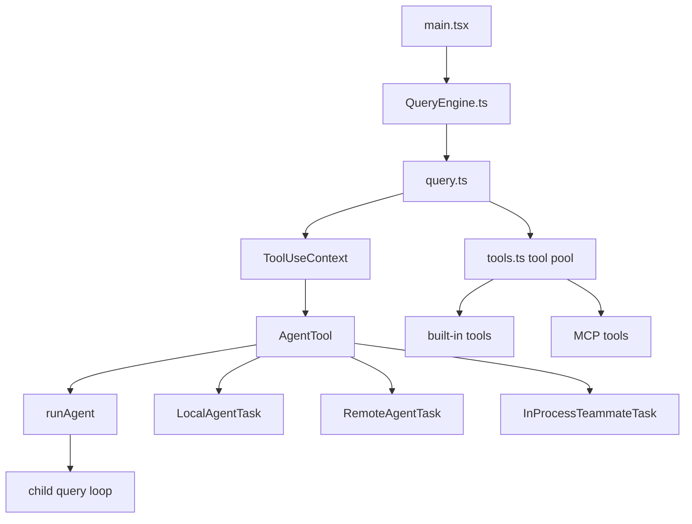

# 深度拆解：Agent Loop And Teams

这一章关心的不是“Claude Code 能不能开子 agent”，而是另一件更关键的事：

**主线程、子 agent、后台 task、teammate，到底是怎么接成一条稳定运行链的。**

从 `ChinaSiro/claude-code-sourcemap` 这份镜像来看，这套能力不是几段 prompt 拼出来的，而是明确落在 `main.tsx -> QueryEngine.ts -> query.ts -> AgentTool -> runAgent -> tasks/*` 这条运行时链上。

## 这部分负责什么

这一层主要负责三件事：

1. 把一次用户输入推进成一轮可继续递归的 query
2. 把 agent 调度做成正式 tool，而不是临时 prompt 约定
3. 把本地 agent、远端 agent、同进程 teammate 等执行对象统一表示为 task state

如果你想理解 Claude Code 为什么不像“问一次、答一次”的普通 CLI，这一层就是最核心的入口。

## 关键文件

- `restored-src/src/main.tsx`
  - 启动总控。负责 interactive / non-interactive 分流、工具种子、MCP 预热、插件初始化，以及把控制权交给 REPL 或 `runHeadless`
- `restored-src/src/QueryEngine.ts`
  - headless / SDK 会话的 turn orchestrator。负责 `mutableMessages`、`ToolUseContext`、`processUserInput()`、transcript 和记账
- `restored-src/src/query.ts`
  - 真正的模型-工具递归循环。负责 `tool_use -> tool_result -> 下一轮`
- `restored-src/src/Tool.ts`
  - 统一 tool contract 与 `ToolUseContext`
- `restored-src/src/tools.ts`
  - 工具池装配层，区分 `getAllBaseTools()`、`getTools()`、`assembleToolPool()`、`getMergedTools()`
- `restored-src/src/tools/AgentTool/AgentTool.tsx`
  - 子 agent 编排入口，负责普通 subagent / fork / teammate / worktree / async 分流
- `restored-src/src/tools/AgentTool/runAgent.ts`
  - 本地 subagent 执行引擎，负责子上下文、工具池、权限、skills、hooks、MCP、transcript
- `restored-src/src/tools/AgentTool/forkSubagent.ts`
  - fork gate、父 prompt 复用、父消息前缀重建
- `restored-src/src/tools/AgentTool/resumeAgent.ts`
  - 后台 agent 恢复，含 resumed fork 路径
- `restored-src/src/tasks/LocalAgentTask/LocalAgentTask.tsx`
  - 本地 agent task 状态、前后台切换、通知与 kill
- `restored-src/src/tasks/RemoteAgentTask/RemoteAgentTask.tsx`
  - 远端 session 任务状态、sidecar 持久化、恢复与轮询
- `restored-src/src/tasks/InProcessTeammateTask/`
  - 同进程 teammate 的状态与运行时表示

## 执行流

### 1. 启动层先决定这是不是一条 interactive 会话

`restored-src/src/main.tsx` 会先拿到 built-in tools，再按 interactive / non-interactive 分流。

这里有两个很重要的事实：

- interactive 路径不会为了 MCP 连接阻塞首屏和首轮
- non-interactive 路径会先筛掉不支持 headless 的命令，并在进入 `runHeadless` 前等待 regular MCP 批次连接

也就是说，Claude Code 一开始就把 REPL 和 headless 当成两套不同的运行容器，而不是同一套逻辑换个壳。

### 2. `QueryEngine` 负责 turn orchestration，不负责 UI

`restored-src/src/QueryEngine.ts` 的职责很清楚：

- 维护 `mutableMessages`
- 构造 `ToolUseContext`
- 调 `processUserInput()` 处理 slash command / local command
- 记录 transcript
- 需要时进入 `query()`

这里值得特别注意的一点是：`QueryEngine` 自己就把会话标成 `isNonInteractiveSession: true`。这也是为什么 headless 路径不会再回头向用户索要权限或额外输入。

### 3. `query.ts` 才是主循环

`restored-src/src/query.ts` 不是“发一次模型请求”的薄封装，而是一条递归循环：

1. 组装本轮可见消息
2. 调模型，收集 `tool_use`
3. 执行工具
4. 把结果变成 `tool_result / attachment / user` 消息
5. 在必要时刷新工具集
6. 递归进入下一轮

这就是 Claude Code 的 agent loop 骨架。

值得注意的细节：

- 调模型时，`toolUseContext.options.tools` 和 `appState.mcp.tools` 是分开的两组输入
- `refreshTools` 如果存在，`query()` 可以在 turn 之间刷新工具集
- 但当前 `QueryEngine` 这条 headless 链里并没有把 `refreshTools` 填进 `ToolUseContext.options`

这也是为什么“built-in tool pool”和“MCP tool pool”在源码里必须分开理解。

### 4. `AgentTool` 是编排入口，不是执行器

`restored-src/src/tools/AgentTool/AgentTool.tsx` 负责的是编排：

- 如果传了 `team_name + name`，走 teammate spawn
- 如果显式给 `subagent_type`，走普通 subagent
- 如果省略 `subagent_type` 且 fork gate 开启，走隐式 fork
- 再决定是否 async、是否 worktree、是否注册任务

这里要特别收窄一个常见误解：

**fork 不是另一个普通 agent type。**

`forkSubagent.ts` 里的 `FORK_AGENT` 是一条 feature-gated 的特殊路径，它的目标不是“换一个 agent prompt”，而是尽量复用父线程已经渲染好的 prompt 前缀和工具上下文。

### 5. 普通 subagent 与 fork subagent 是两种不同模型

普通 subagent：

- 使用所选 agent 自己的 `getSystemPrompt()`
- 再通过 `enhanceSystemPromptWithEnvDetails()` 补环境信息
- 默认只拿到一条新的用户任务消息
- 不自动继承完整父对话

fork subagent：

- 优先复用父级 `renderedSystemPrompt`
- 复用父级精确工具池与 thinking 配置
- 用 `buildForkedMessages()` 重建父 assistant 消息前缀和占位 `tool_result`
- 显式阻止递归 fork

这两条路径的行为目标完全不同：

- 普通 subagent 更像“按专用 agent 定义开一个新线程”
- fork 更像“复制父线程上下文，继续拆一支做事”

### 6. `runAgent` 是真正的执行引擎

`restored-src/src/tools/AgentTool/runAgent.ts` 会把编排结果真正落地：

- 构造子上下文
- 解析工具池
- 设定权限模式
- 预载 skill / frontmatter hooks / MCP
- 写 sidechain transcript 和 metadata
- 驱动 `query()`
- 清理收尾

所以更准确的分层应该是：

- `AgentTool` 决定“跑谁、怎么跑”
- `runAgent` 决定“子线程内部如何真正执行”

### 7. `tasks/*` 是 runtime representation layer

`tasks/` 这层的职责不是“替模型做推理”，而是把运行中的对象变成统一任务状态。

当前这份镜像里能确认的对象至少包括：

- `LocalAgentTask`
- `RemoteAgentTask`
- `InProcessTeammateTask`
- `LocalShellTask`

这层负责：

- 任务状态
- 前后台切换
- 通知
- kill
- 恢复
- 轮询

这也是为什么同步 subagent 也会先注册前台 `LocalAgentTask`，而不是直接裸跑。

## 一张图看主执行链

## 一张图看分层关系

## 为什么这个设计重要

这套分层的重要性，不是“支持多 agent”这么简单，而是：

- 主线程和子线程共享同一种 query runtime 语言
- fork、resume、background 都不是临时 hack，而是源码里的正式路径
- 本地 agent、远端 agent、teammate、shell task 都能落到统一任务表示层

这也是 Claude Code 的 team / worker 能力看起来更像 runtime feature，而不是几段 prompt fan-out 的原因。

## 推荐阅读顺序

1. `restored-src/src/main.tsx`
2. `restored-src/src/QueryEngine.ts`
3. `restored-src/src/query.ts`
4. `restored-src/src/Tool.ts`
5. `restored-src/src/tools.ts`
6. `restored-src/src/tools/AgentTool/AgentTool.tsx`
7. `restored-src/src/tools/AgentTool/runAgent.ts`
8. `restored-src/src/tools/AgentTool/forkSubagent.ts`
9. `restored-src/src/tools/AgentTool/resumeAgent.ts`
10. `restored-src/src/tasks/LocalAgentTask/LocalAgentTask.tsx`
11. `restored-src/src/tasks/RemoteAgentTask/RemoteAgentTask.tsx`
12. `restored-src/src/tasks/InProcessTeammateTask/`

## 仍待确认

- `remote isolation` 的代码路径和任务模型都存在，但这份 `restored-src` 快照里，`AgentTool` 的公开 `isolation` schema 仍收窄为 `worktree`。因此不能把 remote isolation 写成“当前构建已公开可用”的事实。
- teammate spawn 的完整执行链不在这次重点范围内；当前只能确认 `AgentTool` 的入口条件和任务表示层。
- fork、KAIROS、coordinator、proactive 这些分支的线上默认开关状态，不能从静态源码直接推出。
