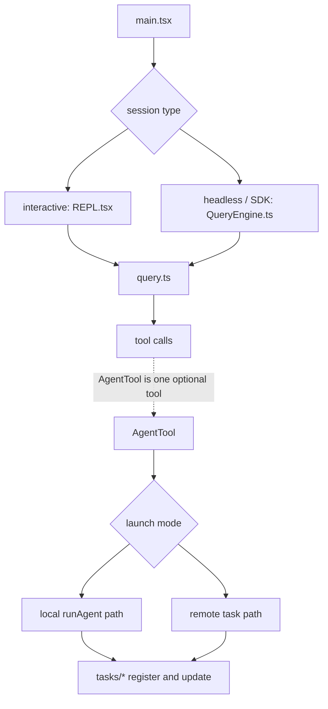
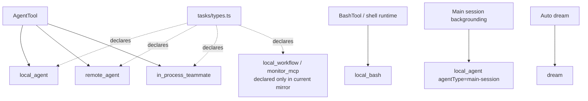

# 深度拆解：Agent Loop And Teams

这一章的重点不是“Claude Code 能不能开子 agent”，而是：

**主线程、子代理、后台任务、远端任务、同进程 teammate，究竟是怎么接成一条稳定运行链的。**

从 `ChinaSiro/claude-code-sourcemap` 这份公开镜像来看，这套能力并不是几段 prompt fan-out，而是明确落在：

- `main.tsx`
- `screens/REPL.tsx`
- `QueryEngine.ts`
- `query.ts`
- `AgentTool.tsx`
- `runAgent.ts`
- `tasks/*`

这条运行时链上。

如果你愿意把这一章读完，后面很多“为什么它不像普通 fan-out”的问题会自然顺下来。

## 这部分负责什么

这一层主要负责三件事：

1. 把一次用户输入推进成一轮可继续递归的 query
2. 把 agent 调度做成正式 tool，而不是临时 prompt 协议
3. 把本地 agent、远端 agent、shell、主会话后台任务、in-process teammate 统一表示成 task state

## 关键文件

### 主线程与 query runtime

- `restored-src/src/main.tsx`
  - interactive / non-interactive 分流、built-in tools 与 MCP 接入
- `restored-src/src/screens/REPL.tsx`
  - interactive 主线程的 prompt 装配、工具池合并与 `query()` 入口
- `restored-src/src/QueryEngine.ts`
  - headless / SDK turn orchestrator
- `restored-src/src/query.ts`
  - 真正的 turn loop
- `restored-src/src/Tool.ts`
  - `ToolUseContext`
- `restored-src/src/tools.ts`
  - `getAllBaseTools()`、`getTools()`、`assembleToolPool()`、`getMergedTools()`

### Agent 编排与执行

- `restored-src/src/tools/AgentTool/AgentTool.tsx`
  - 子代理编排入口
- `restored-src/src/tools/AgentTool/runAgent.ts`
  - 子代理执行引擎
- `restored-src/src/tools/AgentTool/forkSubagent.ts`
  - fork 路径与 `FORK_AGENT`
- `restored-src/src/tools/AgentTool/resumeAgent.ts`
  - transcript 驱动的后台恢复
- `restored-src/src/tools/AgentTool/agentToolUtils.ts`
  - async lifecycle、结果收尾、handoff 分类
- `restored-src/src/tools/AgentTool/loadAgentsDir.ts`
  - agent definition 来源与解析

### 任务表示层

- `restored-src/src/tasks/LocalAgentTask/LocalAgentTask.tsx`
  - `local_agent` 状态、前后台切换、通知、kill
- `restored-src/src/tasks/RemoteAgentTask/RemoteAgentTask.tsx`
  - `remote_agent` 轮询、恢复、review / ultraplan 状态
- `restored-src/src/tasks/LocalShellTask/LocalShellTask.tsx`
  - `local_bash`
- `restored-src/src/tasks/LocalMainSessionTask.ts`
  - 主会话后台化
- `restored-src/src/tasks/InProcessTeammateTask/`
  - 同进程 teammate 的状态镜像
- `restored-src/src/tasks/types.ts`
  - `TaskState` 联合类型与任务形态声明
- `restored-src/src/tasks/stopTask.ts`
  - 通用 stop 路径

## 执行流

### 1. 主线程其实有 interactive / headless 两条入口

这一层最容易写粗的地方，是把 `main.tsx -> QueryEngine.ts -> query.ts` 说成唯一主链。

更准确的写法是：

- interactive 主线程主要落在 `main.tsx -> REPL.tsx -> query.ts`
- headless / SDK 主线程主要落在 `main.tsx -> QueryEngine.ts -> query.ts`

各层分工大致是：

- `main.tsx`
  - 做启动、模式分流、插件与 MCP 预备装配
- `REPL.tsx`
  - 负责 interactive prompt 装配、工具池合并、输入处理与 `query()` 调用
- `QueryEngine.ts`
  - 负责 headless / SDK turn orchestration
- `query.ts`
  - 负责真正的 turn loop

这也是为什么文档里要把 “主循环” 和 “agent tool” 分开写：

- 主循环先存在
- 子代理只是这条主循环上的一个 tool 分支

### 2. `AgentTool` 是 orchestration layer，不是执行器

先用一句更直白的话说：`AgentTool` 决定“开哪种子线程”，但真正把子线程跑起来的是后面的执行链。

`AgentTool.call()` 负责的事情主要是：

1. 解析 `subagent_type`
2. 在 fork gate 开启时决定是否走隐式 fork
3. 处理 `team_name` 这种 teammate 例外入口
4. 检查 `requiredMcpServers`
5. 决定 sync / async / remote / worktree 分支
6. 把运行结果重新包装成 tool result

所以更准确的说法是：

- `AgentTool` 决定“跑谁、在哪跑、以前台还是后台跑”
- `runAgent` 决定“子线程内部怎么真正执行”

还有一个非常容易误解的点：

```ts
// AgentTool.tsx
isReadOnly() {
  return true
}
```

这里的 `true` 只说明：

- `AgentTool` 自己把权限判定委托给底层工具

不等于：

- 子代理不会修改文件

### 3. fork 不是普通 agent type

当前实现里，fork 是一个合成路径：

- 由 `forkSubagent.ts` 里的 `FORK_AGENT` 定义
- 触发条件是“省略 `subagent_type` 且 fork gate 开启”

如果 fork gate 没开，省略 `subagent_type` 的回退逻辑是：

- `GENERAL_PURPOSE_AGENT.agentType`

这也是为什么文档里不能把 fork 写成“另一个普通 agent 定义”。

### 4. 普通 subagent 与 fork subagent 是两种不同模型

普通 subagent：

- 走 `selectedAgent.getSystemPrompt()`
- 再做 env enhancement
- 不自动继承完整父对话
- 但仍可能叠加 hook context、预加载 skills 与 agent-specific MCP

fork subagent：

- 复用父 `renderedSystemPrompt`
- 复用父精确工具池
- 复用父 `thinkingConfig`
- 用 `buildForkedMessages()` 重建父 assistant 前缀和占位 `tool_result`
- 显式阻止递归 fork

所以它们并不是“同一个机制的两个小变体”，而是两条行为目标不同的路径。

### 5. `runAgent()` 才是实际执行引擎

`runAgent()` 内部会做这些事：

1. 处理 fork 上下文中未完成的 tool call
2. 构造 agent 专属 `getAppState()`、`ToolUseContext`、tool pool
3. 预加载 agent frontmatter 指定的 `skills`
4. 初始化 agent frontmatter 指定的 `mcpServers`
5. 写 sidechain transcript 与 metadata
6. 驱动 `query()`
7. 清理 session hooks、todos 与 transcript 映射
8. 回收该 agent 生成的 orphan shell tasks

这条链路说明：

- agent 不是“再发一个模型请求”
- 而是“在同一套 runtime 上再开一条完整子线程”

### 6. sync 与 async 共享同一套任务表示

这也是源码里一个很重要的设计点。

异步子代理：

- 先 `registerAsyncAgent()`
- 再进 `runAsyncAgentLifecycle()`

同步子代理：

- 先注册前景 `local_agent`
- 再手动拉取 `runAgent()` 的 iterator
- 如果中途被后台化，会以同一个 task / agent 身份重新进入 async 生命周期

也就是说：

- “一开始就是后台”
- “先前台跑，后面转后台”

最终都落在同一个：

- `LocalAgentTaskState`

这里更准确的说法不是：

- “同一个执行实例原地切后台”

而是：

- 同一个 task / transcript 身份被延续到了后台生命周期

### 7. `tasks/` 既是任务状态层，也是运行时实现层

`tasks/` 不负责模型推理本身，但也不只是一个展示层。当前可见实现里，它同时承担：

- 任务注册
- 前后台切换
- 恢复与轮询
- 通知与 kill
- 状态暴露给 UI

当前快照里能直接确认的任务形态包括：

- `local_agent`
- `remote_agent`
- `local_bash`
- `in_process_teammate`
- `dream`
- 以及用 `agentType: 'main-session'` 区分的主会话后台任务

这也意味着一个很容易写错的点：

- `background` 是生命周期状态
- 不是另一种新的 task 类型

这里还有一个需要写明的边界：

- `tasks/types.ts` 仍引用 `LocalWorkflowTask` 和 `MonitorMcpTask`
- 但这两个实现文件不在本次 `restored-src` 可读树里

所以文档不能写成“当前镜像已经完整覆盖全部 task 实现”。

## 一张图看主执行链



## 一张图看任务表示层



## 为什么这个设计重要

这套设计的重要性，不只是“支持多 agent”，而是：

- 主线程与子线程共享同一种 query runtime
- fork、resume、background 都是源码里的正式路径
- 同步 agent、异步 agent、主会话后台任务都复用 `local_agent` 表示层
- 本地 agent、远端 agent、shell、主会话后台任务都能落到统一任务表示层

这也是 Claude Code 的 worker / team 能力看起来更像 runtime feature，而不是 prompt fan-out 的原因。

## 推荐阅读顺序

1. `restored-src/src/main.tsx`
2. `restored-src/src/QueryEngine.ts`
3. `restored-src/src/query.ts`
4. `restored-src/src/tools/AgentTool/AgentTool.tsx`
5. `restored-src/src/tools/AgentTool/runAgent.ts`
6. `restored-src/src/tools/AgentTool/forkSubagent.ts`
7. `restored-src/src/tools/AgentTool/resumeAgent.ts`
8. `restored-src/src/tasks/LocalAgentTask/LocalAgentTask.tsx`
9. `restored-src/src/tasks/RemoteAgentTask/RemoteAgentTask.tsx`
10. `restored-src/src/tasks/LocalMainSessionTask.ts`
11. `restored-src/src/tasks/types.ts`
12. `restored-src/src/tasks/InProcessTeammateTask/`

## 仍待确认

- `AgentTool` 的输入 schema 和 `call()` 分支都能看到 ant-only 的 `isolation: 'remote'`，但更广的用户可见性与稳定性仍不外推。
- `requiredMcpServers` 在运行时会被检查，但本轮没有坐实自定义 markdown/json agent 是否能在 frontmatter 中稳定声明它。
- `resumeAgentBackground()` 的调用入口不在这轮重点范围内，所以“谁负责触发恢复”不能写死。
- foreground agent 被后台化时，源码更接近“同一 task 身份重进 async 生命周期”，而不是“原来的执行实例直接切后台线程”。
