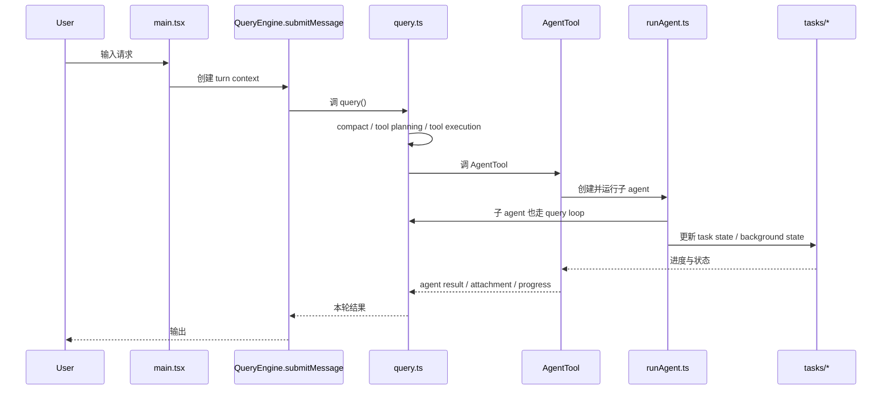
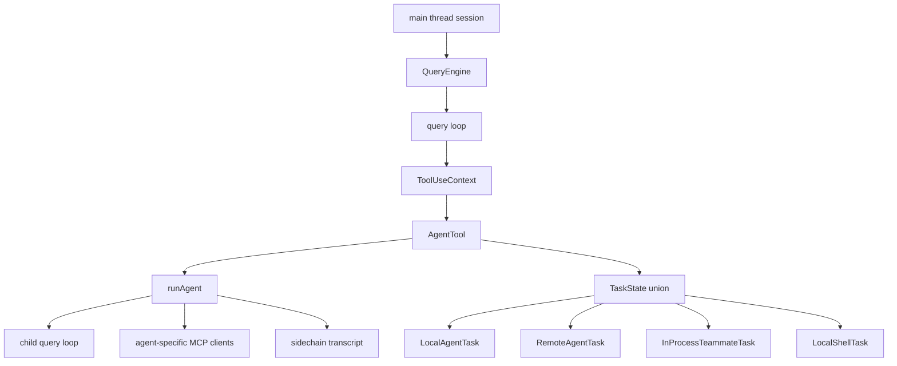

# 深度拆解：Agent Loop And Teams

这一章要回答的核心问题是：**Claude Code 怎么把“主循环、子 agent、task runtime”接成一套真实运行时。**

它的重点不是“支持并行”这件事本身，而是并行是怎样被放进主执行链里的。

## 这部分负责什么

这部分主要负责三件事：

1. 把用户输入推进到一轮完整的 query lifecycle
2. 把 agent 调度做成可调用的 tool/runtime，而不是只靠 prompt 描述
3. 把后台任务、子 agent、teammate 这些执行对象挂到统一 task state 上

如果你想理解 Claude Code 为什么不像“问一次、答一次”的普通对话工具，这一章是最重要的入口之一。

## 关键文件

- `restored-src/src/main.tsx`
  - 启动与装配入口，负责把工具、权限、MCP、plugins、skills、session state 装到主线程里
- `restored-src/src/QueryEngine.ts`
  - turn 级协调器，负责 `submitMessage()`
- `restored-src/src/query.ts`
  - 真正的 query loop，负责多轮继续、compact、tools、attachments、stop hooks
- `restored-src/src/Tool.ts`
  - 定义统一 tool contract 与 `ToolUseContext`
- `restored-src/src/tools.ts`
  - 定义 built-in tool 列表和 tool pool 装配逻辑
- `restored-src/src/tools/AgentTool/AgentTool.tsx`
  - AgentTool 主入口
- `restored-src/src/tools/AgentTool/runAgent.ts`
  - 子 agent 实际运行逻辑
- `restored-src/src/tools/AgentTool/forkSubagent.ts`
  - fork child 的上下文继承和约束
- `restored-src/src/tools/AgentTool/resumeAgent.ts`
  - background / resumed agent 续跑路径
- `restored-src/src/tasks/types.ts`
  - task union 类型入口
- `restored-src/src/tasks/LocalMainSessionTask.ts`
- `restored-src/src/tasks/LocalAgentTask/`
- `restored-src/src/tasks/RemoteAgentTask/`
- `restored-src/src/tasks/InProcessTeammateTask/`

## 执行流

### 1. 主线程先进入 `QueryEngine.submitMessage()`

`restored-src/src/QueryEngine.ts` 里的 `submitMessage()` 会先做 turn 级准备：

- 读取当前 `cwd`、`tools`、`commands`、`mcpClients`
- 调 `fetchSystemPromptParts()` 准备 prompt 与上下文
- 调 `processUserInput()` 处理用户输入和 slash command
- 记录 transcript
- 加载 skills / plugins 缓存
- 然后把控制权交给 `query()`

这说明真正的“主线程 agent loop”不是只在 `main.tsx` 里，而是 `main.tsx -> QueryEngine.submitMessage() -> query()` 这一整条链。

### 2. `query.ts` 决定这轮如何继续

`restored-src/src/query.ts` 里的 `queryLoop()` 是一段真正的循环，而不是单次请求包装层。

它每轮大致做这些事：

1. 从当前消息里取出 compact boundary 之后的可用历史
2. 应用 tool result budget、snip、microcompact、autocompact
3. 进入模型采样并收集 tool use blocks
4. 执行 tools
5. 把 tool results、attachments、queued commands、memory attachments 再挂回消息流
6. 判断是否继续下一轮

也就是说，Claude Code 的“agent loop”本质上是 `query.ts` 维护的一条递进状态机。

### 3. `tools.ts` 把 AgentTool 放进正式 tool pool

`restored-src/src/tools.ts` 里，`AgentTool` 是 `getAllBaseTools()` 返回列表的一部分，而不是临时外挂。

同一层里还能看到：

- `EnterPlanModeTool`
- `TodoWriteTool`
- `Task*Tool`
- `ListMcpResourcesTool`
- `ReadMcpResourceTool`

这很关键，因为它说明：

- agent 调度
- plan mode
- todo / task 管理
- MCP 资源访问

这些都被当成同级的运行时能力，而不是分散脚本。

### 4. AgentTool 触发子 agent，`runAgent.ts` 负责真正执行

`restored-src/src/tools/AgentTool/runAgent.ts` 不是小型 adapter，它做的事情很完整：

- 解析 agent definition
- 计算 agent model
- 组装 agent system prompt
- 初始化 agent-specific MCP servers
- 创建 agent context
- 调 `query()` 跑子 agent 的内部循环
- 管理 sidechain transcript、cleanup、agent tracking

这意味着 Claude Code 的子 agent 不是“把一段 prompt 再发一遍”，而是一个新的 query runtime 实例。

### 5. `forkSubagent.ts` 解释了“隐式 fork”到底是什么

`restored-src/src/tools/AgentTool/forkSubagent.ts` 是非常值得读的文件。

从源码注释可以直接确认：

- `subagent_type` 可以在特定 gate 下变成可选
- 如果省略 `subagent_type`，会触发“继承父上下文”的 implicit fork
- fork child 不是任意扩散的，它有明确的行为约束
- fork child 共享父 prompt cache 时，甚至会直接传入父线程已经渲染好的 system prompt bytes，避免重新计算造成 cache miss

更直白一点说：这里不是“让模型假装自己是个 worker”，而是专门实现了一条 fork 路径。

### 6. `tasks/` 把执行对象落成了统一状态层

`restored-src/src/tasks/types.ts` 明确把不同任务对象并到 `TaskState` 里，包括：

- `LocalShellTaskState`
- `LocalAgentTaskState`
- `RemoteAgentTaskState`
- `InProcessTeammateTaskState`
- `LocalWorkflowTaskState`
- `MonitorMcpTaskState`
- `DreamTaskState`

这说明 Claude Code 把“执行中的对象”抽象成了统一 task runtime，而不是只靠 UI 做列表展示。

## 一张图看主执行链

## 一张图看运行时对象关系

## 为什么这个设计重要

这里最重要的不是“它能开子线程”，而是它把子线程、后台任务、主线程 loop 放进了同一种运行模型。

这样带来的几个直接效果是：

- 子 agent 能复用主线程已有的很多运行时能力
- task state 能统一展示本地 agent、远程 agent、teammate、shell task
- fork、resume、background 不是临时 hack，而是源码里明确存在的路径

这也是为什么 Claude Code 的 team / worker 能力看起来更像“runtime feature”，而不是单纯 prompt fan-out。

## 推荐阅读顺序

建议按下面顺序看：

1. `restored-src/src/QueryEngine.ts`
2. `restored-src/src/query.ts`
3. `restored-src/src/tools.ts`
4. `restored-src/src/Tool.ts`
5. `restored-src/src/tools/AgentTool/AgentTool.tsx`
6. `restored-src/src/tools/AgentTool/runAgent.ts`
7. `restored-src/src/tools/AgentTool/forkSubagent.ts`
8. `restored-src/src/tasks/types.ts`
9. `restored-src/src/tasks/LocalAgentTask/`
10. `restored-src/src/tasks/InProcessTeammateTask/`

## 仍待确认

以下点在公开镜像里还不适合写成过重结论：

- coordinator mode 在不同构建形态下暴露了多少 orchestration 逻辑
- `DreamTask` 的真实产品定位
- `agent swarms` 在公开构建中的完整可用范围

这些内容后续只适合写成“有代码线索，但不下完整产品结论”。
