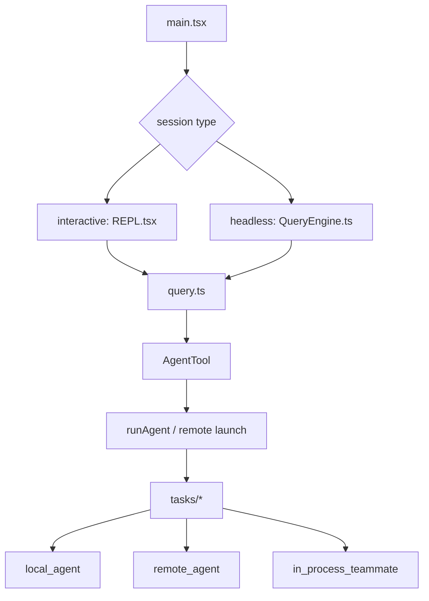

[简体中文](./README.md) | [English](./README.en.md)

# Agent Loop And Teams In One Minute

Keep this short mental model:

Claude Code first establishes a shared `query()` turn loop, then attaches child agents, background work, and team-oriented tasks through orchestration and task-state layers around that loop.

## Three Takeaways

- the interactive path clearly runs through `REPL.tsx`
- `AgentTool` orchestrates while `runAgent()` executes
- `tasks/*` is a runtime state layer, not only a display layer

## Read Next

- overview: [README.en.md](../README.en.md)
- deep dive: [DEEP/README.en.md](../DEEP/README.en.md)
