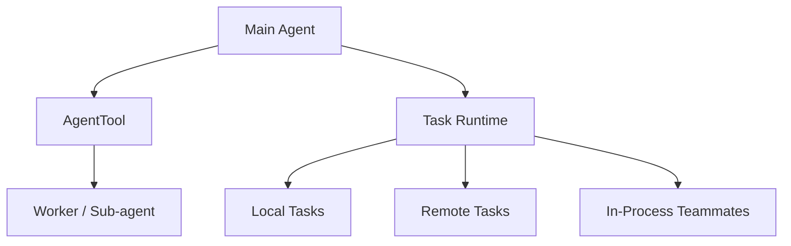

[简体中文](./README.md) | [English](./README.en.md)

# Agent Loop And Teams In One Minute

Keep one short mental model:

Claude Code places the main thread, child agents, task state, and team coordination inside the same runtime chain.

## Three Takeaways

- the main thread drives overall progress
- `AgentTool` chooses and launches child-agent paths
- `tasks/` shows that workers have durable state, not just one message

## Read Next

- overview: [README.en.md](../README.en.md)
- deep dive: [DEEP/README.en.md](../DEEP/README.en.md)
