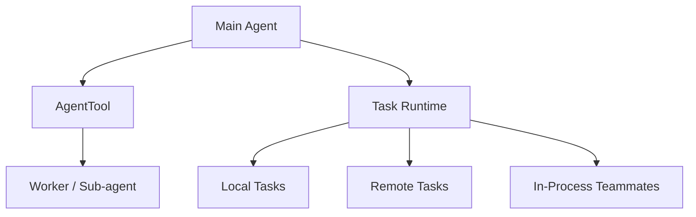

[简体中文](./README.md) | [English](./README.en.md)

# 1 分钟看懂 Agent Loop And Teams

先记住一个最短的心智模型：

Claude Code 把主线程、子 agent、任务状态和 team 协作放进了同一套运行链。

## 三个要点

- 主线程负责整体推进
- `AgentTool` 负责创建、恢复或切换子代理路径
- `tasks/` 说明 worker 有独立状态，不只是一条消息里的临时对象

## 下一步去哪里

- 总览：[README.md](../README.md)
- 深读：[DEEP/README.md](../DEEP/README.md)
