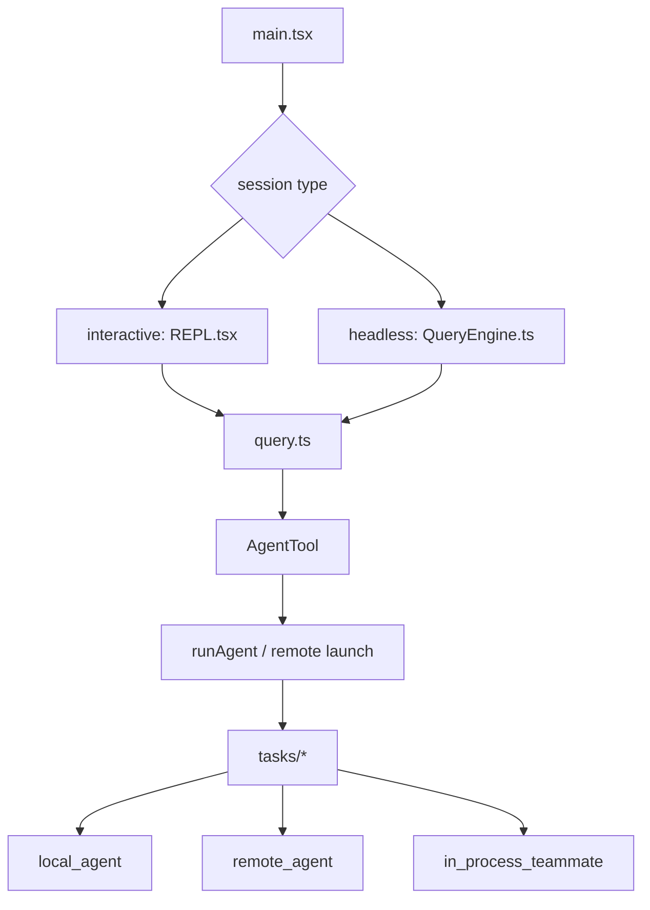

[简体中文](./README.md) | [English](./README.en.md)

# 1 分钟看懂 Agent Loop And Teams

最短心智模型如下：

Claude Code 先建立一条通用 `query()` 回合循环，再把子 agent、后台任务和 team 任务都接到这条循环外层的编排与任务表示层。

## 三个要点

- 交互式主链明确经过 `REPL.tsx`
- `AgentTool` 负责编排，`runAgent()` 负责执行
- `tasks/*` 是运行时状态层，不是单纯展示层

## 下一步去哪里

- 总览：[README.md](../README.md)
- 深读：[DEEP/README.md](../DEEP/README.md)
