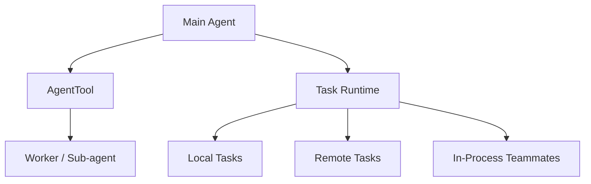

# 1 分钟看懂 Agent Loop And Teams

Claude Code 不只是“把一个请求拆成几个子请求”。

它更像这样一套流程：

## 核心理解

- 主线程负责整体推进
- `AgentTool` 负责创建或恢复子 agent
- `tasks/` 目录说明 worker 不是只存在于一条消息里
- team 模式让多个 agent 可以在同一任务体系里工作

## 先看哪几个文件

- `tools/AgentTool/AgentTool.tsx`
- `tools/AgentTool/forkSubagent.ts`
- `tasks/types.ts`
- `tasks/InProcessTeammateTask/`

