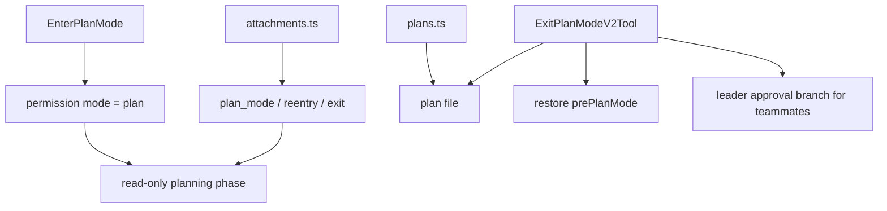
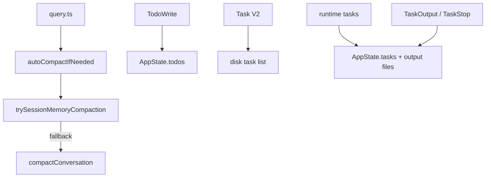

[简体中文](./README.md) | [English](./README.en.md)

# Deep Dive: Planning, Compaction, And Assistant

This chapter explains how planning state, plan files, compaction paths, and task-checklist layers support long-running sessions.

The public source mirror directly supports these conclusions:

- `EnterPlanModeTool` switches planning state and does not write the plan file
- `ExitPlanModeV2Tool` reads the plan and writes `input.plan` back to disk when needed
- `autoCompactIfNeeded()` tries `trySessionMemoryCompaction()` before falling back
- `TodoWrite`, Task V2, and runtime tasks land in `AppState.todos`, disk task lists, and `AppState.tasks` respectively

## What This Layer Does

This layer owns four jobs:

1. switching the session into planning mode and restoring the previous mode on exit
2. managing the plan file as a separate artifact
3. choosing the correct compaction path as context grows
4. separating checklists, task records, and actively running tasks into different layers

## Key Files

### Planning State And Plan Files

- `_upstream/claude-code-sourcemap/restored-src/src/tools/EnterPlanModeTool/EnterPlanModeTool.ts`
- `_upstream/claude-code-sourcemap/restored-src/src/tools/ExitPlanModeTool/ExitPlanModeV2Tool.ts`
- `_upstream/claude-code-sourcemap/restored-src/src/utils/plans.ts`
- `_upstream/claude-code-sourcemap/restored-src/src/utils/attachments.ts`

### Turn Loop And Compaction

- `_upstream/claude-code-sourcemap/restored-src/src/query.ts`
- `_upstream/claude-code-sourcemap/restored-src/src/services/compact/autoCompact.ts`
- `_upstream/claude-code-sourcemap/restored-src/src/services/compact/compact.ts`
- `_upstream/claude-code-sourcemap/restored-src/src/services/compact/sessionMemoryCompact.ts`

### Todos, Task Lists, And Runtime Tasks

- `_upstream/claude-code-sourcemap/restored-src/src/tools/TodoWriteTool/TodoWriteTool.ts`
- `_upstream/claude-code-sourcemap/restored-src/src/tools/TaskCreateTool/TaskCreateTool.ts`
- `_upstream/claude-code-sourcemap/restored-src/src/tools/TaskListTool/TaskListTool.ts`
- `_upstream/claude-code-sourcemap/restored-src/src/tools/TaskUpdateTool/TaskUpdateTool.ts`
- `_upstream/claude-code-sourcemap/restored-src/src/tools/TaskGetTool/TaskGetTool.ts`
- `_upstream/claude-code-sourcemap/restored-src/src/tools/TaskStopTool/TaskStopTool.ts`
- `_upstream/claude-code-sourcemap/restored-src/src/tools/TaskOutputTool/TaskOutputTool.tsx`
- `_upstream/claude-code-sourcemap/restored-src/src/utils/tasks.ts`

## Source-Backed Walkthrough

### 1. `Plan Mode` is a permission-mode transition

`EnterPlanModeTool` sets `toolPermissionContext.mode` to `plan` and explicitly instructs the model to enter a read-only exploration and design phase. The current implementation also forbids using it from agent contexts.

That tells us:

- planning mode is a runtime state transition
- entering planning mode does not itself create the plan document

### 2. `utils/plans.ts` manages the plan artifact

`utils/plans.ts` generates a word slug for the current session. The main-session plan file path is `<slug>.md`. Child-agent plan files use `<slug>-agent-<agentId>.md`.

The same file also defines two important recovery paths:

- `copyPlanForResume()` restores the original slug and can recover content from file snapshots or message history
- `copyPlanForFork()` duplicates the original plan into a new slug for the forked session so the two sessions do not overwrite each other

`persistFileSnapshotIfRemote()` currently snapshots the plan explicitly. Public docs should keep that exact scope.

### 3. `ExitPlanModeV2Tool` reads, writes, and restores state

`ExitPlanModeV2Tool` first reads the current plan file. If the UI or permission flow sends an edited `input.plan`, the tool writes it back to disk and then triggers the remote snapshot path.

For a normal main session, it restores `prePlanMode`. For teammates with `plan_mode_required`, it sends `plan_approval_request` and returns `awaitingLeaderApproval`. That branch does not immediately restore the permission mode.

### 4. Attachments keep planning state visible across long conversations

`utils/attachments.ts` exposes these planning-related attachment types:

- `plan_mode`
- `plan_mode_reentry`
- `plan_mode_exit`
- `plan_file_reference`

These attachments keep the model informed about the current planning state and the plan-file location after compaction, resume, and long-session reentry.

### 5. `query.ts` runs turn-level shrinking before autocompact

The visible `query.ts` flow shows:

- microcompaction runs inside the turn loop
- autocompact checks happen before the next model call
- the result is threaded back into the same turn execution

Compaction is therefore not just a button. It is part of the ongoing runtime path.

### 6. Autocompact tries the session-memory path first

`autoCompactIfNeeded()` follows a clear order:

1. check whether autocompact is needed
2. try `trySessionMemoryCompaction()` first
3. fall back to `compactConversation()`

`sessionMemoryCompact.ts` rebuilds a compact result from session memory content plus a kept tail. `compact.ts` handles full and partial compaction results, boundary messages, and post-compaction attachment reinjection.

### 7. `TodoWrite`, Task V2, and runtime tasks are three different layers

`TodoWriteTool` is enabled only when `!isTodoV2Enabled()`, and it targets `AppState.todos`. That is a session-scoped or agent-scoped checklist surface.

`utils/tasks.ts` owns the disk-backed Task V2 model. Task lists live in their own directory, use lock files, and support owners, dependencies, claims, and unassignment.

Runtime tasks are the actively running background objects. They live in `AppState.tasks` and corresponding output files. `TaskOutputTool` and `TaskStopTool` operate on that runtime layer, not on Task V2 JSON records.

### 8. `TaskOutputTool` and `TaskStopTool` belong to the running-task surface

In the current source, `TaskOutputTool` reads output from actively running tasks, while `TaskStopTool` stops actively running tasks. They are not part of the Task V2 disk task-list layer.

The public-facing wording can stay simple:

- Task V2 answers “what should be done”
- runtime tasks answer “what is running now”

## Planning State And Plan Files

## Compaction And Task Layers

## Conservative Boundaries

- `sessionMemoryCompact` and full compaction do not expose identical reinjection scope in the visible source. Keep the wording at “session-memory compaction is an alternate compaction path.”
- `persistFileSnapshotIfRemote()` is currently confirmed for plans.
- static source does not tell us the live rollout defaults of the relevant gates.

## Read Next

- overview: [../README.en.md](../README.en.md)
- quick guide: [../SIMPLE/README.en.md](../SIMPLE/README.en.md)
- short comparison: [../comparison.en.md](../comparison.en.md)
