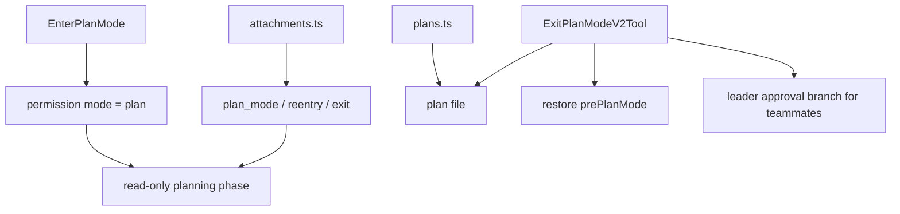
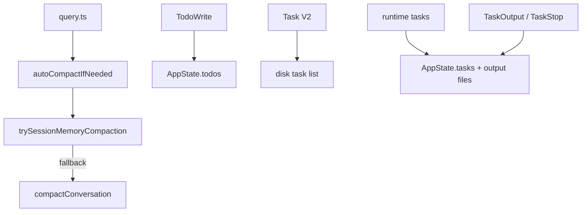

[简体中文](./README.md) | [English](./README.en.md)

# 深度拆解：Planning, Compaction, And Assistant

本章说明计划态、plan 文件、compact 路径和任务清单层如何共同支撑长会话。

公开镜像可以直接支持以下结论：

- `EnterPlanModeTool` 只切换计划态，不负责写 plan 文件
- `ExitPlanModeV2Tool` 读取 plan，必要时把 `input.plan` 写回磁盘
- `autoCompactIfNeeded()` 优先尝试 `trySessionMemoryCompaction()`
- `TodoWrite`、Task V2、runtime task 分别落在 `AppState.todos`、磁盘 task list、`AppState.tasks`

## 这部分负责什么

这一层负责四件事：

1. 把当前会话切到计划态并在退出时恢复模式
2. 把 plan 文件作为独立 artifact 管理
3. 在上下文增长时选择合适的 compact 路径
4. 把 checklist、任务记录和运行中任务分到不同层

## 关键文件

### 计划态与 plan 文件

- `_upstream/claude-code-sourcemap/restored-src/src/tools/EnterPlanModeTool/EnterPlanModeTool.ts`
- `_upstream/claude-code-sourcemap/restored-src/src/tools/ExitPlanModeTool/ExitPlanModeV2Tool.ts`
- `_upstream/claude-code-sourcemap/restored-src/src/utils/plans.ts`
- `_upstream/claude-code-sourcemap/restored-src/src/utils/attachments.ts`

### 回合循环与 compact

- `_upstream/claude-code-sourcemap/restored-src/src/query.ts`
- `_upstream/claude-code-sourcemap/restored-src/src/services/compact/autoCompact.ts`
- `_upstream/claude-code-sourcemap/restored-src/src/services/compact/compact.ts`
- `_upstream/claude-code-sourcemap/restored-src/src/services/compact/sessionMemoryCompact.ts`

### todo、task list 与 runtime task

- `_upstream/claude-code-sourcemap/restored-src/src/tools/TodoWriteTool/TodoWriteTool.ts`
- `_upstream/claude-code-sourcemap/restored-src/src/tools/TaskCreateTool/TaskCreateTool.ts`
- `_upstream/claude-code-sourcemap/restored-src/src/tools/TaskListTool/TaskListTool.ts`
- `_upstream/claude-code-sourcemap/restored-src/src/tools/TaskUpdateTool/TaskUpdateTool.ts`
- `_upstream/claude-code-sourcemap/restored-src/src/tools/TaskGetTool/TaskGetTool.ts`
- `_upstream/claude-code-sourcemap/restored-src/src/tools/TaskStopTool/TaskStopTool.ts`
- `_upstream/claude-code-sourcemap/restored-src/src/tools/TaskOutputTool/TaskOutputTool.tsx`
- `_upstream/claude-code-sourcemap/restored-src/src/utils/tasks.ts`

## 源码主线

### 1. `Plan Mode` 是权限模式切换

`EnterPlanModeTool` 会把 `toolPermissionContext.mode` 设为 `plan`，并明确要求模型进入只读探索与方案设计阶段。当前实现还限制它不能在 agent context 里使用。

这条路径说明两件事：

- 进入计划态是运行时状态变更
- 进入计划态本身不产生计划正文文件

### 2. plan 文件由 `utils/plans.ts` 管理

`utils/plans.ts` 为当前会话生成 word slug。主会话 plan 文件路径是 `<slug>.md`。子 agent plan 文件路径是 `<slug>-agent-<agentId>.md`。

同一个文件里还定义了两条重要恢复路径：

- `copyPlanForResume()` 恢复原会话 slug，并在需要时从 file snapshot 或消息历史恢复正文
- `copyPlanForFork()` 为 fork 出来的新会话复制原 plan 内容，并生成新的 slug，避免相互覆盖

`persistFileSnapshotIfRemote()` 当前显式 snapshot 的对象是 plan。公开文档保留这个范围，不把 todos 一并写死。

### 3. 退出计划态时，`ExitPlanModeV2Tool` 负责读写 plan 与恢复模式

`ExitPlanModeV2Tool` 会先读取当前 plan 文件。Web UI 或权限流如果传入了编辑后的 `input.plan`，工具会先把内容写回 plan 文件，再做 remote snapshot。

普通主会话退出时，工具会恢复 `prePlanMode`。teammate 且 `plan_mode_required` 的分支会先发 `plan_approval_request`，并返回 `awaitingLeaderApproval`。这条分支不会立刻恢复权限模式。

### 4. attachment 负责把计划态跨长会话继续传下去

`utils/attachments.ts` 当前可见的计划态相关附件包括：

- `plan_mode`
- `plan_mode_reentry`
- `plan_mode_exit`
- `plan_file_reference`

它们负责在 compact、resume 和长会话重入之后继续提醒模型当前处于什么阶段，以及计划文件在哪里。

### 5. `query.ts` 会先跑回合级压缩，再决定是否自动 compact

`query.ts` 里能直接看到：

- microcompact 在回合内优先运行
- auto compact 判定发生在正式模型调用前
- `autoCompactIfNeeded()` 会把结果重新接回当前回合

这条结构说明 compact 是 turn loop 里的常驻机制。

### 6. 自动 compact 优先尝试 session-memory 路径

`autoCompactIfNeeded()` 的顺序很明确：

1. 判断是否达到 auto compact 条件
2. 先尝试 `trySessionMemoryCompaction()`
3. 再回退到 `compactConversation()`

`sessionMemoryCompact.ts` 使用 session memory 内容和保留尾巴消息重建 compact 结果。`compact.ts` 则负责 full compact / partial compact 之后的边界消息与附件重建。

### 7. `TodoWrite`、Task V2、runtime task 是三套层

`TodoWriteTool` 只在 `!isTodoV2Enabled()` 时启用，目标是 `AppState.todos`。这更接近当前会话或当前 agent 的 checklist。

`utils/tasks.ts` 负责 Task V2 的磁盘模型。task list 使用单独目录、锁文件和 JSON task 文件，支持 `owner`、依赖关系、claim、unassign 等操作。

runtime task 则是正在跑的后台对象。它们落在 `AppState.tasks` 和对应 output file。`TaskOutputTool` 与 `TaskStopTool` 面向这层 runtime task，不面向 Task V2 的 JSON task 记录。

### 8. `TaskOutputTool` 与 `TaskStopTool` 属于运行中任务表面

当前源码里，`TaskOutputTool` 读取运行中任务输出，`TaskStopTool` 终止运行中的任务。两者与 Task V2 的磁盘 task list 不同层。

公开文档适合直接写成：

- Task V2 负责“要做什么”
- runtime task 负责“现在正在跑什么”

## 一张图看计划态与 plan 文件

## 一张图看 compact 与任务层

## 保守边界

- `sessionMemoryCompact` 与 full compact 的 reinjection 范围不完全相同。公开文档保留“session-memory 路径是替代 compact 路径”的表述，不写成完全等价。
- `persistFileSnapshotIfRemote()` 当前可确认的 snapshot 对象是 plan。
- 线上 gate 的默认开启状态不能从静态源码直接推出。

## 继续阅读

- 概览：[../README.md](../README.md)
- 快速版：[../SIMPLE/README.md](../SIMPLE/README.md)
- 轻量比较：[../comparison.md](../comparison.md)
