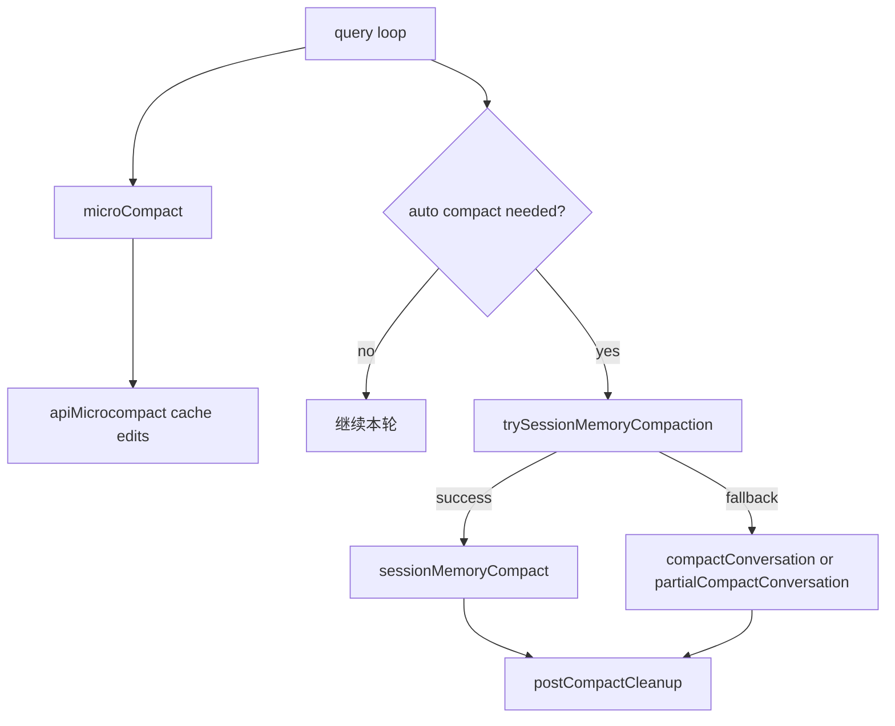
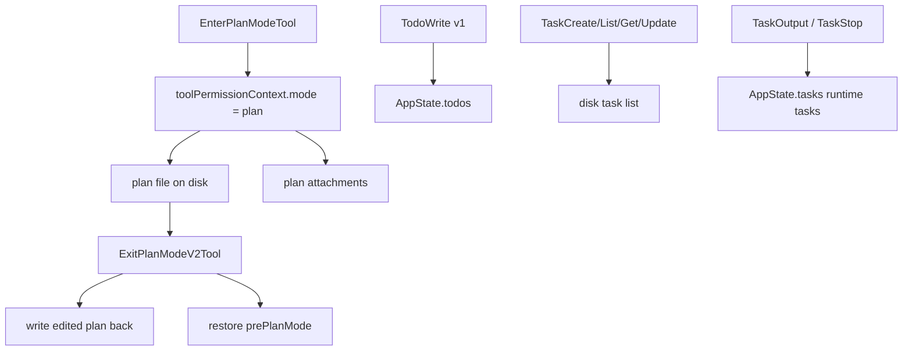

# 深度拆解：Planning, Compaction, And Assistant

这一章的重点不是“Claude Code 会不会写计划”，而是：

**Plan Mode、compact、todo / task 到底是怎么作为运行时机制接起来的。**

从 `ChinaSiro/claude-code-sourcemap` 这份公开镜像里，可以直接确认几件事：

- Plan Mode 不是一段提示词，而是权限模式 + plan 文件 + attachment 保留链
- compact 不是单一路径，而是多层上下文管理系统
- `TodoWrite`、Task V2、runtime task 不是同一套对象

## 这部分负责什么

这一层主要负责四件事：

1. 把会话切进“先探索、先写计划”的受限模式
2. 把 plan 文件当成 session artifact 管理
3. 在上下文过长时选择合适的 compact 路径
4. 让 todo、task list、后台任务分别落到各自的存储和运行时层

## 关键文件

### Compact 主链

- `restored-src/src/services/compact/microCompact.ts`
  - 本地消息层的轻量削减
- `restored-src/src/services/compact/apiMicrocompact.ts`
  - API 请求层的原生 cache edits / context-management
- `restored-src/src/services/compact/sessionMemoryCompact.ts`
  - 用 session memory 直接替代传统摘要 compact
- `restored-src/src/services/compact/compact.ts`
  - full compact / partial compact
- `restored-src/src/services/compact/autoCompact.ts`
  - 自动 compact 调度与优先级
- `restored-src/src/services/compact/postCompactCleanup.ts`
  - compact 后状态清理

### Plan Mode

- `restored-src/src/tools/EnterPlanModeTool/EnterPlanModeTool.ts`
  - 进入 Plan Mode
- `restored-src/src/tools/ExitPlanModeTool/ExitPlanModeV2Tool.ts`
  - 退出 Plan Mode
- `restored-src/src/utils/plans.ts`
  - plan 文件路径、恢复、remote snapshot
- `restored-src/src/utils/attachments.ts`
  - `plan_mode / plan_mode_reentry / plan_mode_exit`
- `restored-src/src/bootstrap/state.ts`
  - attachment 标志与模式切换辅助

### Todo / Task / Runtime task

- `restored-src/src/tools/TodoWriteTool/TodoWriteTool.ts`
  - v1 todo
- `restored-src/src/utils/tasks.ts`
  - Task V2 的磁盘模型
- `restored-src/src/tools/TaskCreateTool/`
- `restored-src/src/tools/TaskGetTool/`
- `restored-src/src/tools/TaskListTool/`
- `restored-src/src/tools/TaskUpdateTool/`
  - Task V2
- `restored-src/src/tools/TaskOutputTool/TaskOutputTool.tsx`
  - runtime task 输出读取器
- `restored-src/src/tools/TaskStopTool/TaskStopTool.ts`
  - runtime task 停止器

## 执行流

### 1. `microCompact` 与 `apiMicrocompact` 不是同一层

`microCompact.ts` 做的是本地消息层的轻量削减。

它会优先尝试：

- time-based 清理旧 `tool_result`
- cached microcompact 记录 `pendingCacheEdits`

目标是：

- 尽量不做摘要
- 先把最占上下文的旧工具结果和思维块减掉

`apiMicrocompact.ts` 则是另一层：

- 把 cache edits / clear 策略变成真正的 API 请求参数

所以这两者不能被写成“同一个 compact 功能”。

### 2. auto compact 会优先尝试 session-memory 路径

`autoCompactIfNeeded()` 的顺序很明确：

1. 判断是否超过 auto compact 阈值
2. 先尝试 `trySessionMemoryCompaction()`
3. 失败后才回退到 `compactConversation()`

也就是说，Claude Code 并不是一到超限就摘要全部历史，而是先看 session memory 能不能承担 compact 摘要角色。

### 3. `sessionMemoryCompact` 是替代路径，不是 full compact 的等价副本

`sessionMemoryCompact.ts` 会：

- 读取 session memory
- 计算保留尾巴
- 对 `tool_use` / `tool_result` 做配对保护
- 把 session memory 当作 summary
- 重建 boundary、summary 和保留消息

但这条链的 reinjection 范围更窄。

当前明确能看到：

- 它会显式补回 `plan_file_reference`

但在这一层没有直接看到：

- `plan_mode` attachment 的补回

所以文档里更稳妥的表述是：

- `sessionMemoryCompact` 是一条更省成本、以连续性优先的替代 compact 路径

不要把它写成：

- “与 full / partial compact 完全等价”

### 4. full / partial compact 会显式重建后置上下文

`compactConversation()` 与 `partialCompactConversation()` 的职责更重：

- 真正生成 compact summary
- 重建 compact boundary
- 补回 compact 之后继续工作需要的附件
- 在结尾再做 post-compact cleanup

当前可以明确写出的补回内容包括：

- `plan_file_reference`
- 当前仍在 plan mode 时的 `plan_mode`
- skills 相关附件
- async task 相关附件
- 其他继续工作所需的 delta / listing

两者的主要区别不在“会不会补”，而在“摘要边界在哪里”。

### 5. Plan Mode 是“权限模式 + plan 文件 + attachment 保留链”

这一轮最重要的收紧点之一，就是把 Plan Mode 写清楚。

`EnterPlanModeTool` 负责的是：

- 校验当前上下文
- 切到 `toolPermissionContext.mode = 'plan'`
- 建立只读探索阶段的约束

它不负责创建或写入 plan 文件。

真正与 plan 文件直接打交道的，是：

- `utils/plans.ts`
- `ExitPlanModeV2Tool.ts`

当前 plan 文件路径可以明确写成：

- 主会话：`<slug>.md`
- 子 agent：`<slug>-agent-<agentId>.md`

`ExitPlanModeV2Tool` 在退出时会：

1. 读取现有 plan
2. 如果有编辑后的 `input.plan`，写回 plan 文件
3. remote 环境下调用 `persistFileSnapshotIfRemote()`
4. 恢复到退出前权限模式

### 6. attachment 负责把 Plan Mode 在长会话里继续告诉模型

Plan Mode 的权限模式只解决“系统当前处于什么模式”。

但 compact、resume 和长会话会让模型丢失这件事，所以还需要 attachment 层补充：

- `plan_mode`
- `plan_mode_reentry`
- `plan_mode_exit`

常规 turn 中，系统会按需要注入这些 attachment。

而 full / partial compact 之后，还会显式重新补：

- `plan_file_reference`
- 当前仍在 plan mode 时的 `plan_mode`

这也是为什么更准确的描述应该是：

- tool 负责切模式
- plan 文件负责保存计划内容
- attachment 负责在长会话里继续提醒模型

### 7. `TodoWrite`、Task V2、runtime task 是三套系统

这一点在文档里必须强分开。

`TodoWrite`：

- 只在 `!isTodoV2Enabled()` 时启用
- 写到 `AppState.todos`
- 更像 session / agent 级 checklist

Task V2：

- 只在 `isTodoV2Enabled()` 时启用
- 写入磁盘 task-list JSON
- 支持 `owner`、依赖、`metadata`
- 面向持久化任务记录

runtime task：

- 运行中的 `local_bash`、`local_agent`、`remote_agent`
- 状态在 `AppState.tasks`
- 输出落到 `<projectTemp>/<session>/tasks/<taskId>.output`

所以这三者不能被混成“todo 系统”。

### 8. `TaskOutputTool` 与 `TaskStopTool` 面向 runtime task，不是 Task V2

`TaskOutputTool` / `TaskStopTool` 处理的是：

- runtime background task

不是：

- Task V2 的 JSON task 记录

而且当前源码还能确认一个重要边界：

- `TaskOutputTool` 已明显偏向 deprecated 兼容层
- 更推荐模型直接 `Read` 输出文件路径

这也是文档里需要直接写明的地方。

### 9. `persistFileSnapshotIfRemote()` 当前只确认保存 plan

这一点必须纠正旧文档中容易模糊的说法。

虽然注释里提到：

- `plan, todos`

但当前实现里本轮坐实的事实是：

- 这里只显式 snapshot 了 plan

所以不要再写：

- “remote file snapshot 会保存 plan 和 todos”

## 一张图看 compact 分层

## 一张图看 Plan Mode 与任务分层

## 为什么这个设计重要

这里真正重要的地方，是 Claude Code 没有把“计划”和“上下文压缩”做成一段模糊提示词。

它把这些能力拆成了明确运行时层：

- compact 有多条路径
- Plan Mode 有权限模式、plan 文件和保留链
- todo、task list、runtime task 各自独立

这也是为什么它能在长链路工作里同时维持：

- 规划阶段约束
- compact 后连续性
- 后台任务可追踪性

## 推荐阅读顺序

1. `restored-src/src/tools/EnterPlanModeTool/EnterPlanModeTool.ts`
2. `restored-src/src/tools/ExitPlanModeTool/ExitPlanModeV2Tool.ts`
3. `restored-src/src/utils/plans.ts`
4. `restored-src/src/utils/attachments.ts`
5. `restored-src/src/services/compact/microCompact.ts`
6. `restored-src/src/services/compact/apiMicrocompact.ts`
7. `restored-src/src/services/compact/sessionMemoryCompact.ts`
8. `restored-src/src/services/compact/compact.ts`
9. `restored-src/src/services/compact/autoCompact.ts`
10. `restored-src/src/tools/TodoWriteTool/TodoWriteTool.ts`
11. `restored-src/src/utils/tasks.ts`
12. `restored-src/src/tools/TaskOutputTool/TaskOutputTool.tsx`
13. `restored-src/src/tools/TaskStopTool/TaskStopTool.ts`

## 仍待确认

- `sessionMemoryCompact` 不补 `plan_mode` attachment，到底是有意为之还是尚未补齐，当前只能保守描述。
- `EnterPlanModeTool` 不写 plan 文件，但首次把 plan 正文落盘的具体上游入口，这轮没有继续展开。
- cached microcompact、`tengu_session_memory` 等开关的线上默认状态，不能从静态源码直接推出。
