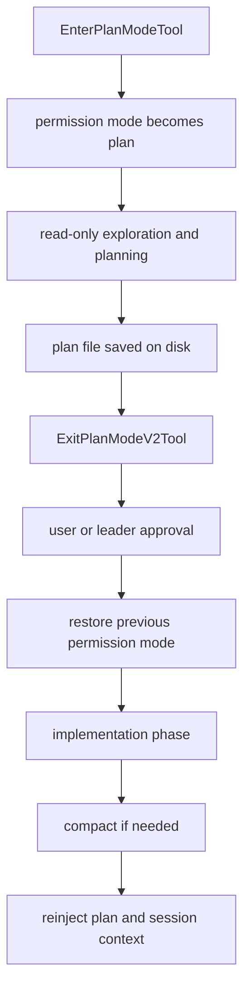

# 深度拆解：Planning, Compaction, And Assistant

这一章要回答的核心问题是：**Plan Mode 在 Claude Code 里到底是提示词阶段，还是运行时状态。**

从公开镜像来看，答案比较明确：**它既有 prompt 约束，也有运行时状态切换。**

## 这部分负责什么

这部分主要负责三件事：

1. 让模型进入一个“先探索、先写计划”的工作阶段
2. 把计划文件作为会话工件保存下来，并在需要时恢复
3. 在 compact 之后把 plan、技能、延迟工具等关键上下文重新挂回会话

## 关键文件

- `restored-src/src/tools/EnterPlanModeTool/EnterPlanModeTool.ts`
- `restored-src/src/tools/ExitPlanModeTool/ExitPlanModeV2Tool.ts`
- `restored-src/src/utils/plans.ts`
- `restored-src/src/services/compact/compact.ts`
- `restored-src/src/services/compact/autoCompact.ts`
- `restored-src/src/services/compact/sessionMemoryCompact.ts`
- `restored-src/src/tools/TodoWriteTool/`
- `restored-src/src/tools/Task*Tool/`

## 执行流

### 1. `EnterPlanModeTool` 不只是提示模型“开始规划”

`restored-src/src/tools/EnterPlanModeTool/EnterPlanModeTool.ts` 可以直接确认几件事：

- 它是正式 tool，不是 UI 按钮
- 它会调用 `prepareContextForPlanMode()`
- 它会通过 `applyPermissionUpdate()` 把 `toolPermissionContext.mode` 设成 `plan`
- 它还会记录进入 plan mode 的状态迁移

换句话说，进入 Plan Mode 不是“加一段 system prompt”这么简单，而是会修改权限与会话上下文。

### 2. `ExitPlanModeV2Tool` 会处理 plan 文件、审批和模式恢复

`restored-src/src/tools/ExitPlanModeTool/ExitPlanModeV2Tool.ts` 的职责比名字看起来更重。

从源码能确认：

- tool input / output 都显式带 plan 相关字段
- 它会从 `getPlan()` / `getPlanFilePath()` 读取当前 plan
- teammate 和普通用户路径不同
- 非 teammate 默认要走用户确认
- 退出时会根据 `prePlanMode` 恢复原来的 permission mode

这说明“退出 plan mode”本身就是一段运行时收尾流程，而不是只弹一个确认框。

### 3. `utils/plans.ts` 把 plan 当成会话工件

`restored-src/src/utils/plans.ts` 很值得读，因为它说明 plan 不是只存在消息历史里。

源码里可以直接看到这些能力：

- 为当前 session 生成 plan slug
- 生成 plan file path
- 支持 resume 时恢复 plan slug
- plan 文件缺失时尝试从消息历史或 file snapshot 恢复
- fork session 时还会复制 plan 文件，避免新旧 session 互相覆盖

也就是说，plan 在这里已经是“真正的文件工件”。

### 4. `compact.ts` 会在 compact 后重新注入上下文

`restored-src/src/services/compact/compact.ts` 最重要的一点，不只是做摘要，而是管理 compact 后的继续工作能力。

从文件 imports 和实现可以直接看出，它会处理很多 compact 后的回挂材料，例如：

- plan 文件
- memory
- session start hooks
- deferred tools delta
- agent listing delta
- MCP instructions delta

这说明 compact 不是“清空一遍再来”，而是尽量把继续工作需要的上下文重新塞回去。

### 5. `autoCompact` 和 `sessionMemoryCompact` 是两条不同路径

当前公开镜像里，至少可以区分两种思路：

- `autoCompact.ts`
  - 按 token 阈值驱动普通 compact
- `sessionMemoryCompact.ts`
  - 如果 session memory 足够可用，优先把 session memory 当 summary 使用

这个区别很重要，因为它说明 Claude Code 的 compact 并不只有一种策略。

## 一张图看 Plan Mode 与 compact 的关系

## 为什么这个设计重要

这里最关键的一点是：**Plan Mode 是运行时行为，而不是文案包装。**

这样做带来几个实际效果：

- 进入计划阶段时，权限模式能被明确切走
- 计划文件能跨会话、resume、fork 继续存在
- compact 之后，计划不会轻易丢掉

也正因为如此，Claude Code 里的“先规划再执行”更像流程控制，而不是模型自觉。

## 推荐阅读顺序

1. `restored-src/src/tools/EnterPlanModeTool/EnterPlanModeTool.ts`
2. `restored-src/src/tools/ExitPlanModeTool/ExitPlanModeV2Tool.ts`
3. `restored-src/src/utils/plans.ts`
4. `restored-src/src/services/compact/compact.ts`
5. `restored-src/src/services/compact/autoCompact.ts`
6. `restored-src/src/services/compact/sessionMemoryCompact.ts`

## 仍待确认

- `KAIROS` 在公开镜像里出现了多个 gate 和分支，但还不适合写成完整 assistant subsystem
- teammate 计划审批在不同构建形态下的全部产品表现

当前更稳妥的写法仍然是“有代码线索，但不做过度结论”。
