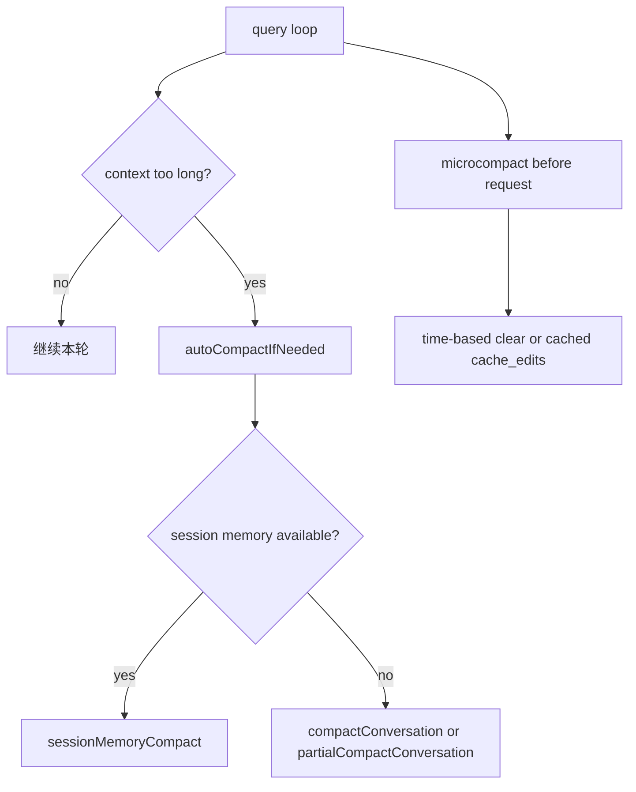
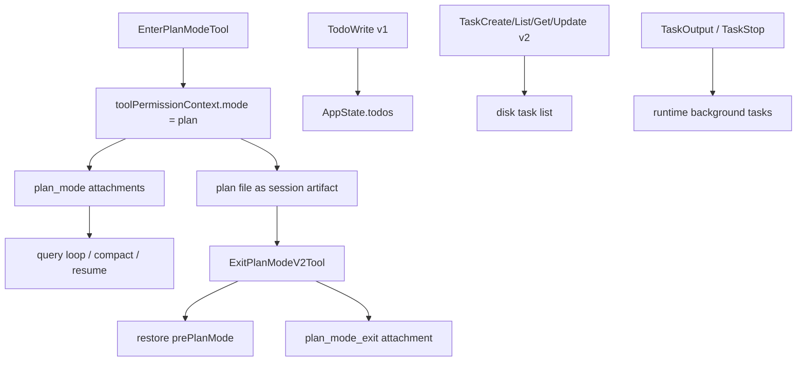

# 深度拆解：Planning, Compaction, And Assistant

这一章的重点不是“Claude Code 会不会写计划”，而是：

**Plan Mode、compact、todo/task 到底是怎么作为运行时机制接起来的。**

从这份公开镜像能直接看出的结论是：

- Plan Mode 不是一段提示词，而是权限模式 + attachment + plan 文件三件事同时成立
- compact 不是单一路径，至少有三条不同实现
- `TodoWrite` v1、`Task*` v2、后台 runtime task 不是同一套系统

## 这部分负责什么

这一层主要负责四件事：

1. 把会话切进“先探索、先写计划”的受限模式
2. 把 plan 文件当成 session artifact 管理
3. 在上下文过长时选择合适的 compact 路径
4. 让 todo、task list、后台任务分别落到各自的存储和运行时层

## 关键文件

- `restored-src/src/services/compact/microCompact.ts`
  - 请求前的轻量上下文削减
- `restored-src/src/services/compact/sessionMemoryCompact.ts`
  - 用 session memory 直接替代传统摘要 compact
- `restored-src/src/services/compact/compact.ts`
  - full compact / partial compact 主流程
- `restored-src/src/services/compact/autoCompact.ts`
  - 自动 compact 的调度与优先级
- `restored-src/src/services/compact/apiMicrocompact.ts`
  - API 层原生 `contextManagement` / cache edits 入口
- `restored-src/src/tools/EnterPlanModeTool/EnterPlanModeTool.ts`
  - 进入 Plan Mode
- `restored-src/src/tools/ExitPlanModeTool/ExitPlanModeV2Tool.ts`
  - 退出 Plan Mode
- `restored-src/src/utils/attachments.ts`
  - `plan_mode / plan_mode_reentry / plan_mode_exit` 的常规 attachment 注入
- `restored-src/src/bootstrap/state.ts`
  - 退出 Plan Mode 后的状态标记
- `restored-src/src/tools/TodoWriteTool/TodoWriteTool.ts`
  - v1 todo
- `restored-src/src/utils/tasks.ts`
  - v2 task list 的磁盘模型与共享逻辑
- `restored-src/src/tools/TaskCreateTool/`
- `restored-src/src/tools/TaskGetTool/`
- `restored-src/src/tools/TaskListTool/`
- `restored-src/src/tools/TaskUpdateTool/`
  - v2 task list 工具
- `restored-src/src/tools/TaskOutputTool/TaskOutputTool.tsx`
  - 后台 runtime task 输出查看器，当前已是 deprecated 兼容层
- `restored-src/src/tools/TaskStopTool/TaskStopTool.ts`
  - 后台 runtime task 停止器

## 执行流

### 1. `microcompact` 不是小号 `compact`

`microCompact.ts` 这条链做的事情很克制：

- 优先看 time-based trigger
- 命中时，直接把旧 `tool_result.content` 清成占位文本
- 若没命中，再尝试 cached microcompact
- 仍不满足，就直接 no-op

也就是说，`microcompact` 的目标是“尽量不做摘要，只先减掉旧工具结果”，而不是生成 compact summary。

更细一点看，还有两条不同实现：

- time-based microcompact
  - 真正改本地消息内容
- cached microcompact
  - 本地消息不变，只登记 `pendingCacheEdits`，交给 API 请求层去做 cache edits

### 2. API 层还有一条原生 context-edit 路径

`apiMicrocompact.ts` 和 API 侧的 `contextManagement` 是另一件事。

它和 `microcompactMessages()` 的关系是：

- `microcompactMessages()` 决定本地消息要不要改，或要不要登记 cache edits
- API 层再单独把这些 edits 变成真正的请求参数

所以这两者不能混写成“同一个 compact 功能”。

### 3. 自动 compact 会优先尝试 `session-memory compact`

`autoCompactIfNeeded()` 的顺序很明确：

1. 判断是否超过 auto compact 阈值
2. 先尝试 `trySessionMemoryCompaction()`
3. 只有失败后才回退到 `compactConversation()`

这说明 Claude Code 不是无脑走“摘要一次”，而是先看 session memory 能不能直接承担摘要角色。

### 4. `session-memory compact` 是替代路径，不是 reinjection 完整版

`sessionMemoryCompact.ts` 会：

- 读取 session memory
- 依据 `lastSummarizedMessageId` 计算保留尾巴
- 过滤旧 compact boundary
- 把 session memory 当作 summary
- 拼出新的 boundary、summary、hooks 和保留消息

但它有一个很重要的边界：

**这条路径补回的 attachment 很窄。**

当前源码里能看到的只有可选的 `plan_file_reference`，没有 full/partial compact 那种：

- `plan_mode`
- `invoked_skills`
- async task
- tool delta
- MCP delta

因此它更像“一条省成本、保持连续性优先的替代 compact 路径”。

### 5. full compact 与 partial compact 会显式重建后置上下文

`compactConversation()` 的职责是：

- 真的生成 compact summary
- 清理 read state
- 补回 compact 后继续工作需要的 attachment

当前可直接确认会被补回的内容包括：

- 文件附件
- `plan_file_reference`
- `plan_mode`
- skill 附件
- async agent 附件
- deferred tool / agent listing / MCP delta

`partialCompactConversation()` 的差别不在“会不会补”，而在“只压哪一侧”：

- `from`：保留前缀，摘要后缀
- `up_to`：摘要前缀，保留后缀

它和 full compact 的 attachment 重建逻辑基本同构，只是摘要边界不同。

### 6. Plan Mode 的持续约束不只靠 permission mode

Plan Mode 的本体当然是：

- `toolPermissionContext.mode === 'plan'`

但单靠这个状态不够，因为 compact、resume 和长会话都会让模型丢失“当前仍在 plan mode”的上下文。

所以源码里还专门有 attachment 体系来补这件事：

- `plan_mode`
- `plan_mode_reentry`
- `plan_mode_exit`

常规会话中，`attachments.ts` 会按 turn 周期性注入 `plan_mode`；退出后再发一次 `plan_mode_exit`；如果之后重新回到实现阶段再进入计划相关上下文，还可能发 `plan_mode_reentry`。

更关键的一点是：

- compact 专用的 `createPlanModeAttachmentIfNeeded()` 固定发送 `reminderType: 'full'`

这说明 compact 后的计划约束是故意重新完整提醒一遍，而不是沿用平时的 sparse 节流策略。

### 7. `EnterPlanMode` 与 `ExitPlanMode` 负责真正切模式

`EnterPlanModeTool` 会：

- 校验当前上下文不是 agent context
- 准备 Plan Mode 上下文
- 把 permission mode 切成 `plan`

`ExitPlanModeV2Tool` 会：

- 校验当前真的还在 `plan`
- 处理 plan 文件与批准逻辑
- 恢复到 `prePlanMode`
- 设置 `hasExitedPlanMode` 与 `needsPlanModeExitAttachment`

因此更准确的描述应该是：

- attachment 负责把约束继续告诉模型
- tool 负责真正切权限模式和会话状态

### 8. `TodoWrite` v1 与 `Task*` v2 是两套体系

`TodoWrite`：

- 只在 `!isTodoV2Enabled()` 时启用
- 写到 `AppState.todos`
- 偏会话内、轻量、非持久化

`TaskCreate/Get/List/Update`：

- 在 `isTodoV2Enabled()` 时启用
- 写入磁盘 JSON task list
- 支持 `owner`、依赖、`metadata`
- 可跨 teammate / team 共享

这两套东西不能混成“一个 todo 系统”。

### 9. `TaskOutput` / `TaskStop` 处理的是后台 runtime task

这又是第三套东西。

`TaskOutputTool` 和 `TaskStopTool` 面向的是运行中的后台任务，例如：

- `local_bash`
- `local_agent`
- `remote_agent`

它们不对应 v2 task list 里的条目，而是对应 runtime task framework。

当前更强的一手信号是：

- runtime task 完成时会发 `task-notification`
- 通知里会尽量带 `output-file`
- `task_status` attachment 也会补 `outputFilePath`
- post-compact 提示文本会优先引导模型去 `Read` 这个输出文件

所以 `TaskOutputTool` 现在更像兼容层，而不是主路径。

## 一张图看 compact 分层

## 一张图看 Plan Mode 与 task 分层

## 为什么这个设计重要

这里真正重要的地方，是 Claude Code 没有把“计划”和“上下文压缩”做成一段模糊的提示词。

它把这些能力拆成了明确的运行时层：

- 计划模式是权限模式
- 计划持续性靠 attachment 和 plan file
- compact 至少有三条不同路径
- todo、task list、后台 runtime task 各自独立

这也是为什么它能在长链路工作里同时维持：

- 规划阶段约束
- compact 后连续性
- 后台任务可追踪性

## 推荐阅读顺序

1. `restored-src/src/tools/EnterPlanModeTool/EnterPlanModeTool.ts`
2. `restored-src/src/tools/ExitPlanModeTool/ExitPlanModeV2Tool.ts`
3. `restored-src/src/utils/attachments.ts`
4. `restored-src/src/services/compact/microCompact.ts`
5. `restored-src/src/services/compact/sessionMemoryCompact.ts`
6. `restored-src/src/services/compact/compact.ts`
7. `restored-src/src/services/compact/autoCompact.ts`
8. `restored-src/src/tools/TodoWriteTool/TodoWriteTool.ts`
9. `restored-src/src/utils/tasks.ts`
10. `restored-src/src/tools/TaskCreateTool/`
11. `restored-src/src/tools/TaskUpdateTool/`
12. `restored-src/src/tools/TaskOutputTool/TaskOutputTool.tsx`
13. `restored-src/src/tools/TaskStopTool/TaskStopTool.ts`

## 仍待确认

- `session-memory compact` 不补 `plan_mode` attachment，到底是有意为之还是尚未补齐，单靠当前源码还不能下结论。
- cached microcompact、`tengu_session_memory`、plan mode interview phase 等开关的线上默认状态，不能从静态源码推出。
- `TaskOutputTool` 虽然已经明显走向 deprecated 兼容层，但未来是否彻底移除，当前也不能从这份快照确认。
