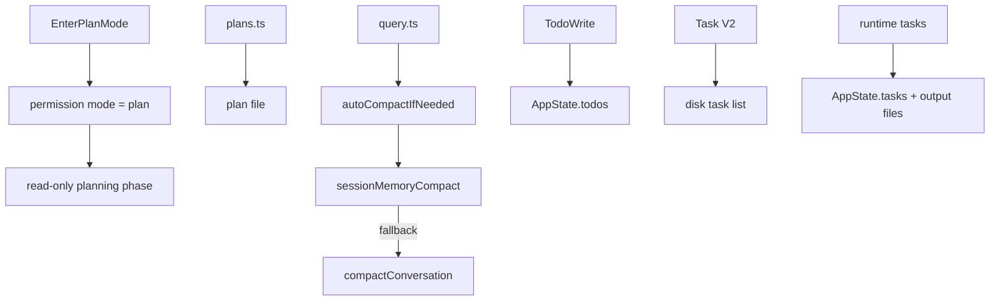

[简体中文](./README.md) | [English](./README.en.md)

# Planning, Compaction, And Assistant In One Minute

Keep this short mental model:

Claude Code splits “design first,” “persist the plan,” “shrink long context,” and “track work” into four separate runtime mechanisms.

## Three Takeaways

- `Plan Mode` is a mode switch, not the same thing as the plan file
- compaction has multiple paths, and autocompact tries the session-memory path first
- `TodoWrite`, Task V2, and runtime tasks are different objects

## Read Next

- overview: [README.en.md](../README.en.md)
- deep dive: [DEEP/README.en.md](../DEEP/README.en.md)
