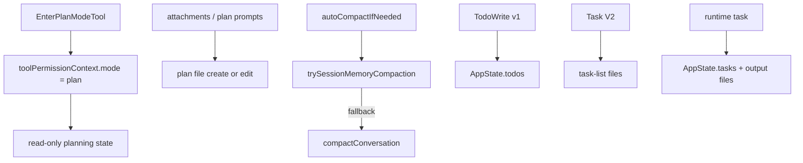

[简体中文](./README.md) | [English](./README.en.md)

# Planning, Compaction, And Assistant In One Minute

This chapter makes more sense if you split it into parallel mechanisms:

## Three Takeaways

- `Plan Mode` combines permission state and follow-up prompt attachments
- the plan file is a separate artifact
- `TodoWrite`, Task V2, and runtime tasks are three different layers

## Read Next

- overview: [README.en.md](../README.en.md)
- deep dive: [DEEP/README.en.md](../DEEP/README.en.md)
