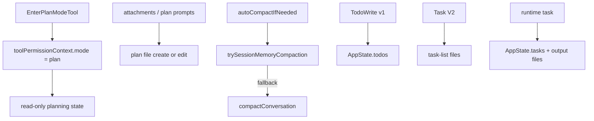

# 1 分钟看懂 Planning, Compaction, And Assistant

Claude Code 的这部分更适合先拆成几条并行机制：

如果你经常好奇“为什么它会记住计划、又能在长会话里继续推进”，这页就是最短入口。

## 核心理解

- `Plan Mode` 不是一句提示词，而是权限态加上后续 attachment 提醒
- plan 文件是独立 artifact，但不是进入 Plan Mode 的同步副作用
- `compact` 至少分成 session-memory、full、partial 等几条路径
- `TodoWrite`、Task V2、runtime task 不是同一套对象

## 下一步去哪里

- 想先抓大意：读 `README.md`
- 想继续跟源码：读 `DEEP/README.md`
