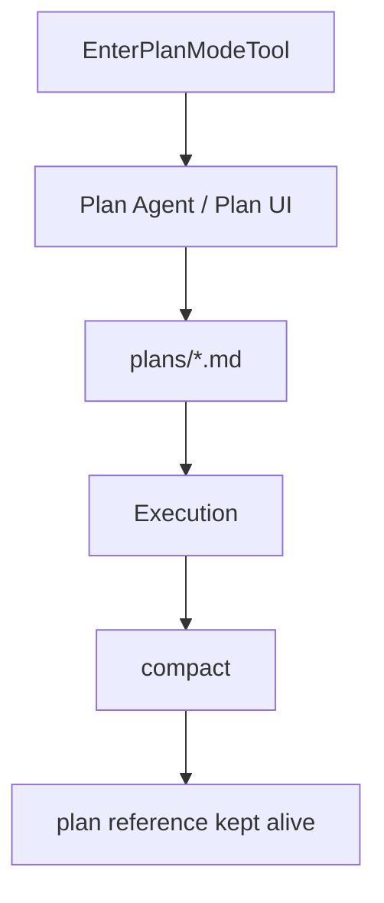

# 1 分钟看懂 Planning, Compaction, And Assistant

Claude Code 的规划链可以先这样理解：

```mermaid
flowchart TD
    A[EnterPlanModeTool] --> B[Plan Agent / Plan UI]
    B --> C[plans/*.md]
    C --> D[Execution]
    D --> E[compact]
    E --> F[plan reference kept alive]
```

## 核心理解

- `Plan Mode` 不是一句提示词
- 计划会落成文件
- 上下文压缩时，计划不会被简单丢掉
- `QueryEngine` 负责把这些对象真正串起来

