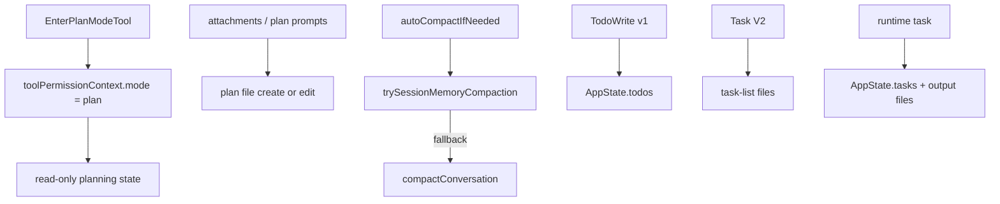

[简体中文](./README.md) | [English](./README.en.md)

# 1 分钟看懂 Planning, Compaction, And Assistant

这一章可以先拆成几条并行机制来看：

## 三个要点

- `Plan Mode` 是权限状态和附件提醒的组合
- plan 文件是独立 artifact
- `TodoWrite`、Task V2、runtime task 是三套不同对象

## 下一步去哪里

- 总览：[README.md](../README.md)
- 深读：[DEEP/README.md](../DEEP/README.md)
