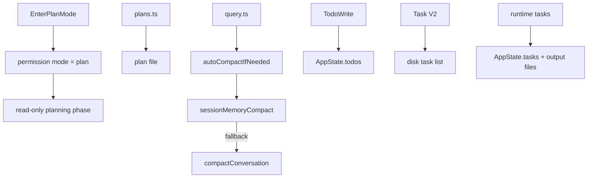

[简体中文](./README.md) | [English](./README.en.md)

# 1 分钟看懂 Planning, Compaction, And Assistant

最短心智模型如下：

Claude Code 把“先设计方案”“如何保存计划”“上下文变长时怎么压缩”“任务如何追踪”拆成了四套运行时机制。

## 三个要点

- `Plan Mode` 是模式切换，不等于 plan 文件本身
- compact 有多条路径，自动 compact 会先试 session-memory 路径
- `TodoWrite`、Task V2、runtime task 是三套对象

## 下一步去哪里

- 总览：[README.md](../README.md)
- 深读：[DEEP/README.md](../DEEP/README.md)
