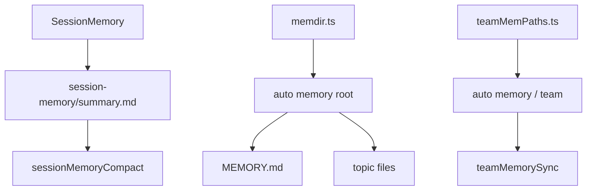
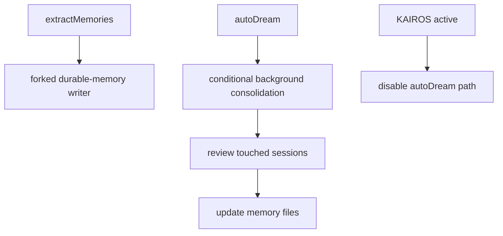

[简体中文](./README.md) | [English](./README.en.md)

# Deep Dive: Persistent Memory System

This chapter explains how Claude Code separates its memory system into three layers, then keeps those layers involved through attachments, scanning, sync, and background consolidation paths.

The public source mirror directly supports these conclusions:

- `SessionMemory` maintains `summary.md` for the current session
- durable memory uses `MEMORY.md` plus topic files for cross-session recall
- team memory lives in a `team/` subtree under auto memory and syncs through a dedicated watcher and service layer

## What This Layer Does

This layer owns four jobs:

1. maintaining summary-style memory for the current session
2. maintaining durable topic files for personal cross-session memory
3. maintaining a shared team subtree and sync path for team memory
4. triggering background consolidation when conditions are met

## Key Files

### Session Memory

- `_upstream/claude-code-sourcemap/restored-src/src/services/SessionMemory/sessionMemory.ts`
- `_upstream/claude-code-sourcemap/restored-src/src/services/SessionMemory/sessionMemoryUtils.ts`
- `_upstream/claude-code-sourcemap/restored-src/src/services/SessionMemory/prompts.ts`

### Durable Memory

- `_upstream/claude-code-sourcemap/restored-src/src/services/extractMemories/extractMemories.ts`
- `_upstream/claude-code-sourcemap/restored-src/src/memdir/memdir.ts`
- `_upstream/claude-code-sourcemap/restored-src/src/memdir/memoryScan.ts`

### Team Memory

- `_upstream/claude-code-sourcemap/restored-src/src/memdir/teamMemPaths.ts`
- `_upstream/claude-code-sourcemap/restored-src/src/services/teamMemorySync/index.ts`
- `_upstream/claude-code-sourcemap/restored-src/src/services/teamMemorySync/watcher.ts`
- `_upstream/claude-code-sourcemap/restored-src/src/services/teamMemorySync/types.ts`

### Conditional Consolidation

- `_upstream/claude-code-sourcemap/restored-src/src/services/autoDream/autoDream.ts`

## Source-Backed Walkthrough

### 1. `SessionMemory` serves current-session continuity only

`sessionMemory.ts` registers a post-sampling hook, checks thresholds, and uses a forked worker to update the current session’s `summary.md`. The file also states an important boundary directly: `SessionMemory` only runs on the main REPL thread.

That means:

- `SessionMemory` is not another name for durable memory
- it is the summary layer for the current session
- `sessionMemoryCompact` can consume it as a compaction input

### 2. Durable memory uses `MEMORY.md` plus topic files

`memdir.ts` directly defines the durable-memory structure:

- `MEMORY.md` is the index entrypoint
- detailed memories live in separate topic files
- topic files carry frontmatter
- `buildMemoryLines()` tells the model to keep details in topic files instead of stuffing full content into `MEMORY.md`

`extractMemories.ts` is the path that launches a forked worker to write new durable-memory files when thresholds are met.

### 3. Query-time recall is not the same as durable writing

`memoryScan.ts` provides directory scanning and manifest formatting for reading existing memory content during recall or extraction. It is not the writing path itself.

That boundary matters:

- durable writing is primarily owned by `extractMemories.ts`
- query-time recall is primarily owned by `memdir/*` scanning, indexing, and attachment logic

Public docs should keep “write” and “recall” separate.

### 4. Team memory is part of the auto-memory tree

`teamMemPaths.ts` defines the location directly:

- `getTeamMemPath()` returns `join(getAutoMemPath(), 'team')`

The same file also makes two constraints explicit:

- team memory requires auto memory to be enabled
- team-memory writes perform path validation and symlink-escape protection

So team memory is not a parallel product root. It is a shared subtree inside the auto-memory system.

### 5. Team-memory sync is a separate service layer

`services/teamMemorySync/index.ts` handles pull, push, checksums, conflicts, and entry limits. `watcher.ts` handles directory watching, initial pull, debounced push, and retry suppression.

The visible source also confirms several public-facing boundaries:

- team-memory sync requires first-party OAuth
- team-memory sync requires a GitHub repo identity
- the watcher starts only when the `TEAMMEM` gate and team-memory availability checks pass

### 6. `loadMemoryPrompt()` conditionally combines auto and team memory

Inside `memdir.ts`, `loadMemoryPrompt()` chooses among:

- an auto-memory prompt
- a combined auto + team prompt
- a KAIROS daily-log prompt

That branching shows that KAIROS, team memory, and auto memory interact conditionally. Public docs should not flatten those branches into one fixed product model.

### 7. `autoDream` is a conditional background consolidation path

`autoDream.ts` explicitly describes itself as background memory consolidation. It checks time thresholds, session thresholds, and a lock before launching a forked worker.

The visible source includes two conservative points that must remain:

- when `getKairosActive()` is true, `autoDream` disables itself, and the file comments say KAIROS mode uses disk-skill dream
- the current files confirm the background consolidation path, but they do not settle the full public semantics of KAIROS or `/dream`

### 8. `SessionMemory`, durable memory, and team memory must stay separate

The easiest mistake in this chapter is to flatten everything into one vague “memory system.” The visible source requires more precise wording:

- `SessionMemory`: current-session summary for continuity and compaction
- durable memory: `MEMORY.md` plus topic files for personal cross-session recall
- team memory: the team subtree plus sync services for shared memory

These layers share some filesystem and prompt infrastructure. They do not share the same semantic boundary.

## Three Memory Layers

## Background Consolidation

## Conservative Boundaries

- keep `SessionMemory`, durable memory, and team memory as three separate layers
- keep team memory framed as a subtree under auto memory rather than a separate product root
- keep `autoDream`, KAIROS daily-log mode, and `/dream` conditional rather than fixed public semantics
- static source does not tell us the live default rollout state of the memory gates

## Read Next

- overview: [../README.en.md](../README.en.md)
- quick guide: [../SIMPLE/README.en.md](../SIMPLE/README.en.md)
- short comparison: [../comparison.en.md](../comparison.en.md)
