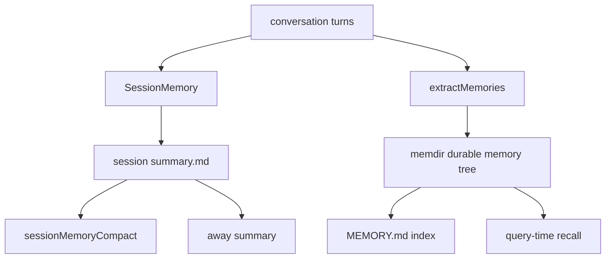
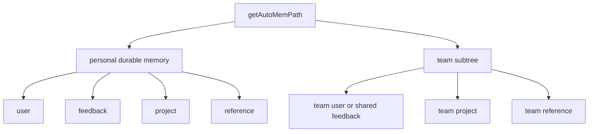

# 深度拆解：Persistent Memory System

这一章最容易被误解的地方，是大家会把 Claude Code 的 memory 想成“一个 `CLAUDE.md` 文件”。

但从公开镜像来看，更准确的结构是两条并行链：

- **session continuity**：`SessionMemory`
- **durable recall**：`memdir + extractMemories`

它们会互相配合，但不是同一套系统的上下两层。

## 这部分负责什么

这一层主要负责四件事：

1. 定义 durable memory 存在哪、怎么被注入 prompt
2. 在当前会话内持续维护 session 级摘要
3. 在回合结束后把值得长期保留的信息写入 durable memory
4. 给 team memory 提供路径边界与作用域规则

## 关键文件

- `restored-src/src/services/SessionMemory/sessionMemory.ts`
  - session 级 `summary.md` 的更新主流程
- `restored-src/src/services/SessionMemory/sessionMemoryUtils.ts`
  - session memory 阈值、运行态、读取与等待
- `restored-src/src/services/SessionMemory/prompts.ts`
  - `summary.md` 模板和更新 prompt
- `restored-src/src/services/extractMemories/extractMemories.ts`
  - turn-end durable memory 提取器
- `restored-src/src/services/extractMemories/prompts.ts`
  - durable memory 提取 prompt
- `restored-src/src/memdir/memdir.ts`
  - durable memory 的 prompt 注入层与 `MEMORY.md` 入口规则
- `restored-src/src/memdir/memoryTypes.ts`
  - durable taxonomy 与禁止保存项
- `restored-src/src/memdir/paths.ts`
  - auto memory 根目录解析与校验
- `restored-src/src/memdir/teamMemPaths.ts`
  - team memory 子树路径、键清洗与 containment 校验
- `restored-src/src/memdir/memoryScan.ts`
  - memory frontmatter 扫描
- `restored-src/src/memdir/findRelevantMemories.ts`
  - query-time 相关 durable memory 选择

## 执行流

### 1. `SessionMemory` 负责当前会话的 `summary.md`

`SessionMemory` 这条链是 session-local 的。

它会在满足条件时：

- 创建当前 session 的 `summary.md`
- 用 forked agent 更新它
- 把它提供给 `sessionMemoryCompact` 和 away summary 使用

这不是 durable memory，也不是 topic file。

当前源码里能确认的物理形态，是类似：

- `~/.claude/projects/<project>/<sessionId>/session-memory/summary.md`

并且它的权限是：

- 目录 `0700`
- 文件 `0600`

更重要的是，它的写入边界非常窄：

- 更新子代理只能 `Edit` 当前这一个 `summary.md`
- 不允许随便读写其它 memory 文件

### 2. `SessionMemory` 的触发条件很克制

这条链不会每轮都跑。

它至少会看：

- 总 token 是否达到初始化阈值
- 距上次摘要后增长的 token 是否够
- 工具调用数是否够
- 最后一轮 assistant 是否仍带 tool call

另外还有两个重要前提：

- 只在 `repl_main_thread` 运行
- 只在 auto-compact 开启时注册 hook

所以它更像“为了长会话连续性服务的后台摘要器”，而不是通用 memory 引擎。

### 3. `extractMemories` 负责 durable memory 写入

`extractMemories.ts` 是另一条完全不同的链。

它的触发点在 turn-end stop hook 之后，目标是：

- 从最近对话里提取值得长期保留的信息
- 写入 memdir 管理的 durable memory 文件

这里要特别强调两个边界：

- 它自己不是 memory model，本质是一个后台 writer
- 它写的不是 session `summary.md`，而是 durable memory 树里的文件

当前源码还能确认一个关键去重逻辑：

- 如果主代理这一轮已经直接写过 auto memory
- 那么后台 extractor 会跳过这轮，避免双写

### 4. `memdir` 定义 durable memory 的制度层

`memdir` 这层真正负责 durable memory 的规则：

- 根目录在哪里
- `MEMORY.md` 如何作为入口索引
- taxonomy 有哪些
- 什么内容不应该被写进去
- private / team 作用域怎么区分
- query-time 如何扫描和召回

也就是说，durable memory 的“语义”不在 `extractMemories` 里，而在 `memdir` 里。

### 5. durable taxonomy 是闭集四类

当前源码里，durable taxonomy 是闭集四类：

- `user`
- `feedback`
- `project`
- `reference`

这四类之外，没有 `session` 这一类。

同时，源码还明确要求 durable memory **不要**保存这些内容：

- 代码结构
- 架构模式
- git 历史
- debug recipe
- `CLAUDE.md` 已有内容
- 当前会话的临时任务状态

这恰好说明 durable memory 与 `SessionMemory` 是刻意分层的：

- `SessionMemory` 可以保留当前会话连续性
- durable memory 只保留未来会话仍值得记住的内容

### 6. team memory 是 auto memory 根下的子树

这点很重要，也很容易写错。

当前源码里，team memory 不是独立根目录，而是：

- `getAutoMemPath()/team/`

因此在 combined 模式下：

- personal durable memory
- team durable memory

实际上位于同一棵 auto-memory 树中。

这也是为什么 `extractMemories` 只要被允许写 `isAutoMemPath(file_path)`，就天然可以覆盖 personal 和 team 两类 durable memory。

### 7. team memory 的边界不只是字符串前缀判断

`teamMemPaths.ts` 这部分值得单独看，因为它把路径边界写得非常具体。

当前能确认的防线包括：

- `sanitizePathKey()`
  - 拒绝 null byte
  - 拒绝 URL 编码 traversal
  - 拒绝 Unicode NFKC 归一化后的 traversal
  - 拒绝反斜杠与绝对路径
- `validateTeamMemKey()`
  - 做 key 层面的基础合法性校验
- `validateTeamMemWritePath()`
  - 做 `resolve() + realpathDeepestExisting()` 的 containment 校验
  - 防 symlink escape

但这里也要保守一点：

- 当前能直接确认 team sync 写入会用到这套校验
- 不能直接写成“所有本地 team memory 写路径都统一经过了这套 validator”

这部分应继续放进“仍待确认”。

## 一张图看两条 memory 主线

## 一张图看 durable memory 结构

## 为什么这个设计重要

这套设计真正厉害的地方，不是“有记忆”，而是把不同时间尺度的记忆分开了：

- 当前会话连续性：`SessionMemory`
- 跨会话可复用知识：`memdir + extractMemories`

这样做的直接好处是：

- session 摘要可以大胆服务 compact 和长会话续航
- durable memory 不会被当前会话的噪声污染
- team memory 可以在同一套 durable 树里增加共享层，但仍保留边界控制

## 推荐阅读顺序

1. `restored-src/src/services/SessionMemory/sessionMemory.ts`
2. `restored-src/src/services/SessionMemory/sessionMemoryUtils.ts`
3. `restored-src/src/services/SessionMemory/prompts.ts`
4. `restored-src/src/memdir/memoryTypes.ts`
5. `restored-src/src/memdir/memdir.ts`
6. `restored-src/src/memdir/paths.ts`
7. `restored-src/src/memdir/teamMemPaths.ts`
8. `restored-src/src/services/extractMemories/extractMemories.ts`
9. `restored-src/src/memdir/memoryScan.ts`
10. `restored-src/src/memdir/findRelevantMemories.ts`

## 仍待确认

- `validateTeamMemWritePath()` 虽然定义得很完整，但当前能直接确认的调用链主要在 team sync 路径；不能写成“所有本地写入都已统一经过它”。
- `FileWriteTool` / `FileEditTool` 自身是否还叠加了额外的 symlink/path 安全措施，这次没有一起复核。
- 各类 `tengu_* / TEAMMEM / EXTRACT_MEMORIES / KAIROS` gate 的线上默认状态，不能从静态源码直接推出。
