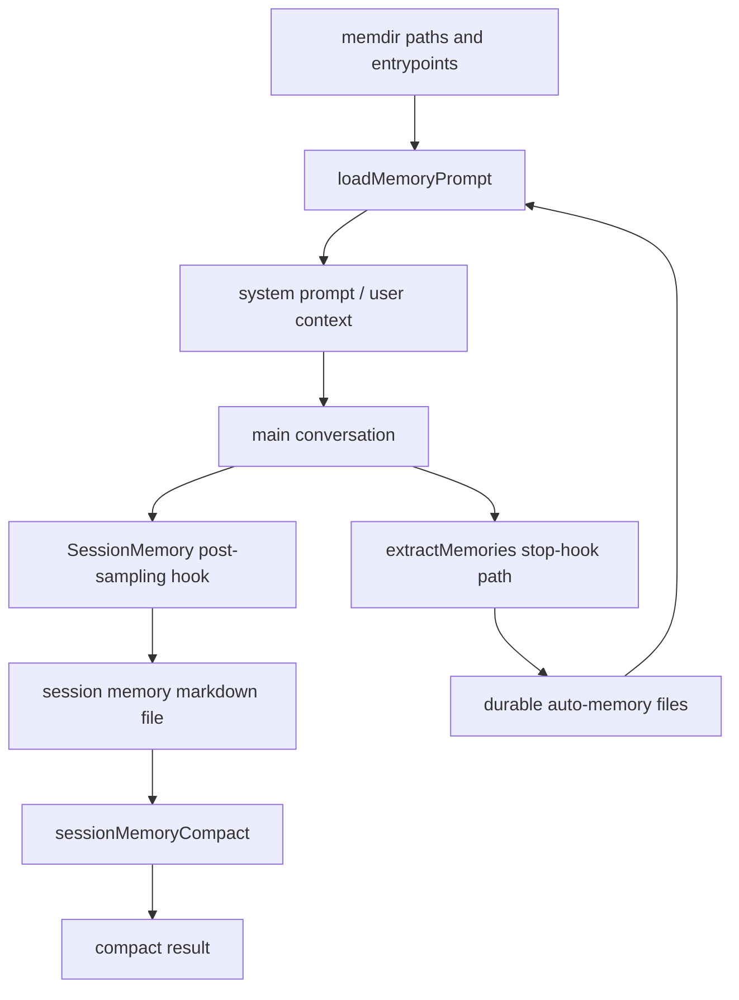

# 深度拆解：Persistent Memory System

这一章要回答的核心问题是：**Claude Code 的 memory 为什么不是一个单文件提示词，而是一条持续运转的上下文链。**

公开镜像里最值得注意的一点是：memory 至少分成了“目录与入口”“会话内笔记”“后台提炼”“compact 续航”几层，而不是只有一个 `CLAUDE.md`。

## 这部分负责什么

这部分负责四件事：

1. 决定 memory 写到哪里、怎么注入 prompt
2. 在会话过程中维护 session memory 文件
3. 在完整 query loop 结束后提炼 durable memory
4. 在 compact 之后尽量保留连续性

## 关键文件

- `restored-src/src/memdir/paths.ts`
  - 负责 auto memory 路径解析、override、路径安全约束
- `restored-src/src/memdir/memdir.ts`
  - 负责 `loadMemoryPrompt()`
- `restored-src/src/memdir/memoryTypes.ts`
  - 负责 memory 类型定义
- `restored-src/src/memdir/teamMemPaths.ts`
  - 负责 team memory 路径逻辑
- `restored-src/src/services/SessionMemory/sessionMemory.ts`
  - 负责 session memory 的后台更新
- `restored-src/src/services/SessionMemory/sessionMemoryUtils.ts`
  - 负责阈值、状态、等待与读取辅助函数
- `restored-src/src/services/SessionMemory/prompts.ts`
  - 负责 session memory 模板和更新 prompt
- `restored-src/src/services/extractMemories/extractMemories.ts`
  - 负责 durable memory 提炼
- `restored-src/src/services/extractMemories/prompts.ts`
  - 负责 durable memory 提炼 prompt
- `restored-src/src/services/compact/sessionMemoryCompact.ts`
  - 负责利用 session memory 做 compact

## 执行流

### 1. `memdir` 先决定“memory 在哪里”

`restored-src/src/memdir/paths.ts` 不是简单拼路径。

从文件注释和实现可以确认：

- auto memory 可以有 override
- 路径解析有明确优先级
- 路径会做安全检查，避免把危险目录直接当成 memory 根目录
- `getAutoMemPath()`、`getAutoMemEntrypoint()`、`isAutoMemPath()` 是这层的核心入口

也就是说，“memory 存哪儿”在源码里是一个被认真处理的系统问题。

### 2. `loadMemoryPrompt()` 决定“memory 怎么进 prompt”

`restored-src/src/memdir/memdir.ts` 里的 `loadMemoryPrompt()` 是这层最关键的入口。

它会根据当前状态选择不同路径：

- auto memory
- team memory
- 特定 gate 下的 daily-log 路径

并且会在注入 prompt 之前确保目录存在。

这意味着 memory 并不是静态文本，而是运行时动态装配出来的一段能力说明。

### 3. `SessionMemory` 负责会话内持续笔记

`restored-src/src/services/SessionMemory/sessionMemory.ts` 文件开头的注释已经说得很直接：

- session memory 会维护一个 markdown 文件
- 它会在后台周期性更新
- 它用 forked subagent 提炼信息
- 它尽量不打断主会话

更细一点看，可以确认这些事实：

- 它通过 post-sampling hook 触发
- 只在 `querySource === 'repl_main_thread'` 时运行
- 需要满足 token threshold 和 tool call threshold 才会触发更新
- 更新前会先准备 session memory 文件
- 真正的提炼由 `runForkedAgent()` 完成

这说明 session memory 不是“compact 之后临时写个总结”，而是一条单独运行的后台维护链。

### 4. `extractMemories` 负责 durable memory 提炼

`restored-src/src/services/extractMemories/extractMemories.ts` 的文件注释也非常关键。

源码明确写了：

- 它从当前 session transcript 提取 durable memories
- 它在一次完整 query loop 结束时运行
- 触发点在 `handleStopHooks`
- 它使用的是 forked agent pattern

更重要的是，这个文件还明确实现了一个专门的 `createAutoMemCanUseTool()`：

- 允许 `Read` / `Grep` / `Glob`
- 允许只读 `Bash`
- 只允许在 auto memory 目录内 `Edit` / `Write`

这说明 durable memory 提炼不是放任后台 agent 任意操作，而是做了专门工具约束。

### 5. `sessionMemoryCompact` 负责 compact 之后的续航

`restored-src/src/services/compact/sessionMemoryCompact.ts` 里，`trySessionMemoryCompaction()` 会：

1. 先检查是否允许走 session memory compaction
2. 等待正在进行的 session memory extraction 完成
3. 读取 session memory 文件
4. 如果文件为空模板，就回退到传统 compact
5. 如果有内容，就拿 session memory 作为 summary 构造 compaction result

这里非常重要，因为它说明：

- session memory 不是旁路产物
- 它会反过来参与 compact
- 它的目标是让 compact 之后还能尽量保持会话连续性

## 一张图看 memory pipeline

## 为什么这个设计重要

这一层最重要的价值，不是“有记忆”，而是**把不同时间尺度的记忆接起来了**。

可以把它粗略理解成三层：

- 第一层：prompt 注入层
  - 让模型知道 memory 目录、入口文件、使用方式
- 第二层：session continuity 层
  - 让当前会话不断沉淀结构化笔记
- 第三层：durable memory 层
  - 让完整会话结束后，值得长期保留的信息进入 memory 目录

再加上 `sessionMemoryCompact`，这套设计才真正解释了“为什么它长链工作时不那么容易失忆”。

## 推荐阅读顺序

建议按下面顺序看：

1. `restored-src/src/memdir/paths.ts`
2. `restored-src/src/memdir/memdir.ts`
3. `restored-src/src/services/SessionMemory/sessionMemory.ts`
4. `restored-src/src/services/SessionMemory/sessionMemoryUtils.ts`
5. `restored-src/src/services/extractMemories/extractMemories.ts`
6. `restored-src/src/services/compact/sessionMemoryCompact.ts`

## 已确认的事实

- `loadMemoryPrompt()` 是 memory 注入入口，且会在目录存在性上做准备
- session memory 是 post-sampling hook 驱动，不是手动摘要
- session memory 更新走 `runForkedAgent()`
- durable memory extraction 在完整 query loop 结束后运行
- durable memory extraction 有专门的 `canUseTool` 约束
- session memory 可以被 compact 逻辑重新利用

## 仍待确认

以下内容在公开镜像里有线索，但还不适合写成完整结论：

- team memory 在公开构建中的完整协作体验
- `KAIROS` 下 daily log 的完整产品语义
- memory 与某些云端/远程模式是否还有额外分支

这些点后续只保留为“有代码线索，但不做重结论”。
