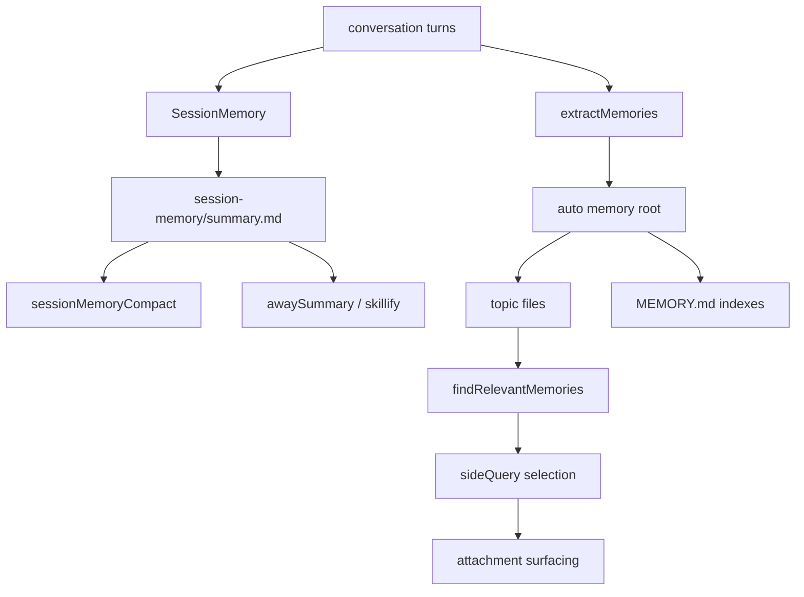
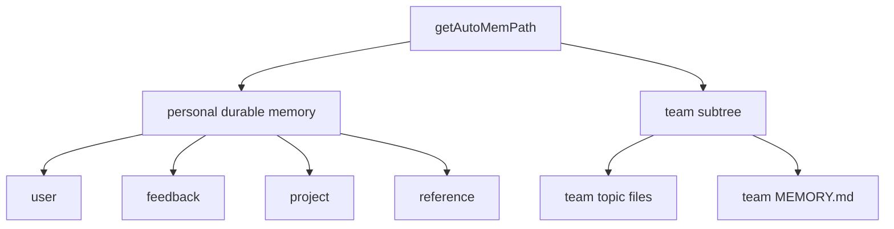

# 深度拆解：Persistent Memory System

这一章最容易被误解的地方，是大家会把 Claude Code 的 memory 想成“一个 `CLAUDE.md` 文件”。

但从公开镜像来看，更准确的结构是两条并行链：

- **session continuity**：`SessionMemory`
- **durable recall**：`memdir + extractMemories`

它们会互相配合，但不是同一套系统的上下两层。

## 这部分负责什么

这一层主要负责四件事：

1. 定义 durable memory 存在哪、怎么进入 system prompt 与 recall 流程
2. 在当前会话内维护 session 级 `summary.md`
3. 在回合结束后把值得长期保留的信息写入 durable memory
4. 给 team memory 提供路径边界与作用域规则

## 关键文件

### Session memory

- `restored-src/src/services/SessionMemory/sessionMemory.ts`
  - session 级摘要更新主流程
- `restored-src/src/services/SessionMemory/sessionMemoryUtils.ts`
  - 配置、阈值、等待与读取
- `restored-src/src/services/SessionMemory/prompts.ts`
  - `summary.md` 模板、更新 prompt、compact 截断
- `restored-src/src/utils/permissions/filesystem.ts`
  - `session-memory/summary.md` 的真实路径定义

### Durable memory

- `restored-src/src/services/extractMemories/extractMemories.ts`
  - turn-end durable memory writer
- `restored-src/src/services/extractMemories/prompts.ts`
  - durable / team extraction prompt
- `restored-src/src/memdir/memdir.ts`
  - durable memory 的 prompt 注入层
- `restored-src/src/memdir/paths.ts`
  - `getAutoMemPath()` 与 auto memory 根目录解析
- `restored-src/src/memdir/memoryTypes.ts`
  - taxonomy 与不该保存的内容
- `restored-src/src/memdir/memoryScan.ts`
  - topic file 扫描
- `restored-src/src/memdir/findRelevantMemories.ts`
  - query-time recall

### Team memory

- `restored-src/src/memdir/teamMemPaths.ts`
  - `team/` 子树路径、键清洗、路径校验
- `restored-src/src/memdir/teamMemPrompts.ts`
  - team memory prompt 文案

## 执行流

### 1. `SessionMemory` 负责当前会话的 `summary.md`

`SessionMemory` 这条链是 session-local 的。

路径来自：

- `getSessionMemoryDir()`
- `getSessionMemoryPath()`

当前公开源码里能直接确认它落在：

- `getProjectDir(getCwd()) / getSessionId() / session-memory / summary.md`
- 这条路径定义在 `utils/permissions/filesystem.ts`

也就是说，它在项目会话目录里，不在 durable memory 根目录里。

它的典型使用链是：

1. `setup.ts` 启动时调用 `initSessionMemory()`
2. 注册 post-sampling hook
3. 满足阈值后用 forked agent 更新 `summary.md`
4. 后续被 `sessionMemoryCompact`、`awaySummary`、`skillify` 这类路径读取

这条链的边界很明确：

- 它服务会话连续性
- 不是 durable memory
- 也不是 topic file

### 2. Session memory 的写权限非常窄

`SessionMemory` 后台 fork 的权限模型比 durable memory 更窄。

当前可以直接确认：

- 更新子代理只能 `Edit` 当前这一份 `summary.md`
- 不是在整个 memory 根里自由读写

这也是为什么文档里应把它写成：

- “当前会话的摘要文件”

而不是：

- “通用记忆写入器”

### 3. `extractMemories` 负责 durable memory 写入

`extractMemories.ts` 是另一条完全不同的链。

它的触发点在：

- `query/stopHooks.ts` 的回合结束阶段

目标是：

- 从最近对话里提取值得长期保留的信息
- 写入 auto memory 根内的 durable memory 文件

这里要特别强调两点：

- 它自己不是 memory model，本质是一个后台 writer
- 它写的不是 `session-memory/summary.md`

当前源码还能确认一个重要的去重边界：

- 如果主代理本轮已经直接写过 auto memory
- 后台 extractor 会跳过这轮，避免重复写入

而且这条链还有一个很实用的收边：

- 它不会把自己写成新的会话摘要
- 它写的是 auto memory 根里的 durable files

### 4. `memdir` 定义 durable memory 的制度层

`memdir` 这层真正负责 durable memory 的规则：

- 根目录在哪
- `MEMORY.md` 怎么作为入口索引
- taxonomy 是什么
- recall 怎么做
- team/private 作用域怎么区分

也就是说：

- `extractMemories` 负责写
- `memdir` 负责解释“什么叫 durable memory”

### 5. durable taxonomy 是闭集四类

当前源码里，durable taxonomy 是闭集四类：

- `user`
- `feedback`
- `project`
- `reference`

这四类定义在：

- `restored-src/src/memdir/memoryTypes.ts`

同时，源码还明确要求 durable memory 不要保存一些内容，例如：

- 临时任务状态
- 短期噪声
- 已经过时的执行细节

这正好说明 durable memory 与 `SessionMemory` 是刻意分层的：

- `SessionMemory` 可以保留当前会话连续性
- durable memory 只保留未来会话仍值得复用的知识

### 6. team memory 是 durable memory 根下的 `team/` 子域

这轮重新核读后，这一点可以写得更明确。

当前源码里，team memory 不是第三套独立根系统，而是：

- `getAutoMemPath()` 根下的 `team/` 子目录

并且：

- `isTeamMemoryEnabled()` 先检查 auto memory 是否开启
- 再检查 team gate

所以更稳妥的表述是：

- personal durable memory
- team durable memory

共享同一套 auto memory 根基础设施

### 7. relevant-memory 召回会递归扫到 `team/` 子树

`findRelevantMemories()` 这一层默认从：

- `getAutoMemPath()`

开始递归扫描 topic files。

因此当 team memory 开启时：

- `memory/team/` 下的 topic files 会进入候选集合

但这里还有一个很重要的过滤：

- basename 为 `MEMORY.md` 的索引文件不会进入这条 recall 链

也就是说：

- auto `MEMORY.md`
- team `MEMORY.md`

是两份独立索引文件

而相关召回主要面向 topic files，不是直接把索引文件整份塞回去。

### 8. private / team 归属更多体现在 prompt taxonomy，不是自动路由器

这是这一轮需要特别收紧的地方。

当前源码能确认：

- `memoryTypes.ts` 与 team prompt 文案会描述 private / team 的归属建议
- 但真正的硬边界主要是“目标路径是否落在 auto memory 根内”

如果往 team 子树写入，还会额外经过：

- `validateTeamMemWritePath()`
- `validateTeamMemKey()`

这两步会做字符串 containment 和 symlink-aware containment 校验。

所以文档里不要写成：

- “某个 type 会自动路由到 private 或 team”

更准确的写法是：

- type 和 scope 主要通过 prompt taxonomy 引导
- 代码硬边界主要是路径约束

## 一张图看两条 memory 链

## 一张图看 durable / team 结构

## 为什么这个设计重要

这套设计真正厉害的地方，不是“有记忆”，而是把不同时间尺度分开了：

- 当前会话连续性：`SessionMemory`
- 跨会话可复用知识：`durable memory`

这样做的好处是：

- session 摘要可以大胆服务 compact 和长会话续航
- durable memory 不会被当前会话的短期噪声污染
- team memory 可以在同一套 durable 树里增加共享层，但仍保留明确边界

## 推荐阅读顺序

1. `restored-src/src/services/SessionMemory/sessionMemory.ts`
2. `restored-src/src/services/SessionMemory/sessionMemoryUtils.ts`
3. `restored-src/src/services/SessionMemory/prompts.ts`
4. `restored-src/src/memdir/paths.ts`
5. `restored-src/src/memdir/memdir.ts`
6. `restored-src/src/memdir/memoryTypes.ts`
7. `restored-src/src/memdir/teamMemPaths.ts`
8. `restored-src/src/services/extractMemories/extractMemories.ts`
9. `restored-src/src/memdir/memoryScan.ts`
10. `restored-src/src/memdir/findRelevantMemories.ts`

## 仍待确认

- `team memories are synced at the beginning of every session` 这句话能在 prompt 文案里看到，但真实同步机制本轮没有继续展开到 `services/teamMemorySync/`，不能写成已完全证实事实。
- `manuallyExtractSessionMemory()` 的注释提到 `/summary`，但本轮没有在当前树里找到直接调用点。
- `KAIROS` 相关 nightly distillation 只能写成代码线索，不应写成当前构建已完整启用的事实。
