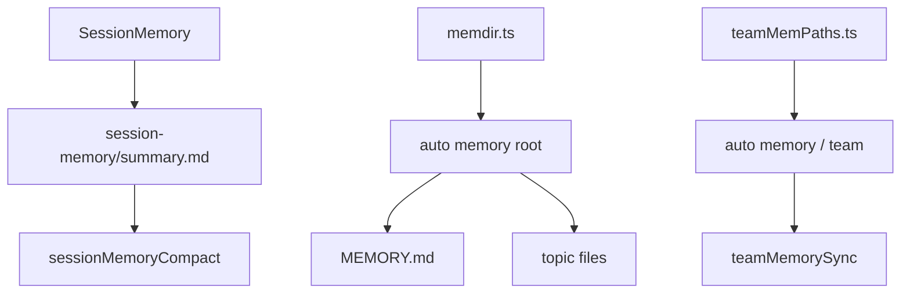
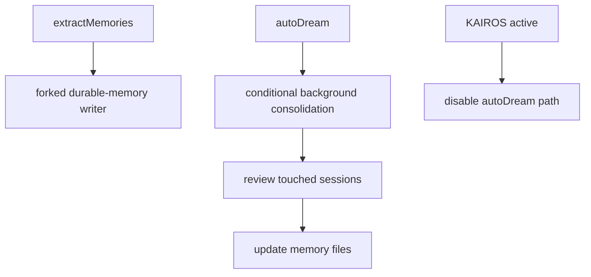

[简体中文](./README.md) | [English](./README.en.md)

# 深度拆解：Persistent Memory System

本章说明 Claude Code 的记忆系统如何分成三层，并通过附件、扫描、同步和后台整理机制继续参与长会话。

公开镜像可以直接支持以下结论：

- `SessionMemory` 维护当前会话的 `summary.md`
- durable memory 通过 `MEMORY.md` 加 topic files 保存跨会话记忆
- team memory 位于 auto memory 子树中的 `team/` 目录，并由 sync watcher 与服务端同步

## 这部分负责什么

这一层负责四件事：

1. 为当前会话维护摘要型记忆
2. 为个人跨会话记忆维护 durable topic files
3. 为团队共享记忆维护 team 子树与同步
4. 在满足条件时触发后台整理路径

## 关键文件

### Session memory

- `_upstream/claude-code-sourcemap/restored-src/src/services/SessionMemory/sessionMemory.ts`
- `_upstream/claude-code-sourcemap/restored-src/src/services/SessionMemory/sessionMemoryUtils.ts`
- `_upstream/claude-code-sourcemap/restored-src/src/services/SessionMemory/prompts.ts`

### Durable memory

- `_upstream/claude-code-sourcemap/restored-src/src/services/extractMemories/extractMemories.ts`
- `_upstream/claude-code-sourcemap/restored-src/src/memdir/memdir.ts`
- `_upstream/claude-code-sourcemap/restored-src/src/memdir/memoryScan.ts`

### Team memory

- `_upstream/claude-code-sourcemap/restored-src/src/memdir/teamMemPaths.ts`
- `_upstream/claude-code-sourcemap/restored-src/src/services/teamMemorySync/index.ts`
- `_upstream/claude-code-sourcemap/restored-src/src/services/teamMemorySync/watcher.ts`
- `_upstream/claude-code-sourcemap/restored-src/src/services/teamMemorySync/types.ts`

### 条件化整理路径

- `_upstream/claude-code-sourcemap/restored-src/src/services/autoDream/autoDream.ts`

## 源码主线

### 1. `SessionMemory` 只服务当前会话连续性

`sessionMemory.ts` 会在 post-sampling hook 中检查门限，然后通过 forked agent 更新当前会话的 `summary.md`。当前文件明确写了一个重要边界：`SessionMemory` 只在主 REPL 线程运行。

这条路径说明：

- `SessionMemory` 不是 durable memory 的别名
- 它是当前会话的摘要层
- 它还会被 `sessionMemoryCompact` 当作 compact 的优先输入

### 2. durable memory 由 `MEMORY.md` 和 topic files 组成

`memdir.ts` 里可以直接确认 durable memory 的组织方式：

- `MEMORY.md` 是索引入口
- 具体记忆写入单独 topic files
- topic files 带 frontmatter
- `buildMemoryLines()` 会要求模型把细节写进 topic files，而不是把正文塞进 `MEMORY.md`

`extractMemories.ts` 负责在合适时机启动 forked agent，把新信息写成 durable memory 文件。

### 3. query-time recall 与 durable write 不是同一动作

`memoryScan.ts` 提供目录扫描与 manifest 格式化能力，用于在 recall 或提取阶段读取已有记忆。它不等于写入本身。

这条边界很重要：

- durable write 主要由 `extractMemories.ts` 完成
- query-time recall 主要依赖 `memdir/*` 的扫描、索引和附件逻辑

公开文档不把“写入”和“召回”混成一个机制。

### 4. team memory 是 auto memory 子树的一部分

`teamMemPaths.ts` 直接定义了 team memory 的位置：

- `getTeamMemPath()` 返回 `join(getAutoMemPath(), 'team')`

同一个文件还明确要求：

- team memory 依赖 auto memory 已启用
- team memory 写入要做路径校验和 symlink 逃逸防护

这说明 team memory 不是并列于 auto memory 的另一套根目录。它是 auto memory 体系里的共享子树。

### 5. team memory sync 是独立服务层

`services/teamMemorySync/index.ts` 负责 pull、push、checksum、冲突与 entry 限制。`watcher.ts` 负责本地目录监听、初始 pull、debounced push 与失败抑制。

当前源码还能确认几个公开表述里值得保留的点：

- team memory sync 依赖 first-party OAuth
- team memory sync 依赖 GitHub repo 识别
- watcher 只在 `TEAMMEM` 开关与 team memory 可用时启动

### 6. `loadMemoryPrompt()` 会按条件组合 auto 与 team 记忆

`memdir.ts` 里，`loadMemoryPrompt()` 会根据当前配置选择：

- 纯 auto memory prompt
- auto + team 的 combined prompt
- KAIROS daily-log prompt

这条分支说明 KAIROS 与 team memory、auto memory 的交互是条件化的。公开文档不把任何一种分支写成唯一固定模式。

### 7. `autoDream` 是条件化后台整理路径

`autoDream.ts` 当前明确把自己描述成 background memory consolidation。它会在满足时间门限、session 数门限与锁条件后，启动一条 forked worker。

源码里还有两个必须保留的保守点：

- `getKairosActive()` 为真时，`autoDream` 直接关闭，并注释说明 KAIROS 模式使用 disk-skill dream
- 当前可见文件能确认 `autoDream` 的后台整理逻辑，不能把 KAIROS 和 `/dream` 的完整产品语义写死

### 8. `SessionMemory`、durable memory、team memory 必须三分

这一章最容易被写糊的地方就是把所有记忆都写成同一个“memory system”。当前源码要求更细的表述：

- `SessionMemory`：当前会话摘要，服务连续性与 compact
- durable memory：topic files 与 `MEMORY.md`，服务个人跨会话记忆
- team memory：team 子树与同步服务，服务团队共享记忆

这三者共享部分工具与目录规则。它们不共享同一份语义边界。

## 一张图看三层记忆

## 一张图看后台整理路径

## 保守边界

- `SessionMemory`、durable memory、team memory 保持三分表述，不混写。
- team memory 是 auto memory 子树。公开文档不把它写成独立根目录产品。
- `autoDream`、KAIROS daily-log、`/dream` 都保留条件化表述。当前源码不能支撑“固定产品语义”。
- 静态源码不能推出各项记忆 gate 的线上默认状态。

## 继续阅读

- 概览：[../README.md](../README.md)
- 快速版：[../SIMPLE/README.md](../SIMPLE/README.md)
- 轻量比较：[../comparison.md](../comparison.md)
