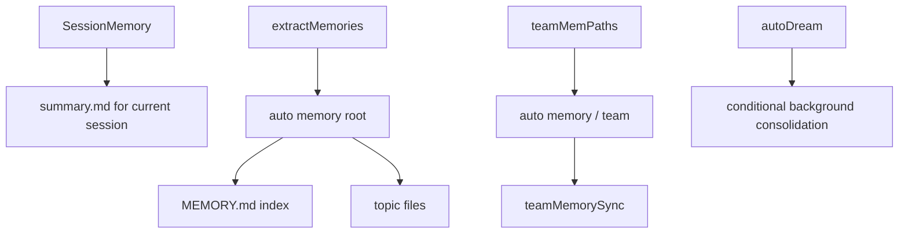

[简体中文](./README.md) | [English](./README.en.md)

# Persistent Memory System In One Minute

Keep this short mental model:

Claude Code does not have one generic “memory.” The visible source exposes at least three layers: session summaries, durable memory, and team memory.

## Three Takeaways

- `SessionMemory` serves current-session continuity
- durable memory serves cross-session topic memory
- team memory is a shared layer under the auto-memory tree

## Read Next

- overview: [README.en.md](../README.en.md)
- deep dive: [DEEP/README.en.md](../DEEP/README.en.md)
