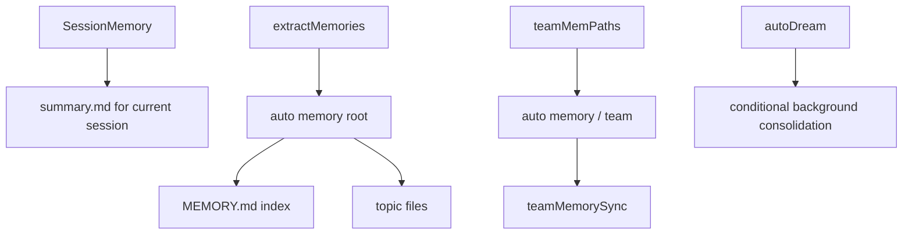

[简体中文](./README.md) | [English](./README.en.md)

# 1 分钟看懂 Persistent Memory System

最短心智模型如下：

Claude Code 当前至少有三层“记忆”：会话摘要、durable memory、team memory。

## 三个要点

- `SessionMemory` 服务当前会话连续性
- durable memory 服务跨会话 topic 记忆
- team memory 是 auto memory 子树里的共享层

## 下一步去哪里

- 总览：[README.md](../README.md)
- 深读：[DEEP/README.md](../DEEP/README.md)
