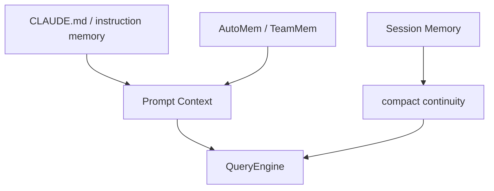

# 1 分钟看懂 Persistent Memory System

先把 Claude Code 的 memory 想成三层：

## 三层分别是什么

- `CLAUDE.md`：告诉 Claude Code 项目背景和长期规则
- AutoMem / TeamMem：自动沉淀长期知识
- Session Memory：帮助当前会话在压缩后继续保持上下文

## 为什么重要

这不是“多放几个笔记文件”，而是一条真正参与运行时的上下文基础设施。

