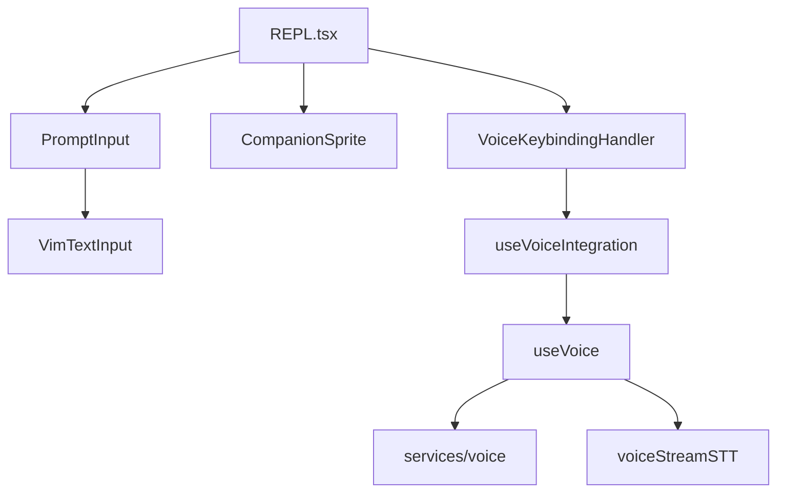
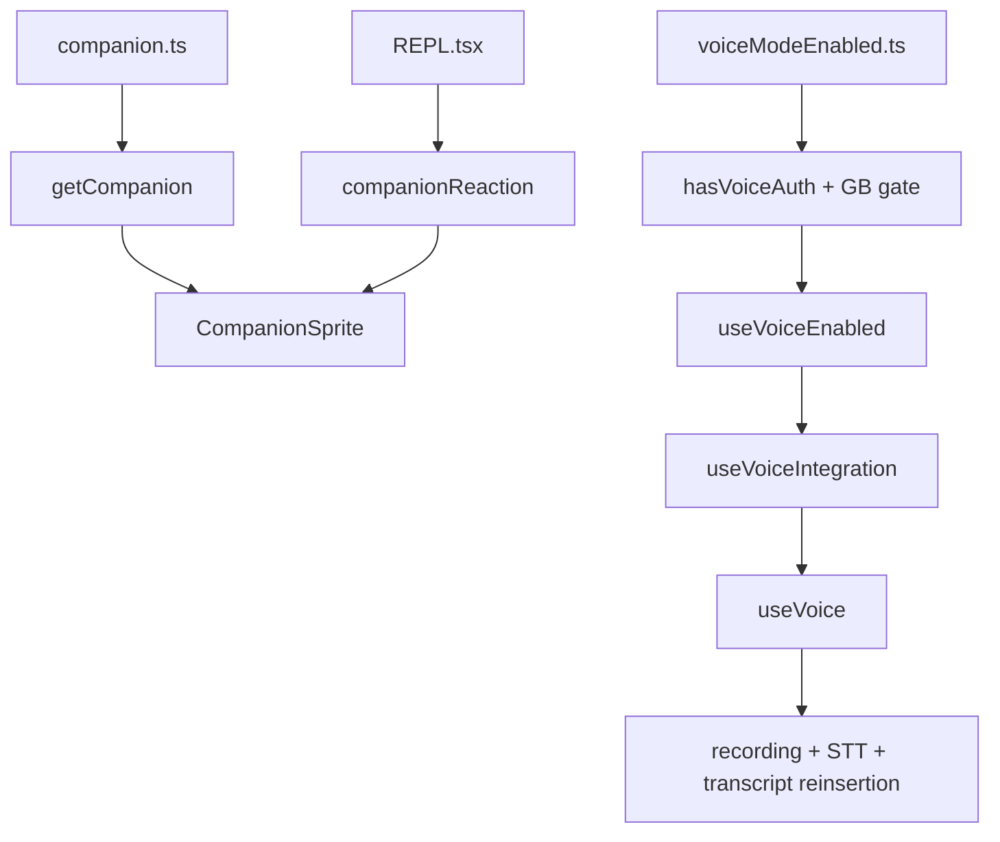

[简体中文](./README.md) | [English](./README.en.md)

# Deep Dive: Buddy, Voice, Vim, And Terminal UI

This chapter explains which interaction-layer capabilities are settled by the current source and which ones still need conservative wording.

The public source mirror directly supports these conclusions:

- `Buddy` is closer to a companion surface clue than to a fully settled public product meaning
- voice already covers visibility checks, hold-to-talk handling, recording, local audio capture, STT, and prompt reinsertion
- vim is a layered modal input engine and should not be described as full Vim compatibility

## What This Layer Does

This layer owns four jobs:

1. connecting companion UI to the terminal surface
2. connecting the voice input chain to `PromptInput`
3. connecting vim-style modal input to the same text-input surface
4. keeping those interaction states wired through `REPL.tsx` and `PromptInput.tsx`

## Key Files

### Companion Surface

- `_upstream/claude-code-sourcemap/restored-src/src/buddy/companion.ts`
- `_upstream/claude-code-sourcemap/restored-src/src/buddy/CompanionSprite.tsx`
- `_upstream/claude-code-sourcemap/restored-src/src/components/PromptInput/PromptInput.tsx`
- `_upstream/claude-code-sourcemap/restored-src/src/screens/REPL.tsx`

### Voice Input Chain

- `_upstream/claude-code-sourcemap/restored-src/src/voice/voiceModeEnabled.ts`
- `_upstream/claude-code-sourcemap/restored-src/src/hooks/useVoiceEnabled.ts`
- `_upstream/claude-code-sourcemap/restored-src/src/hooks/useVoiceIntegration.tsx`
- `_upstream/claude-code-sourcemap/restored-src/src/hooks/useVoice.ts`
- `_upstream/claude-code-sourcemap/restored-src/src/services/voice.ts`
- `_upstream/claude-code-sourcemap/restored-src/src/services/voiceStreamSTT.ts`

### Vim Modal Input

- `_upstream/claude-code-sourcemap/restored-src/src/hooks/useVimInput.ts`
- `_upstream/claude-code-sourcemap/restored-src/src/components/VimTextInput.tsx`
- `_upstream/claude-code-sourcemap/restored-src/src/vim/transitions.ts`
- `_upstream/claude-code-sourcemap/restored-src/src/vim/operators.ts`
- `_upstream/claude-code-sourcemap/restored-src/src/vim/motions.ts`
- `_upstream/claude-code-sourcemap/restored-src/src/vim/textObjects.ts`

## Source-Backed Walkthrough

### 1. `Buddy` currently lands on the companion surface

`buddy/companion.ts` combines the persisted companion soul from config with deterministic bones derived from the user identity. `CompanionSprite.tsx` renders that object as the terminal sprite, speech bubble, and pet-heart surface.

`PromptInput.tsx` still exposes a `/buddy` submission path. `REPL.tsx` reads and clears `companionReaction`. Those files are enough to confirm that the companion surface exists.

This page keeps the conservative boundary:

- the current source confirms a companion surface
- the current source does not settle `Buddy` as a fully specified public product loop

### 2. Voice is an input-side chain, not a full two-way voice product

`voiceModeEnabled.ts` splits voice visibility into two checks:

- `isVoiceGrowthBookEnabled()`
- `hasVoiceAuth()`

`useVoiceEnabled.ts` then adds the user setting `settings.voiceEnabled`. `useVoiceIntegration.tsx` wires hold detection, trailing-character cleanup, anchoring, and interim transcript insertion into the input box. `useVoice.ts` owns the hold-to-talk lifecycle. `services/voice.ts` handles local recording and backend selection. `services/voiceStreamSTT.ts` handles the voice-stream STT WebSocket path.

That chain is strong enough to describe as:

- a real voice input chain exists
- it covers gates, auth, key handling, recording, STT, and prompt reinsertion

That same chain is not enough to describe as:

- a full two-way voice assistant
- confirmed TTS, playback, or output-side voice product behavior

### 3. `REPL.tsx` remains the interaction assembly point

`REPL.tsx` directly wires in:

- `useVoiceIntegration`
- `VoiceKeybindingHandler`
- `CompanionSprite`
- `CompanionFloatingBubble`
- `PromptInput`

So the REPL is not only a message-scroll container. It is still the main interaction assembly point.

### 4. `PromptInput.tsx` is the meeting point for companion, voice, and vim

In the visible source, `PromptInput.tsx` simultaneously owns:

- the `/buddy` submission path
- the switch between `VimTextInput` and ordinary `TextInput`
- voice-related display and layout behavior
- footer state for teammates, tasks, and permission mode

That is why this chapter cannot limit itself to `buddy/*`, `voice/*`, and `vim/*`. The actual convergence point is `PromptInput.tsx`.

### 5. Vim is a layered modal input engine

`useVimInput.ts` manages INSERT / NORMAL mode, dot-repeat, last find, last change, operator context, and replay. `VimTextInput.tsx` bridges that state into `BaseTextInput`. `vim/transitions.ts` owns state transitions. `vim/operators.ts` executes delete, change, yank, paste, indent, replace, and related operations.

This page keeps two conservative points:

- `transitions.ts` and `operators.ts` clearly implement counts, find, operators, and text-object structure
- the current implementation should not be summarized as full Vim parity

### 6. `Buddy` and voice both remain gated surfaces

`CompanionSprite.tsx` is directly gated by `feature('BUDDY')`. Voice-related code is directly gated by `VOICE_MODE`, the GrowthBook kill switch, and OAuth state.

That makes the public wording straightforward:

- these are visible gated surfaces in the source
- they should not be described as universally enabled public capabilities across all builds

## Interaction Layer

## Companion And Voice

## Conservative Boundaries

- keep `Buddy` framed as a companion surface rather than a fully fixed public product name
- keep voice framed as an input-side dictation chain rather than TTS, playback, or a full two-way assistant
- keep KAIROS and `/dream` out of expanded claims in this chapter
- keep vim framed as a layered modal input engine rather than full Vim compatibility

## Read Next

- overview: [../README.en.md](../README.en.md)
- quick guide: [../SIMPLE/README.en.md](../SIMPLE/README.en.md)
- short comparison: [../comparison.en.md](../comparison.en.md)
