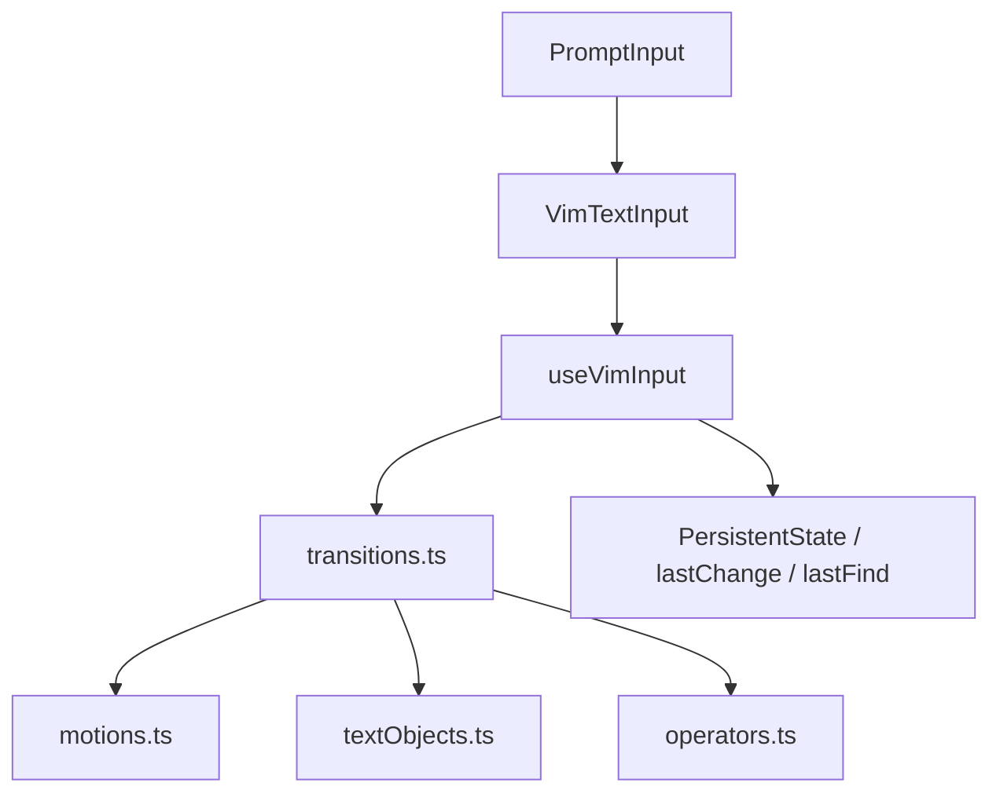
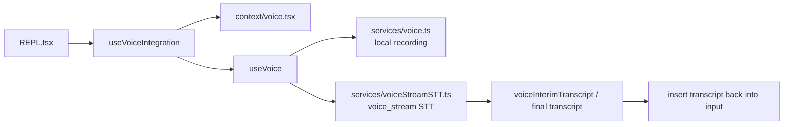

# 深度拆解：Buddy、Voice、Vim 与终端交互层

这一章只做一件事：把终端交互层里**能从源码确认的部分**讲清楚。

这里最容易被写重的，是 `Buddy` 和 `voice`。当前公开镜像能确认的，是一组 companion、sprite、notification、mode gating 和输入状态机实现；还不能把它们直接写成完整产品闭环。

## 这部分负责什么

这一层主要覆盖三件事：

1. `buddy/` 里的 companion 子系统
2. `vim/` 里的 modal 输入内核
3. `voice/` 里的可用性判定、输入集成与录音 / STT 接点

换句话说，这一层解决的是“用户怎么在终端里和 Claude Code 交互”，而不是“模型主循环怎么运行”。

## 关键文件

### Companion 子系统

- `restored-src/src/buddy/companion.ts`
- `restored-src/src/buddy/types.ts`
- `restored-src/src/buddy/sprites.ts`
- `restored-src/src/buddy/CompanionSprite.tsx`
- `restored-src/src/buddy/useBuddyNotification.tsx`
- `restored-src/src/buddy/prompt.ts`
- `restored-src/src/components/PromptInput/PromptInput.tsx`
- `restored-src/src/screens/REPL.tsx`
- `restored-src/src/state/AppStateStore.ts`

### Vim 输入内核

- `restored-src/src/vim/types.ts`
- `restored-src/src/vim/motions.ts`
- `restored-src/src/vim/textObjects.ts`
- `restored-src/src/vim/operators.ts`
- `restored-src/src/vim/transitions.ts`
- `restored-src/src/hooks/useVimInput.ts`
- `restored-src/src/components/VimTextInput.tsx`

### Voice 相关链路

- `restored-src/src/voice/voiceModeEnabled.ts`
- `restored-src/src/hooks/useVoiceEnabled.ts`
- `restored-src/src/hooks/useVoiceIntegration.tsx`
- `restored-src/src/hooks/useVoice.ts`
- `restored-src/src/context/voice.tsx`
- `restored-src/src/commands/voice/index.ts`
- `restored-src/src/commands/voice/voice.ts`
- `restored-src/src/services/voice.ts`
- `restored-src/src/services/voiceStreamSTT.ts`
- `restored-src/src/tools/ConfigTool/ConfigTool.ts`

## 执行流

### 1. `buddy/` 当前更适合写成 companion 子系统

这轮重新核读后，`buddy/` 最稳妥的描述是：

- companion 的确定性骨架生成
- 终端 sprite / 气泡渲染
- 输入区 teaser 与 `/buddy` 触发提示
- 一次性 `companion_intro` 附件注入

`companion.ts` 先从全局配置里读取持久化的 soul，再用：

- `oauthAccount.accountUuid`
- 或 `userID`

生成 deterministic bones，最后由 `getCompanion()` 把两者合并成运行时 companion。

这也意味着：

- `name`、`personality`、`hatchedAt` 更接近持久化 soul
- `species`、`rarity`、`eye`、`hat`、`stats`、`shiny` 是按用户身份稳定派生的 bones

`CompanionSprite.tsx` 再把它变成终端 UI：

- 窄终端下退化为单行 face + label
- 宽终端下显示多帧 sprite
- fullscreen 时把浮动气泡拆成单独渲染层
- `companionReaction` 驱动 speech bubble
- `companionPetAt` 驱动 pet hearts

这一轮还能把 reaction / pet 的边界再写具体一点：

- `REPL.tsx` 在每次 `query()` 结束后，会把 `fireCompanionObserver(messagesRef.current, ...)` 的回调结果写回 `AppState.companionReaction`
- `REPL.tsx` 滚动时也会主动把 `companionReaction` 清空
- `CompanionSprite.tsx` 只是读取 `companionReaction` / `companionPetAt` 并负责渲染，不负责生成 reaction 文本
- `companionPetAt` 这一轮仍只确认到读取点，没有在当前树里复核到明确写入点

`prompt.ts` 则把 `companion_intro` 作为一次性附件注入给主对话，用来提醒模型：

- 输入框旁边还有一个 companion / watcher

这里还要补一个 gate 边界：

- `CompanionSprite.tsx`、`useBuddyNotification.tsx`、`buddy/prompt.ts` 都直接受 `feature('BUDDY')` 控制
- 这说明当前能确认的是 companion 前台表现层与提示附件存在 gated path
- 不能把它外推成“所有构建里默认开启的公开功能”

但这里有两个边界必须单独写出来：

- `fireCompanionObserver(...)` 在 REPL 里有调用点，但本轮没有在当前树中复核到它的定义
- `companionPetAt` 只有读取点，没有确认到写入点

所以文档不能把 companion reaction 的生成机制、模型来源、`/buddy pet` 行为写死。

这里还可以再补一个更具体的限制：

- `PromptInput.tsx` 只证明 companion footer 选中后会提交 `/buddy`
- `commands.ts` 只证明当前树里有 `./commands/buddy/index.js` 这条命令入口引用
- 但这轮没有在当前可见树里复核到 `/buddy` 命令实现文件
- `AppStateStore.ts` 的注释虽然提到 `src/buddy/observer.ts`
- 但当前镜像里没有这个文件
- 因此 hatch / pet / mute / rename 这类具体行为，都不该在这一页写死

### 2. `voice` 不只是 gating，但也不能写成完整语音产品栈

这轮重新核读后，`voice` 最稳妥的说法是：

- `voice/voiceModeEnabled.ts` 负责能不能开
- `/voice` 命令负责开关和预检
- `useVoiceIntegration.tsx` 负责把按键保持、输入框插入和 UI 状态接起来
- `services/voice.ts` 与 `services/voiceStreamSTT.ts` 提供录音和 STT 接点

这说明当前树里已经不只是“能不能显示 voice 按钮”的 gating。

当前源码里能明确看到 3 层条件：

1. `isVoiceGrowthBookEnabled()`
   - 看 `VOICE_MODE` 编译期开关和 GrowthBook kill-switch
2. `hasVoiceAuth()`
   - 看是否具备 Claude.ai OAuth token
3. `useVoiceEnabled()`
   - 再叠加 `settings.voiceEnabled === true`

其中第一层还可以写得更具体一点：

- `isVoiceGrowthBookEnabled()` 不是泛泛的 feature probe
- 它明确把 `VOICE_MODE` 编译期开关和 `tengu_amber_quartz_disabled` kill switch 叠在一起

另外还可以明确写出：

- `/voice` 命令的 `isEnabled` 与 `isHidden` 不是同一条件
- `ConfigTool` 对 `voiceEnabled` 也会再次做 runtime gate
- 默认 push-to-talk 键位是 `space -> voice:pushToTalk`
- `/voice` 的开启流程会继续检查录音能力、stream 可用性、依赖和麦克风权限
- `useVoiceEnabled()` 会把 `settings.voiceEnabled === true`、auth 与 kill-switch 合并成最终 UI 可见状态
- `useVoiceIntegration()` 会处理 hold threshold、尾部按键清理、voice anchor 与 interim transcript 回填
- `useVoiceIntegration()` 也是当前可见运行时里唯一直接调用 `useVoice()` 的地方，而且显式传的是 `focusMode: false`
- `useVoice()` 虽然保留了 focus-driven recording 分支，但这轮没有在当前树里复核到 `focusMode: true` 的实际接线
- `services/voice.ts` 当前更像本地录音后端选择与采集层
- `services/voiceStreamSTT.ts` 当前更像 `voice_stream` WebSocket STT 客户端
- `TextInput.tsx` 只消费 `voiceState` / `voiceAudioLevels` 来画录音时的输入光标波形

如果再往下拆，这条链其实更适合分成两段来看：

- `/voice` 是开关与预检入口
- `REPL -> useVoiceIntegration -> useVoice -> services/voice -> voiceStreamSTT` 才是实际的录音与转写链

因此更稳妥的表述是：

- 这套代码至少已经覆盖了“判定 + 输入集成 + 本地录音 / STT 接点”
- 但不要把它直接扩写成完整语音产品闭环

这一轮还可以把负面边界写得更具体：

- 在这批可见文件里，没有复核到明确的 TTS / playback / output-side 主链
- `commands/voice/index.ts` 与 `commands/voice/voice.ts` 的职责都集中在开关、预检和设置切换
- 所以更稳妥的表述仍然是“终端文本输入上的语音听写增强”，不是“双向语音助手”

另外，`services/voiceStreamSTT.ts` 里还能看到 `tengu_cobalt_frost` 这类运行时 gate 线索；当前可见影响范围只落在 `voice_stream` 的 query params 和 STT provider 选择，不应把它扩写成 output 侧语音能力分支。

### 3. `vim/` 采用“五段式”结构

这轮复读后，`vim/` 的结构可以更清楚地写成：

- `types.ts`
  - 状态机与持久状态
- `motions.ts`
  - motion 解析
- `textObjects.ts`
  - text object 边界查找
- `operators.ts`
  - 实际文本改写
- `transitions.ts`
  - NORMAL 模式状态转移

真正的接入层在：

- `useVimInput.ts`
- `VimTextInput.tsx`
- `PromptInput.tsx`

`useVimInput()` 负责：

- INSERT / NORMAL 切换
- `.` dot-repeat
- `lastFind`
- `lastChange`
- 方向键与 `h/j/k/l` 的映射

这里还有两个这轮应该明确写出的细节：

- `operator + text object` 的 `count` 虽然会被记录，但当前实现里没有真正传进 `findTextObject()`
- `D` 和 `C` 当前固定走 `executeOperatorMotion(..., '$', 1, ctx)`，前置 count 没有继续下沉到这个分支

因此文档里不能写：

- “完全 Vim 兼容”

更稳妥的写法是：

- 当前实现覆盖 INSERT / NORMAL、count、find、部分 `g` 前缀、常见 operator、部分 text object、dot-repeat 与寄存器/粘贴语义

## 一张图看 companion 子系统

```mermaid
flowchart LR
    A[getGlobalConfig().companion] --> B[getCompanion]
    C[userID / oauth uuid] --> B
    B --> D[CompanionSprite.tsx]
    D --> E[sprite / speech bubble / pet hearts]
    K[REPL.tsx query-end] --> L[fireCompanionObserver]
    L --> M[companionReaction]
    M --> D
    B --> F[buddy/prompt.ts]
    F --> G[companion_intro attachment]
    G --> H[main conversation]
    I[PromptInput / REPL] --> D
    I --> J[/buddy teaser / focus state]
```

## 一张图看 Vim 五段式结构



## 一张图看 voice 开关与预检链

```mermaid
flowchart LR
    A[/voice command] --> B[isVoiceModeEnabled]
    B --> C[recording / stream / dependency / mic preflight]
    D[useVoiceEnabled] --> E[settings.voiceEnabled]
    E --> F[hasVoiceAuth + GB kill-switch]
    F --> G[voice feature visible]
```

## 一张图看 voice 录音与转写链



## 为什么这个设计重要

这部分代码很能说明 Claude Code 的一个特点：

- 它不是“先有主循环，再随手接一层 UI”
- 而是把输入模式、companion、voice 判定与输入集成也做成了相对独立的子系统

几个最值得记住的点：

- `buddy` 不是一张静态贴图，而是一个带确定性骨架、持久 soul、附件注入和输入区提示的 companion 子系统
- `voice` 在当前范围里已经不只是 gating，还能看到开关、预检、输入集成、录音和 STT 接点
- `vim` 不是零散快捷键，而是一套清楚拆层的 modal 输入引擎

## 推荐阅读顺序

1. `restored-src/src/buddy/companion.ts`
2. `restored-src/src/buddy/CompanionSprite.tsx`
3. `restored-src/src/buddy/prompt.ts`
4. `restored-src/src/buddy/useBuddyNotification.tsx`
5. `restored-src/src/voice/voiceModeEnabled.ts`
6. `restored-src/src/commands/voice/voice.ts`
7. `restored-src/src/hooks/useVoiceEnabled.ts`
8. `restored-src/src/hooks/useVoiceIntegration.tsx`
9. `restored-src/src/services/voice.ts`
10. `restored-src/src/services/voiceStreamSTT.ts`
11. `restored-src/src/vim/types.ts`
12. `restored-src/src/vim/transitions.ts`
13. `restored-src/src/vim/motions.ts`
14. `restored-src/src/vim/textObjects.ts`
15. `restored-src/src/vim/operators.ts`
16. `restored-src/src/hooks/useVimInput.ts`

## 仍待确认

- `Buddy` 是否就是正式对外产品名。当前源码同时存在 `Buddy`、`Companion`、`watcher` 等命名，不能仅凭这些文件定论。
- `fireCompanionObserver(...)` 的实现未在当前树中复核到，因此不能写死 companion reaction 的生成机制。
- `companionPetAt` 的写入点当前没有确认到。
- `/buddy` 命令的具体实现文件这轮没有在当前树里复核到；当前只能确认 `commands.ts` 里有命令入口引用、`PromptInput.tsx` 会提交 `/buddy`，因此 companion 的 hatch / pet / mute 等动作边界仍不能写死。
- `AppStateStore.ts` 里提到的 `src/buddy/observer.ts` 在当前镜像里没有复核到，因此不能把它当成已读过的实现文件。
- `voice` 的完整产品语义仍然不能从这轮范围推出；这批文件能稳定确认的是开关、预检、按键保持、本地录音、STT 与输入框回填，不能继续外推到 TTS、播放链或 output-side 语音能力。
- `BUDDY`、`VOICE_MODE`、`tengu_cobalt_frost` 这些 gate 在不同构建里的默认状态，静态源码不能直接推出。
- `vim` 这轮复读的是实现层，不是测试层，因此不能把支持范围扩写成“完整 Vim 兼容”。
