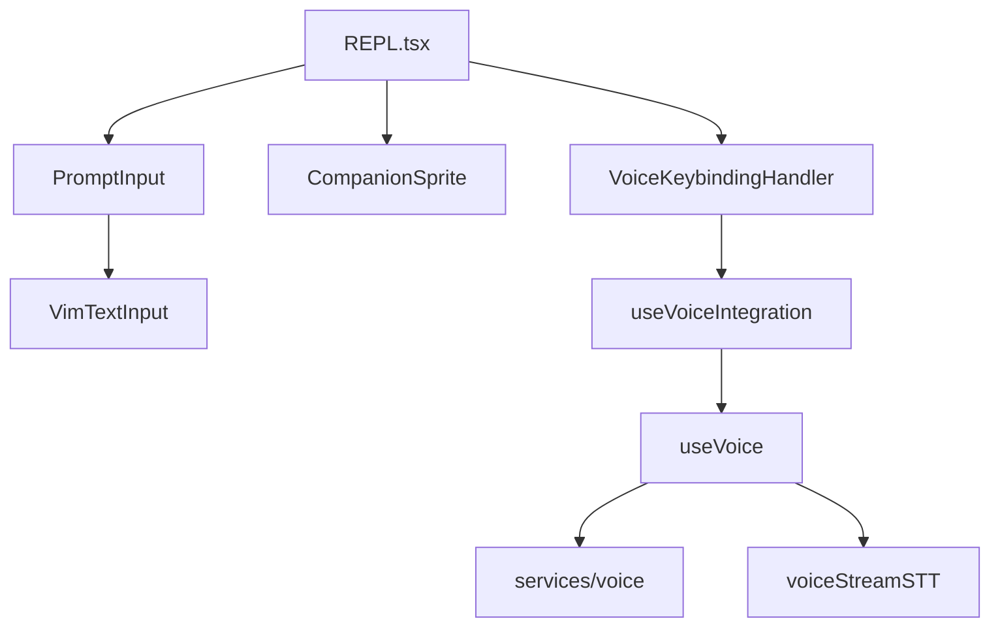
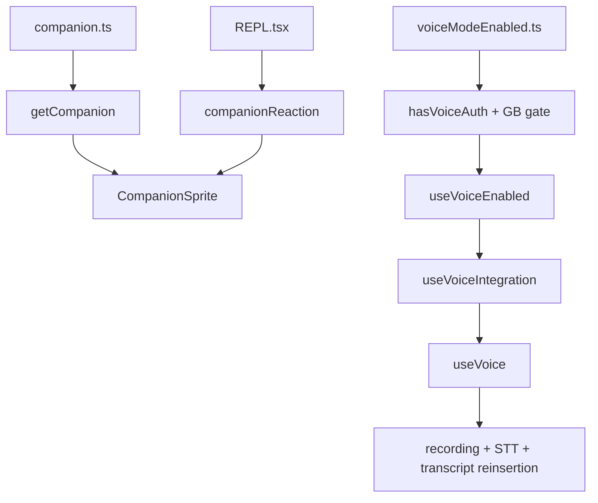

[简体中文](./README.md) | [English](./README.en.md)

# 深度拆解：Buddy、Voice、Vim 与终端交互层

本章说明终端交互层里哪些能力可以从当前源码确认，哪些能力需要继续保守表述。

公开镜像可以直接支持以下结论：

- `Buddy` 更接近 companion surface 线索，而不是已经坐实的完整产品语义
- voice 当前至少覆盖可见性判定、按键保持、录音、本地音频采集、STT 与输入框回填
- vim 当前是一套分层 modal input engine，不应写成完整 Vim 兼容

## 这部分负责什么

这一层负责四件事：

1. 把 companion UI 接到终端界面
2. 把 voice 输入链接到 PromptInput
3. 把 vim 模态输入接到同一个文本输入表面
4. 把这些交互状态统一挂到 `REPL.tsx` 和 `PromptInput.tsx`

## 关键文件

### Companion surface

- `_upstream/claude-code-sourcemap/restored-src/src/buddy/companion.ts`
- `_upstream/claude-code-sourcemap/restored-src/src/buddy/CompanionSprite.tsx`
- `_upstream/claude-code-sourcemap/restored-src/src/components/PromptInput/PromptInput.tsx`
- `_upstream/claude-code-sourcemap/restored-src/src/screens/REPL.tsx`

### Voice 输入链

- `_upstream/claude-code-sourcemap/restored-src/src/voice/voiceModeEnabled.ts`
- `_upstream/claude-code-sourcemap/restored-src/src/hooks/useVoiceEnabled.ts`
- `_upstream/claude-code-sourcemap/restored-src/src/hooks/useVoiceIntegration.tsx`
- `_upstream/claude-code-sourcemap/restored-src/src/hooks/useVoice.ts`
- `_upstream/claude-code-sourcemap/restored-src/src/services/voice.ts`
- `_upstream/claude-code-sourcemap/restored-src/src/services/voiceStreamSTT.ts`

### Vim 模态输入

- `_upstream/claude-code-sourcemap/restored-src/src/hooks/useVimInput.ts`
- `_upstream/claude-code-sourcemap/restored-src/src/components/VimTextInput.tsx`
- `_upstream/claude-code-sourcemap/restored-src/src/vim/transitions.ts`
- `_upstream/claude-code-sourcemap/restored-src/src/vim/operators.ts`
- `_upstream/claude-code-sourcemap/restored-src/src/vim/motions.ts`
- `_upstream/claude-code-sourcemap/restored-src/src/vim/textObjects.ts`

## 源码主线

### 1. `Buddy` 当前落在 companion surface

`buddy/companion.ts` 会把持久化配置里的 companion soul 与按用户身份稳定生成的 bones 合并成运行时 companion。`CompanionSprite.tsx` 负责把这个对象渲染成终端 sprite、speech bubble 和 pet hearts。

`PromptInput.tsx` 还明确保留了 `/buddy` 提交入口。`REPL.tsx` 会读取和清理 `companionReaction`。这些代码足以确认 companion surface 存在。

这页继续保留保守边界：

- 当前源码能确认 companion surface
- 当前源码不能把 `Buddy` 写成完整产品闭环

### 2. voice 是输入侧链路，不是完整双向语音产品

`voiceModeEnabled.ts` 明确把 voice 可见性拆成两层：

- `isVoiceGrowthBookEnabled()`
- `hasVoiceAuth()`

`useVoiceEnabled.ts` 再把用户设置 `settings.voiceEnabled` 叠上去。`useVoiceIntegration.tsx` 负责把按键保持、尾部字符清理、anchor 和 interim transcript 插入逻辑接到输入框。`useVoice.ts` 负责整个 hold-to-talk 生命周期。`services/voice.ts` 负责本地录音与后端选择。`services/voiceStreamSTT.ts` 负责 voice stream STT WebSocket。

这条链已经能稳妥写成：

- voice 输入链存在
- 它覆盖 gate、auth、按键、录音、STT 和输入框回填

这条链不能写成：

- 完整双向语音助手
- 已确认的 TTS / playback / output-side voice 产品

### 3. `REPL.tsx` 仍是交互层总装配点

`REPL.tsx` 当前直接接入：

- `useVoiceIntegration`
- `VoiceKeybindingHandler`
- `CompanionSprite`
- `CompanionFloatingBubble`
- `PromptInput`

这说明 REPL 既负责消息滚动，也承担交互层总装配点。

### 4. `PromptInput.tsx` 是 companion、voice、vim 的汇合面

当前可见源码里，`PromptInput.tsx` 同时负责：

- `/buddy` 提交入口
- `VimTextInput` 与普通 `TextInput` 的切换
- voice 状态相关显示与留白
- teammate、task、permission mode 等多种 footer 状态

这也是为什么这章需要同时写 `buddy/*`、`voice/*`、`vim/*` 和 `PromptInput.tsx`。输入层实际汇合点在 `PromptInput.tsx`。

### 5. vim 当前是分层 modal input engine

`useVimInput.ts` 管理 INSERT / NORMAL 模式、dot-repeat、last find、last change、operator context 和 replay。`VimTextInput.tsx` 把这套状态接到 `BaseTextInput`。`vim/transitions.ts` 负责状态转移。`vim/operators.ts` 负责执行 delete、change、yank、paste、indent、replace 等操作。

这页保留两个保守点：

- `transitions.ts` 与 `operators.ts` 已经实现了 counts、find、operator、text object 等主要结构
- 当前实现不应被概括成“完整 Vim 兼容”

### 6. `Buddy` 与 voice 都有 gate 和条件分支

`CompanionSprite.tsx` 直接受 `feature('BUDDY')` 控制。voice 相关代码直接受 `VOICE_MODE`、GrowthBook kill-switch 与 OAuth 状态控制。

这说明当前公开文档适合强调“可确认的 gated surface”，不适合把这些分支写成所有构建默认开启的稳定公开能力。

## 一张图看交互层

## 一张图看 companion 与 voice

## 保守边界

- `Buddy` 保持 companion surface 表述，不写死成完整公开产品名。
- voice 保持输入侧语音听写链表述，不扩写为 TTS、播放链或完整双向语音助手。
- KAIROS 与 `/dream` 不在这一章扩写。它们的公开语义仍然保持条件化。
- vim 保持“分层 modal input engine”表述，不写成完整 Vim parity。

## 继续阅读

- 概览：[../README.md](../README.md)
- 快速版：[../SIMPLE/README.md](../SIMPLE/README.md)
- 轻量比较：[../comparison.md](../comparison.md)
