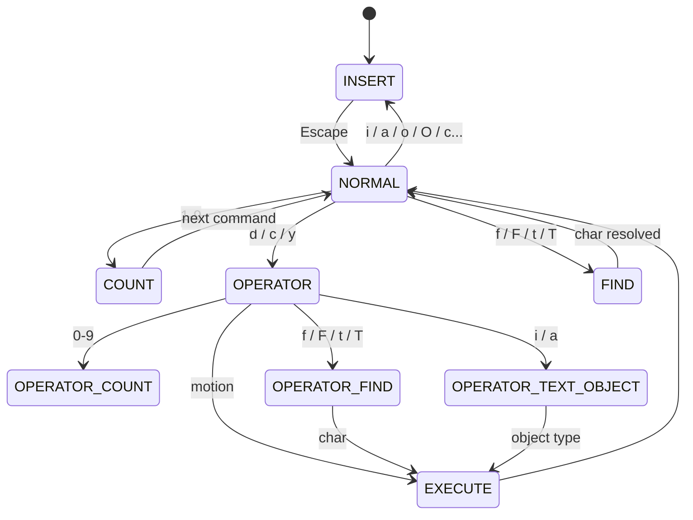

# 深度拆解：Buddy、Voice、Vim 与终端交互层

这一章只做一件事：把终端交互层里**能从源码确认的部分**讲清楚。

这里最容易被写重的，是 `Buddy` 和 `voice`。当前公开镜像能确认的，是一组 companion、sprite、notification、mode gating 和输入状态机实现；还不能把它们直接写成完整产品包装。

## 这部分负责什么

这一组代码主要覆盖三件事：

- `buddy/`：在终端输入区旁边渲染一个 companion，并通过附件和提示把这个 companion 暴露给主对话。
- `vim/`：提供一套独立的 vim 风格输入内核，负责 NORMAL / INSERT、motion、operator、text object 和 repeat 逻辑。
- `voice/`：提供 voice mode 的可用性判定，而不是完整语音链路。

换句话说，这一层解决的是“用户如何在终端里和 Claude Code 交互”，而不是“主循环如何调用模型”。

## 关键文件

### Buddy / Companion

- `restored-src/src/buddy/companion.ts`
- `restored-src/src/buddy/types.ts`
- `restored-src/src/buddy/sprites.ts`
- `restored-src/src/buddy/CompanionSprite.tsx`
- `restored-src/src/buddy/useBuddyNotification.tsx`
- `restored-src/src/buddy/prompt.ts`
- `restored-src/src/components/PromptInput/PromptInput.tsx`
- `restored-src/src/screens/REPL.tsx`

### Vim 输入内核

- `restored-src/src/vim/types.ts`
- `restored-src/src/vim/transitions.ts`
- `restored-src/src/vim/motions.ts`
- `restored-src/src/vim/operators.ts`
- `restored-src/src/vim/textObjects.ts`
- `restored-src/src/hooks/useVimInput.ts`

### Voice mode gating

- `restored-src/src/voice/voiceModeEnabled.ts`
- `restored-src/src/hooks/useVoiceEnabled.ts`
- `restored-src/src/commands.ts`

## 执行流

### 1. Buddy / Companion 这条线

`companion.ts` 不是简单返回一段配置。它先从 `getGlobalConfig().companion` 取持久化的 soul，再用 `oauthAccount.accountUuid` 或 `userID` 经过哈希和伪随机流程稳定生成 bones，最后由 `getCompanion()` 把两者合并成运行时 companion。

这里能确认一个很重要的设计：`name`、`personality`、`hatchedAt` 这类内容是持久化的，但 `species`、`rarity`、`eye`、`hat`、`stats`、`shiny` 是按用户身份稳定派生的，不是任意写进配置里就能伪造。

`CompanionSprite.tsx` 再把这个 companion 渲染成终端 UI：

- 宽屏下显示完整 sprite 和气泡
- 窄屏下退化为单行 face + label
- `companionReaction` 控制 speech bubble
- `companionPetAt` 控制 pet hearts 动画
- `footerSelection === 'companion'` 控制 focus 态

`buddy/prompt.ts` 则给主模型加一条很关键的上下文：通过 `companion_intro` 附件说明“输入框旁边有一个单独 watcher”。这意味着主模型不是直接扮演 companion，而是被提醒在用户直接喊 companion 名字时尽量少说，让气泡来回应。

`useBuddyNotification.tsx`、`PromptInput.tsx`、`REPL.tsx` 这一侧负责把 `/buddy` 相关提示和 companion UI 插到输入区域与主界面里。

```mermaid
flowchart LR
    A[getGlobalConfig().companion] --> B[getCompanion]
    C[userID / oauth uuid] --> B
    B --> D[CompanionSprite.tsx]
    D --> E[sprite / speech bubble / pet animation]
    B --> F[buddy/prompt.ts]
    F --> G[companion_intro attachment]
    G --> H[main conversation]
    I[PromptInput / REPL] --> D
    I --> J[/buddy teaser / focus state]
```

### 2. Vim 这条线

`vim/types.ts` 是这套实现的骨架。它显式定义了：

- `VimState`
- `CommandState`
- `PersistentState`
- `RecordedChange`

这说明它不是“几个快捷键 if/else”，而是一套明确的状态机。

`useVimInput.ts` 是真实接入点。它维护：

- 当前 `VimState`
- 持久 `PersistentState`
- INSERT / NORMAL 切换
- `.` 重放
- 寄存器、last find、last change

真正的 NORMAL 模式逻辑由 `transition()` 驱动。`transitions.ts` 做的事情是：

- 按当前 state type 分发
- 在 `idle` / `count` 状态里处理普通 motion、find、operator、replace、indent 等输入
- 在 `operator` 系列状态里继续等待 motion / find / text object
- 一旦满足执行条件，就调用 `operators.ts`

`motions.ts` 只做“把 motion 解析成目标光标位置”；`operators.ts` 才做真正的文本修改；`textObjects.ts` 只负责找范围。

这个分层很干净：

- `types.ts`：状态与数据结构
- `transitions.ts`：状态转移表
- `motions.ts`：光标移动计算
- `operators.ts`：文本改写
- `textObjects.ts`：范围选择



当前范围内可以稳妥写出的命令覆盖包括：

- 基础移动：`h/l/j/k`
- 屏幕行移动：`gj/gk`
- word / WORD：`w/b/e/W/B/E`
- 行首行尾：`0/^/$`
- `G` / `gg`
- operator：`d/c/y`、`dd/cc/yy`
- `f/F/t/T`
- text object
- `x`、`r`、`~`、`J`
- `p/P`
- `>>/<<`
- `o/O`

但这里仍然不能把它写成“完整 vim 编辑器”。

### 3. Voice 这条线

当前 `src/voice/` 范围里只看到 `voiceModeEnabled.ts`。这份文件只解决一个问题：voice mode 当前是否可见、是否可用。

源码里有三层判断：

- `isVoiceGrowthBookEnabled()`：看 `VOICE_MODE` 编译特性和 GrowthBook kill-switch
- `hasVoiceAuth()`：确认当前是 Anthropic auth，并且有 access token
- `isVoiceModeEnabled()`：把前两者做与运算

`useVoiceEnabled.ts` 再补一层用户意图：只有 `settings.voiceEnabled === true` 且 auth/growthbook 允许时，React 渲染侧才认为 voice 可用。

这意味着当前最稳妥的写法是：`voice/` 在这份镜像里体现的是 **mode gating**，不是完整音频链路。

```mermaid
flowchart LR
    A[VOICE_MODE feature] --> D[isVoiceGrowthBookEnabled]
    B[GrowthBook kill-switch] --> D
    C[Anthropic OAuth token] --> E[hasVoiceAuth]
    D --> F[isVoiceModeEnabled]
    E --> F
    G[settings.voiceEnabled] --> H[useVoiceEnabled]
    F --> H
    H --> I[/voice command / config / notice UI]
```

## 为什么这个设计重要

这部分代码很能说明 Claude Code 的一个特点：它不是“先有主循环，再随手接一层 UI”，而是把输入模式、companion、voice gating 这些交互能力也做成了相对清晰的子系统。

几个值得记住的点：

- `buddy` 不是一张静态贴图，而是有持久 soul、稳定 bones、附件注入和输入区提示的 companion 子系统。
- `vim` 没有和输入框硬耦合成一团，它保持了很强的纯逻辑结构，这也是为什么 `useVimInput.ts` 可以比较干净地接上去。
- `voice` 当前范围里虽然只看到 gating，但这种拆法也说明：能力是否可见、是否允许、是否满足 auth，先在边界层被判定，再交给上层 UI 和命令处理。

## 推荐阅读顺序

1. `restored-src/src/buddy/companion.ts`
2. `restored-src/src/buddy/CompanionSprite.tsx`
3. `restored-src/src/buddy/prompt.ts`
4. `restored-src/src/hooks/useVimInput.ts`
5. `restored-src/src/vim/types.ts`
6. `restored-src/src/vim/transitions.ts`
7. `restored-src/src/vim/motions.ts`
8. `restored-src/src/vim/operators.ts`
9. `restored-src/src/vim/textObjects.ts`
10. `restored-src/src/voice/voiceModeEnabled.ts`
11. `restored-src/src/hooks/useVoiceEnabled.ts`

## 仍待确认

- `Buddy` 是否是正式对外产品名。当前源码同时存在 `Buddy`、`Companion`、`watcher` 等命名，不能仅凭这几个文件定论。
- `/buddy` 的完整行为和 hatch/pet 文法。当前范围主要看到的是 UI 消费和提示，不是完整命令实现。
- `voice` 的完整实现范围。当前只能确认 gating，不能推出音频采集、流式传输、TTS、设备管理或实时 UX。
- `vim` 是否支持 visual mode、macro、marks、完整 undo tree、搜索等更大范围能力。当前看到的是一套明确但有限的输入内核。
