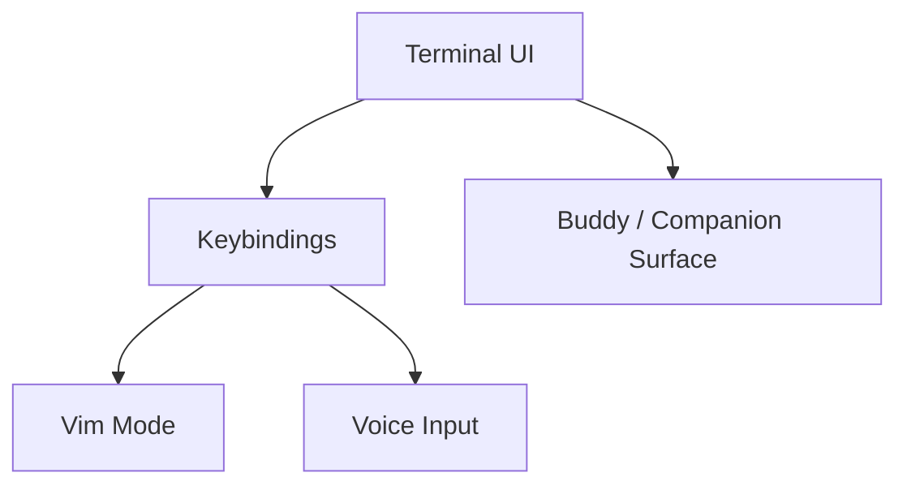

[简体中文](./README.md) | [English](./README.en.md)

# Buddy, Voice, Vim, And Terminal UI In One Minute

Keep one point in mind first:

The interaction layer is more than a terminal shell. It reconnects companion UI, voice input, and vim mode back into the runtime.

## Three Takeaways

- `Buddy` is safer to describe as a companion / watcher surface clue
- `voice` is safer to describe as a dictation-enhancement chain
- `vim/` is a clearly layered modal input system

## Read Next

- overview: [README.en.md](../README.en.md)
- deep dive: [DEEP/README.en.md](../DEEP/README.en.md)
