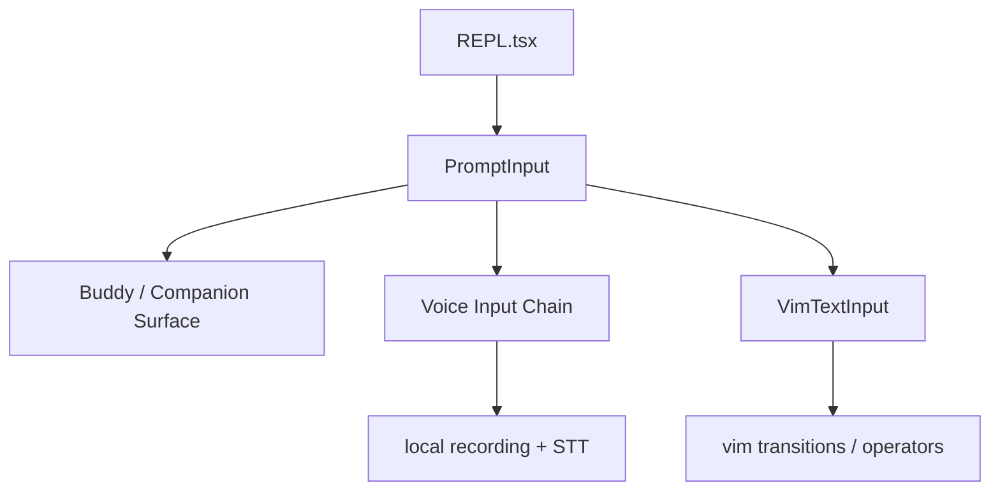

[简体中文](./README.md) | [English](./README.en.md)

# Buddy, Voice, Vim, And Terminal UI In One Minute

Keep this short mental model:

Claude Code’s terminal interaction layer has at least three visible lines: a companion surface, a voice input chain, and vim-style modal input.

## Three Takeaways

- `Buddy` is currently safest as a companion-surface clue
- voice is currently safest as an input-side dictation chain
- vim is currently safest as a layered modal input engine

## Read Next

- overview: [README.en.md](../README.en.md)
- deep dive: [DEEP/README.en.md](../DEEP/README.en.md)
