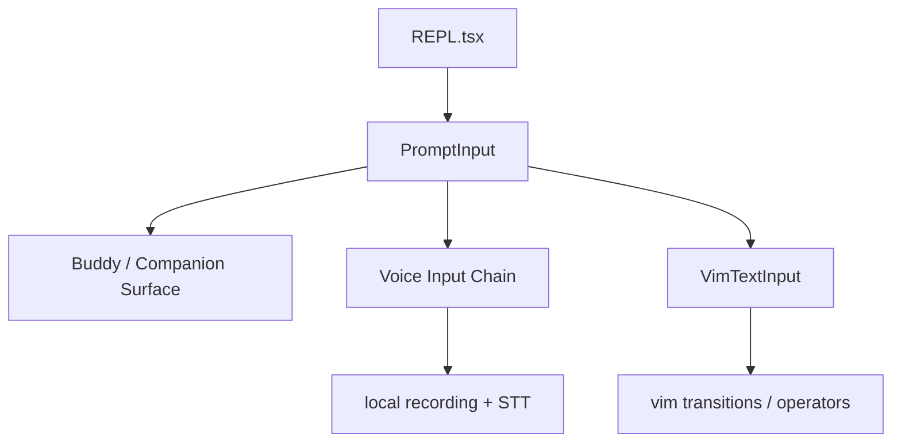

[简体中文](./README.md) | [English](./README.en.md)

# 1 分钟看懂 Buddy, Voice, Vim, And Terminal UI

最短心智模型如下：

Claude Code 的终端交互层至少包含三条线：companion surface、voice 输入链、vim 模态输入。

## 三个要点

- `Buddy` 当前更适合写成 companion surface 线索
- voice 当前更适合写成输入侧语音听写链
- vim 当前更适合写成分层 modal input engine

## 下一步去哪里

- 总览：[README.md](../README.md)
- 深读：[DEEP/README.md](../DEEP/README.md)
