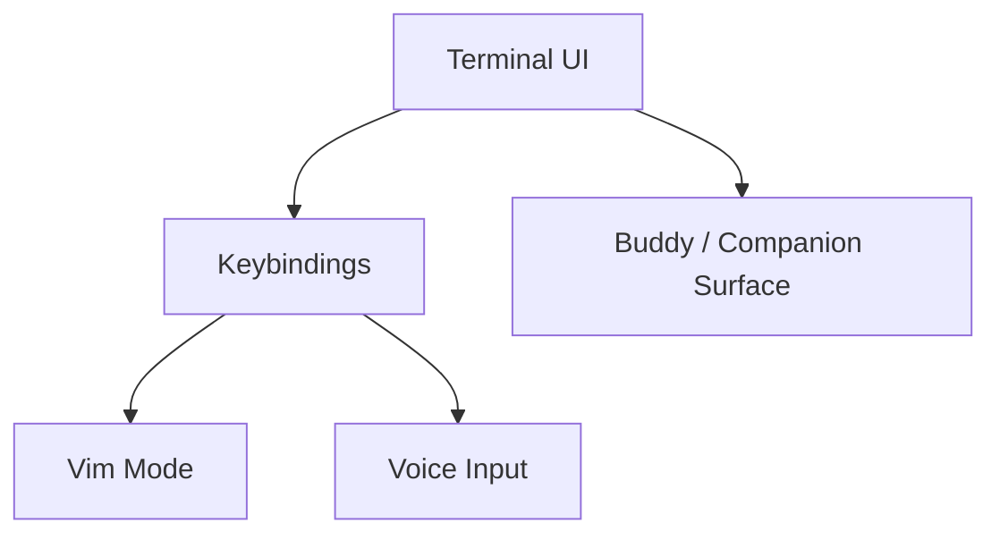

[简体中文](./README.md) | [English](./README.en.md)

# 1 分钟看懂 Buddy, Voice, Vim, And Terminal UI

这一章最适合先记住一件事：

交互层不只是终端外壳，它会把 companion UI、voice 输入和 vim 模式接回运行时。

## 三个要点

- `Buddy` 更适合写成 companion / watcher surface 线索
- `voice` 当前更适合写成语音听写增强链路
- `vim/` 是清楚拆层的模态输入系统

## 下一步去哪里

- 总览：[README.md](../README.md)
- 深读：[DEEP/README.md](../DEEP/README.md)
