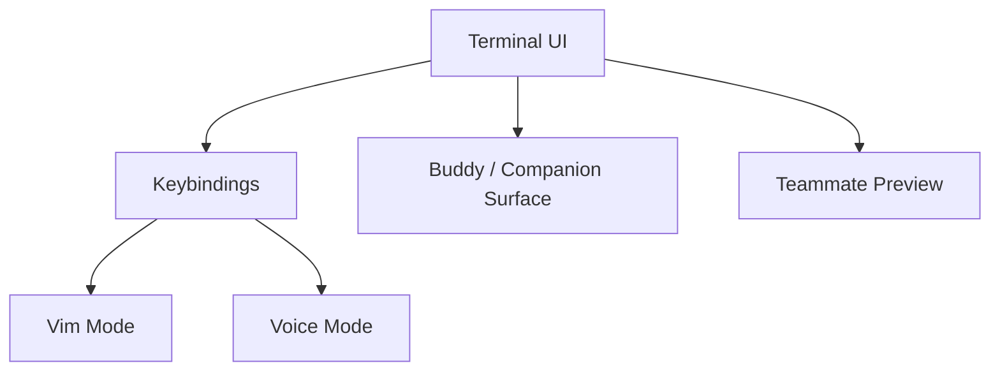

# 1 分钟看懂 Buddy, Voice, Vim, And Terminal UI

这一章可以先这样看：

这部分最适合放在主执行链之后再读，因为它讲的是“体验层怎样接回运行时”，不是模型主循环本身。

## 核心理解

- Claude Code 不只是 command line parser
- 它有自己的交互层
- `vim/` 是输入模式的一部分
- `buddy/` 是一个明确存在的 UI 面，但它在产品里的具体定位要谨慎下结论

## 下一步去哪里

- 想继续看 UI 与边界：读 `README.md`
- 想确认 companion / voice 细节：读 `DEEP/README.md`
