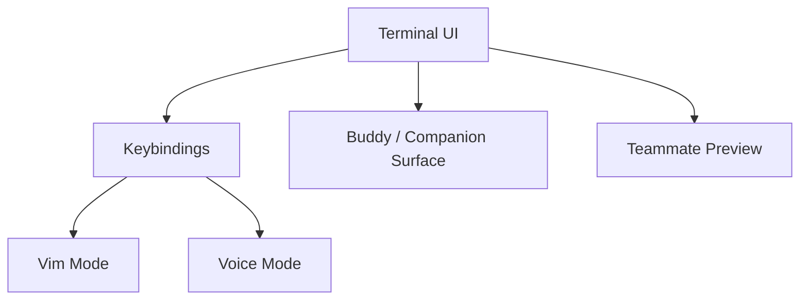

# 1 分钟看懂 Buddy, Voice, Vim, And Terminal UI

这一章可以先这样看：

```mermaid
flowchart TD
    A[Terminal UI] --> B[Keybindings]
    B --> C[Vim Mode]
    B --> D[Voice Mode]
    A --> E[Buddy / Companion Surface]
    A --> F[Teammate Preview]
```

## 核心理解

- Claude Code 不只是 command line parser
- 它有自己的交互层
- `vim/` 是输入模式的一部分
- `buddy/` 是一个明确存在的 UI 面，但它在产品里的具体定位要谨慎下结论

