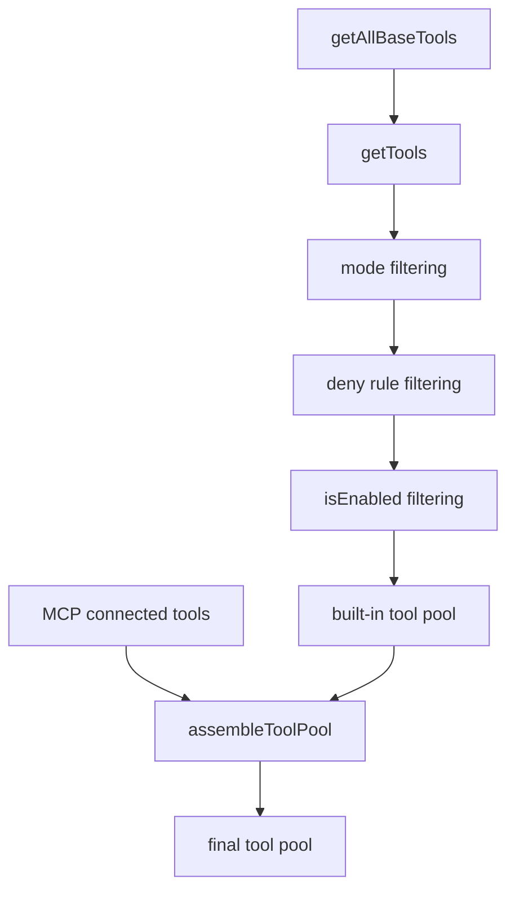
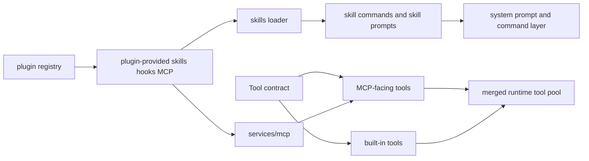

# 深度拆解：Tools, MCP, Skills, And Plugins

这一章要回答的核心问题是：**Claude Code 的扩展面到底是怎么分层的。**

如果只看名字，很容易把 tools、MCP、skills、plugins 混成一团。  
但从公开镜像来看，这几层的职责其实比较清楚：

- `Tool.ts` 定义统一执行接口
- `tools.ts` 组装 built-in tool pool
- `services/mcp/` 负责外部 server 的连接与暴露
- `skills/` 负责 prompt/command 资产
- `plugins/` 负责可启停的扩展包

## 这部分负责什么

这部分负责四件事：

1. 定义工具接口和运行时上下文
2. 决定有哪些内建工具真正进入运行时
3. 把外部 MCP server 变成 tools / commands / resources
4. 把 skills 和 plugins 接到会话里

## 关键文件

- `restored-src/src/Tool.ts`
  - 统一 tool contract
- `restored-src/src/tools.ts`
  - built-in tools 装配入口
- `restored-src/src/services/mcp/client.ts`
  - MCP server 连接、工具与资源提取
- `restored-src/src/services/mcp/config.ts`
  - MCP config 解析
- `restored-src/src/services/mcp/auth.ts`
  - MCP auth 路径
- `restored-src/src/services/mcp/MCPConnectionManager.tsx`
  - React 层的 MCP 连接管理入口
- `restored-src/src/services/mcp/useManageMCPConnections.ts`
  - MCP 连接状态与批量更新逻辑
- `restored-src/src/skills/loadSkillsDir.ts`
  - skills 扫描、解析、动态激活
- `restored-src/src/skills/mcpSkillBuilders.ts`
  - MCP skill builder 注册桥
- `restored-src/src/plugins/builtinPlugins.ts`
  - built-in plugin registry
- `restored-src/src/plugins/bundled/`
  - bundled plugin 初始化入口

## 执行流

### 1. `Tool.ts` 先定义统一接口

`restored-src/src/Tool.ts` 最重要的不是某个具体工具，而是它定义了大家都要遵守的 contract。

源码里可以直接看到这些关键点：

- `ToolUseContext` 很大，说明 tools 可以访问的不只是输入参数，还包括：
  - `commands`
  - `tools`
  - `mcpClients`
  - `mcpResources`
  - `agentDefinitions`
  - `customSystemPrompt`
  - `appendSystemPrompt`
  - `queryTracking`
  - `renderedSystemPrompt`
- `Tool` 接口不只要求 `call()`，还要求：
  - `description()`
  - `checkPermissions()`
  - `renderToolUseMessage()`
  - `renderToolResultMessage()`
  - `isConcurrencySafe()`
  - `isReadOnly()`
  - `isDestructive()`

这说明 tool 在 Claude Code 里不是“函数表”，而是带权限、展示、并发语义的一等对象。

### 2. `tools.ts` 负责 built-in tool pool

`restored-src/src/tools.ts` 里的 `getAllBaseTools()` 是 built-in tools 的主入口。

从这个列表里可以直接看到，内建工具池并不只是文件和 shell：

- `AgentTool`
- `BashTool`
- `FileReadTool`
- `FileEditTool`
- `FileWriteTool`
- `TodoWriteTool`
- `EnterPlanModeTool`
- `ListMcpResourcesTool`
- `ReadMcpResourceTool`
- 多种 task / workflow / REPL / sleep / web / LSP / team 相关工具

之后 `getTools()` 会继续做几层筛选：

- simple mode 筛选
- REPL mode 隐藏 primitive tools
- deny rules 过滤
- `isEnabled()` 过滤

再往后，`assembleToolPool()` 才把 built-in tools 和 MCP tools 合并起来。

### 3. MCP 不是“一个工具”，而是一层服务

`restored-src/src/services/mcp/client.ts`、`config.ts`、`auth.ts` 和 `useManageMCPConnections.ts` 一起说明，MCP 在这里是完整服务层。

最关键的信号有几个：

- `getMcpToolsCommandsAndResources()` 会从 MCP config 批量处理 server
- disabled server、needs-auth server、connected server 都有明确状态
- 本地 server 和远程 server 会按不同并发策略处理
- 连接结果会拆成：
  - tools
  - commands
  - resources
- `useManageMCPConnections()` 会把连接结果批量写回 app state
- `MCPConnectionManager.tsx` 用 context 暴露 reconnect / toggle 能力

换句话说，MCP 在 Claude Code 里不是“额外增加一个 tool”，而是“把外部 server 接成一个新的工具与资源层”。

### 4. skills 是资产层，不是散落 markdown

`restored-src/src/skills/loadSkillsDir.ts` 说明，skills 的处理是有正式加载流程的。

可直接确认的事情包括：

- skills 有来源区分：`skills`、`plugin`、`managed`、`bundled`、`mcp`
- frontmatter 会被正式解析
- skills 支持 hooks、allowed tools、agent、effort、shell 等字段
- 有动态 skills 和 conditional skills
- skills 变化会触发 cache 清理信号

而 `restored-src/src/skills/mcpSkillBuilders.ts` 又说明，MCP skill builder 还有专门的注册桥，目的是避免循环依赖。

所以 skills 更像一层“可加载的行为资产”，而不是附属说明文档。

### 5. plugins 是可启停扩展层

`restored-src/src/plugins/builtinPlugins.ts` 的注释非常清楚：

- built-in plugins 会出现在 `/plugin` UI 里
- 用户可以 enable / disable
- plugin 可以提供多种组件
  - skills
  - hooks
  - MCP servers

这点特别重要，因为它说明 plugin 不是 skill 的别名，也不是 MCP 的别名，而是更上层的打包和分发单位。

## 一张图看 tool pool 组装

## 一张图看 MCP / skill / plugin 分层

## 为什么这个设计重要

这一层真正重要的地方，是它把“扩展”拆成了不同粒度：

- 最底层：tool contract
- 中间层：built-in tool pool 和 MCP service
- 资产层：skills
- 打包层：plugins

这样做的结果是：

- 一个能力可以只表现为 tool
- 也可以表现为 skill
- 也可以被 plugin 一起分发
- 也可以通过 MCP server 从外部接入

这比“只支持插件”或者“只支持工具调用”都更灵活。

## 推荐阅读顺序

建议按下面顺序看：

1. `restored-src/src/Tool.ts`
2. `restored-src/src/tools.ts`
3. `restored-src/src/services/mcp/client.ts`
4. `restored-src/src/services/mcp/useManageMCPConnections.ts`
5. `restored-src/src/services/mcp/MCPConnectionManager.tsx`
6. `restored-src/src/skills/loadSkillsDir.ts`
7. `restored-src/src/skills/mcpSkillBuilders.ts`
8. `restored-src/src/plugins/builtinPlugins.ts`

## 已确认的事实

- tool contract 明确包含权限、并发、展示、MCP metadata 等接口
- built-in tools 和 MCP tools 最终会合并进同一个 tool pool
- MCP 连接结果不只有 tools，还有 commands 和 resources
- skills 有正式的扫描、frontmatter 解析、动态激活流程
- plugins 可以提供 skills、hooks、MCP servers，不只是一个按钮开关

## 仍待确认

以下内容在公开镜像里仍不适合写成过重结论：

- marketplace / built-in / managed plugin 在公开构建里的完整分发路径
- 某些 skill discovery 实验 gate 的最终产品形态
- 某些特定 MCP channel 能力在不同构建中的完整开放范围

这些内容后续继续保持保守表述。
