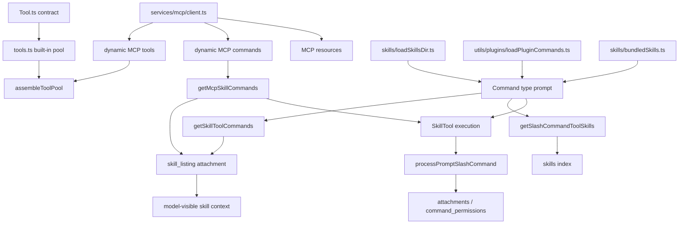

# 深度拆解：Tools, MCP, Skills, And Plugins

这一章最容易写乱，因为 `tools`、`MCP`、`skills`、`plugins` 都在扩展 Claude Code 的能力。

但从 `ChinaSiro/claude-code-sourcemap` 这份公开镜像来看，这四层并不是一锅粥，而是清楚分开的：

- `Tool.ts / tools.ts` 负责工具协议与工具池
- `services/mcp/` 负责外部 server 接入、实例化和连接后刷新
- `skills/ + commands.ts` 负责把技能资产变成 `Command(type: 'prompt')`
- `plugins/ + utils/plugins/` 负责插件边界、路径和运行时装配

## 这部分负责什么

这一层主要负责四件事：

1. 定义统一的 tool contract 和 tool runtime context
2. 组装 built-in tool pool，并把它和 MCP tool pool 区分开
3. 把外部 MCP server 变成本地可调用的 `Tool / Command / Resource`
4. 把 skills 与 plugins 接入命令层，再把可见集合暴露给模型

## 关键文件

### 工具协议与工具池

- `restored-src/src/Tool.ts`
  - `ToolPermissionContext`、`ToolUseContext`、`Tool`、`findToolByName()`
- `restored-src/src/tools.ts`
  - `getAllBaseTools()`、`getTools()`、`assembleToolPool()`、`getMergedTools()`

### MCP 客户端链路

- `restored-src/src/services/mcp/client.ts`
  - transport 建连、`tools/list` / `prompts/list` / `resources/list`、动态实例化、重连
- `restored-src/src/services/mcp/auth.ts`
  - OAuth / XAA provider、token 存取、step-up scope 检测
- `restored-src/src/services/mcp/useManageMCPConnections.ts`
  - `AppState.mcp` 写入、按 server 前缀替换旧产物、`list_changed`
- `restored-src/src/services/mcp/headersHelper.ts`
  - 动态 header helper 与 workspace trust 检查
- `restored-src/src/tools/MCPTool/MCPTool.ts`
  - MCP tool 模板
- `restored-src/src/tools/McpAuthTool/McpAuthTool.ts`
  - `mcp__<server>__authenticate` 伪工具
- `restored-src/src/tools/ListMcpResourcesTool/`
- `restored-src/src/tools/ReadMcpResourceTool/`
  - 资源辅助工具

### Skills 与命令层

- `restored-src/src/skills/loadSkillsDir.ts`
  - 磁盘技能发现、frontmatter 解析、`createSkillCommand()`
- `restored-src/src/skills/bundledSkills.ts`
  - bundled skills 注册表
- `restored-src/src/skills/bundled/index.ts`
  - bundled skill 初始化入口
- `restored-src/src/skills/mcpSkillBuilders.ts`
  - MCP skill builder 复用桥接
- `restored-src/src/commands.ts`
  - 总命令装配与 `getSkillToolCommands()` / `getSlashCommandToolSkills()` / `getMcpSkillCommands()`
- `restored-src/src/tools/SkillTool/SkillTool.ts`
  - 技能执行壳

### Plugins 与 runtime plugin root

- `restored-src/src/main.tsx`
  - `initBuiltinPlugins()` 与 `initBundledSkills()` 的启动接线
- `restored-src/src/plugins/builtinPlugins.ts`
  - built-in plugin registry 定义
- `restored-src/src/plugins/bundled/index.ts`
  - built-in plugin scaffold
- `restored-src/src/utils/plugins/pluginLoader.ts`
  - plugin manifest、路径、组件装配
- `restored-src/src/utils/plugins/loadPluginCommands.ts`
  - plugin commands / plugin skills 加载
- `restored-src/src/utils/plugins/mcpPluginIntegration.ts`
  - plugin MCP server 注入

## 执行流

### 1. `Tool.ts` 先定义统一协议

`Tool.ts` 不是某一个具体工具，而是整个工具系统的协议层。

这里直接定义了：

- `ToolPermissionContext`
- `ToolUseContext`
- `Tool`
- `Tools`
- `findToolByName()`

这意味着“工具”在 Claude Code 里不是一个随手塞进去的函数，而是带运行时上下文、权限语义和渲染语义的一等对象。

### 2. `tools.ts` 里有 4 种不同语义的集合

这里一定要分清下面 4 个函数：

- `getAllBaseTools()`
  - 列出当前环境下可能可用的 built-in 工具全集
- `getTools(permissionContext)`
  - 当前会话真正可见的 built-in 集合
- `assembleToolPool(permissionContext, mcpTools)`
  - built-in + MCP 的正式合并入口
- `getMergedTools(permissionContext, mcpTools)`
  - 简单拼接，不去重

当前源码里，`getTools()` 还会额外做这些过滤：

- `CLAUDE_CODE_SIMPLE` 简化模式
- deny rule 过滤
- `tool.isEnabled()` 过滤
- REPL 模式下隐藏 `REPL_ONLY_TOOLS`

而 `assembleToolPool()` 会进一步：

- 对 MCP tools 再做 deny-rule 过滤
- built-in 与 MCP 分别按 `name` 排序
- 按 `name` 去重

这也是为什么文档里不能把 `getMergedTools()` 写成“最终工具池”。

```ts
// tools.ts
export function getMergedTools(...) {
  return [...builtInTools, ...mcpTools]
}
```

如果要再压得更准确一点，可以直接写成：

- `getMergedTools()` 更像“平铺后的总集合”
- `assembleToolPool()` 才是给 prompt 与运行时正式使用的稳定工具池

### 3. `MCPTool.ts` 只是模板，不是真正的 MCP 工具来源

这点很关键。

`tools/MCPTool/MCPTool.ts` 里能看到的是一个占位模板，真正的 MCP tool 实例化发生在：

- `services/mcp/client.ts -> fetchToolsForClient()`

这里会做的事是：

1. 拿到远端 `tools/list`
2. 以 `MCPTool` 模板为底
3. 覆盖 `name`、`description`、`inputSchema`、`call()`
4. 挂上 `mcpInfo`

默认命名是：

- `mcp__<server>__<tool>`

但 `sdk` MCP 在特定开关下可以去掉 `mcp__` 前缀，直接用原始工具名覆盖 builtin。这个分支要单独提，因为它解释了为什么 `MCPTool` 本身不能当成“固定命名工具”来写。

### 4. MCP 是完整客户端链路，不是几个静态工具

`services/mcp/client.ts` 这条链至少包含：

1. 选择 transport
2. 建立 client
3. 拉取 `tools/list`
4. 拉取 `prompts/list`
5. 拉取 `resources/list`
6. 把这些结果转成本地 `Tool / Command / ServerResource`
7. 处理重连、会话失效、401、URL elicitation

当前 transport 至少包括：

- `sse`
- `http`
- `ws`
- `stdio`
- `claudeai-proxy`

插件提供的 MCP server 则会在运行时被加上：

- `plugin:<pluginName>:` 前缀
- `scope: 'dynamic'`

这里还可以补一个这轮新确认的边界：

- `CHICAGO_MCP` 不是“所有 MCP 行为的总开关”
- 当前更像 Computer Use / Chicago MCP 那一组保留 server name、tool override 与 wrapper 的 gated 分支
- 所以不要把它写成 MCP 客户端主链本身

### 5. resources 与 auth pseudo-tool 都是宿主侧额外补入

MCP 并不只生成远端 tools。

当前客户端还会在特定条件下额外补入宿主工具：

- 如果有 resources capability
  - 注入 `ListMcpResourcesTool`
  - 注入 `ReadMcpResourceTool`
- 如果 server 被判定为 `needs-auth`
  - 注入 `mcp__<server>__authenticate`

这两类都不是 server 自己在 `tools/list` 中暴露出来的普通工具。

`ReadMcpResourceTool` 还有一个很值得写明的行为：

- 对 blob 资源会先落盘，再把保存路径返回给模型
- 不是把大块 base64 直接塞回上下文

### 6. `needs-auth` 是伪工具链路，不是单纯状态标签

当前源码里，“需要授权”的语义不是只停留在连接状态上。

当某个 server 命中 `needs-auth` 时：

1. 连接枚举阶段不下发真实 tools
2. 只下发 `createMcpAuthTool()` 生成的伪工具
3. 调这个伪工具后才执行 `performMCPOAuthFlow()`
4. 成功后再用 `reconnectMcpServerImpl()` 拉回真实 `tools / commands / resources`

这里最好再把 connect 阶段和 tool-call 阶段分开写：

- connect / reconnect 阶段如果命中 401，会直接落成 `client.type = 'needs-auth'`
- 这一条路径会向模型暴露 `mcp__<server>__authenticate`
- tool-call 阶段如果命中 401，会抛 `McpAuthError`
- 上层当前只能确认会把 `client` 状态改成 `needs-auth`

也就是说，这轮能直接坐实的是：

- 连接/重连枚举路径会注入 auth pseudo-tool
- tool-call 阶段 401 会把状态切到 `needs-auth`
- `McpAuthTool` 自己在 OAuth 成功后会通过 server 前缀替换把真实 `tools / commands / resources` 写回 `appState.mcp`

但不要把这几步合并写成“所有 transport 都会自动无缝恢复”。

### 7. `skills/` 的核心不是执行，而是生产 `Command`

`skills/loadSkillsDir.ts` 的中心职责，是把技能资产变成：

- `Command(type: 'prompt')`

它支持的来源至少包括：

- `/skills/<name>/SKILL.md`
- legacy `/commands/`
- bundled skills
- plugin skills

还有一点要单独写明：

- `/skills/` 目录下只认 `SKILL.md` 目录格式
- 单文件 `.md` 不会被当成 skill

而 legacy `/commands/` 仍支持：

- 单文件 `.md`
- 目录式 `SKILL.md`

### 8. `SkillTool` 是执行壳，不是 discovery 源

`SkillTool.ts` 做的事情是：

1. 校验 skill 名
2. 从执行集合里查 `Command`
3. 做权限检查
4. 决定 inline / fork / remote skill 路径
5. 把结果重新注入对话

真正把 skill 内容展开成对话消息的，是：

- `processPromptSlashCommand()`

所以更准确的说法是：

- `loadSkillsDir.ts` 负责发现与生产
- `commands.ts` 负责装配
- `SkillTool.ts` 负责执行

还要多加一个这轮刚坐实的边界：

- `SkillTool` 真正执行时查的是 `getAllCommands()`
- 不是 `getSkillToolCommands()`

### 9. “模型可见的 skill listing” 不等于 “全部可执行 skill”

这点很容易写错。

执行集合更宽，主要来自：

- `getAllCommands()`
- 再加上 `AppState.mcp.commands` 里 `loadedFrom === 'mcp'` 的 prompt commands

但模型看到的 listing 来自：

- `getSkillToolCommands()`

它会额外过滤：

- 只保留 `type === 'prompt'`
- 排除 built-in commands
- `disableModelInvocation` 的项不会进入 listing
- plugin 项通常需要显式 `description` 或 `whenToUse`

这里其实至少有 4 个不同集合：

- `getAllCommands()`
  - 执行集合
- `getSkillToolCommands()`
  - 更接近 SkillTool prompt listing
- `getSlashCommandToolSkills()`
  - 更接近技能索引 / 菜单集合
- `getMcpSkillCommands()`
  - 专门从 `AppState.mcp.commands` 里筛出 MCP skills 的补集

所以文档里要明确区分：

- 执行集合
- SkillTool prompt listing
- 技能索引集合
- MCP skill 补集

另外还有一条单独的模型可见面：

- `attachments.ts` 里的 `skill_listing`
  - 会把本地 `getSkillToolCommands()` 与 `getMcpSkillCommands()` 合并成 attachment

更直白一点说：

- 模型看得到的 skill，不等于运行时真能执行到的全部 skill
- attachment 层还能把本地与 MCP skills 的合并结果作为 `skill_listing` 暴露给模型

### 10. plugin command 与 plugin skill 入口不同，但共用同一构造器

`utils/plugins/loadPluginCommands.ts` 里，这两条链的入口和过滤规则并不相同，但最终会落到同一个命令构造器。

`commands/` 路径支持：

- 普通 `.md`
- `SKILL.md` 目录
- manifest 路径数组
- 对象映射
- inline markdown content

`skills/` 路径则更严格：

- 只认 `SKILL.md` 目录
- 不把普通 markdown 当 skill
- 命名统一是 `pluginName:skillName`

另外，在 plugin `commands/` 树中：

- 如果某目录含 `SKILL.md`
- 该目录会被当作 skill 叶子目录
- 同目录其他 `.md` 文件不会再各自产生命令

所以更准确的说法是：

- plugin command 与 plugin skill 不是两套完全不同的命令对象
- 它们共享同一个构造器
- 主要差别落在 `loadedFrom`、发现路径和过滤条件

### 11. `src/plugins/` 不是完整 runtime plugin loader

当前镜像里：

- `src/plugins/` 主要是 builtin plugin registry 与 scaffold
- 真正的 runtime 装配在 `src/utils/plugins/`

而且本轮重新核读后，可以更明确地写：

- `main.tsx` 启动阶段确实会调用 `initBuiltinPlugins()`
- 但当前树里没有看到实际 `registerBuiltinPlugin(...)` 调用
- `initBuiltinPlugins()` 在当前镜像里仍是空实现
- 真正已经有实际注册内容的是 `initBundledSkills()`

所以文档里不应再写：

- “当前已有 built-in plugin skills 在运行”

更稳妥的写法是：

- 当前镜像里可以确认 registry/scaffold，而且启动接线已经存在
- 看不到实际注册项

### 12. `processPromptSlashCommand()` 是 skill 进入模型上下文的关键桥

`SkillTool` 不会直接把技能 markdown 原文塞回会话。

真正把 skill 展开成对话消息的，是：

- `utils/processUserInput/processSlashCommand.tsx -> processPromptSlashCommand()`

这条链除了正文，还会生成：

- 结构化 metadata
- attachment
- `command_permissions` attachment

所以更准确的顺序是：

- skill 先变成 `Command`
- 再由 `processPromptSlashCommand()` 展开成消息与附件
- 最后进入模型可见面

## 一张图看扩展层关系



## 为什么这个设计重要

这一层真正重要的地方，不是“能不能扩展”，而是把扩展拆成了不同粒度：

- 工具协议层
- 工具池层
- 外部 server 客户端层
- skill 资产层
- plugin 打包层

这样一个能力可以：

- 作为 built-in tool 存在
- 通过 MCP 动态下发
- 作为 skill 进入 prompt command 层
- 再由 plugin 打包成可启停单元

同时它还保留了一个很有用的边界：

- built-in plugin 当前虽然没有实际注册项
- 但启动时机和接线位置已经在 `main.tsx` 里留好了

这比“只有插件系统”或者“只有工具调用”都要灵活得多。

## 推荐阅读顺序

1. `restored-src/src/Tool.ts`
2. `restored-src/src/tools.ts`
3. `restored-src/src/services/mcp/client.ts`
4. `restored-src/src/services/mcp/auth.ts`
5. `restored-src/src/services/mcp/useManageMCPConnections.ts`
6. `restored-src/src/tools/McpAuthTool/McpAuthTool.ts`
7. `restored-src/src/tools/ListMcpResourcesTool/`
8. `restored-src/src/tools/ReadMcpResourceTool/`
9. `restored-src/src/skills/loadSkillsDir.ts`
10. `restored-src/src/commands.ts`
11. `restored-src/src/tools/SkillTool/SkillTool.ts`
12. `restored-src/src/utils/plugins/loadPluginCommands.ts`
13. `restored-src/src/utils/plugins/pluginLoader.ts`
14. `restored-src/src/plugins/builtinPlugins.ts`

## 仍待确认

- `MCP_SKILLS` 这条桥接分支目前只能写到调用侧边界：`clearServerCache()`、server `onclose`、`resources/list_changed` 会删除 `fetchMcpSkillsForClient!.cache`，而 `prompts/list_changed` 明确不会失效这层 cache；但 `mcpSkills.ts` / `mcpSkills.js` 实现文件仍未在当前镜像里复核到，因此 resource 到 MCP skill 的 discover 规则、内部缓存键和映射细节仍不能写死。
- tool-call 阶段 401 之后，当前源码只直接坐实到“把 client 状态改成 `needs-auth`”；是否还有别的 UI effect 会立刻把 auth pseudo-tool 补回模型可见工具池，这一轮没有继续看到独立证据，因此不能写成统一自动热替换承诺。
- `CHICAGO_MCP` 相关 wrapper / reserved-name / tool-override 分支已经能在 `services/mcp/config.ts`、`services/mcp/client.ts`、`utils/computerUse/*` 里看到；当前更稳妥的说法是“本地 computer-use MCP 分支”，不是普通 MCP server 的服务端实现说明。
