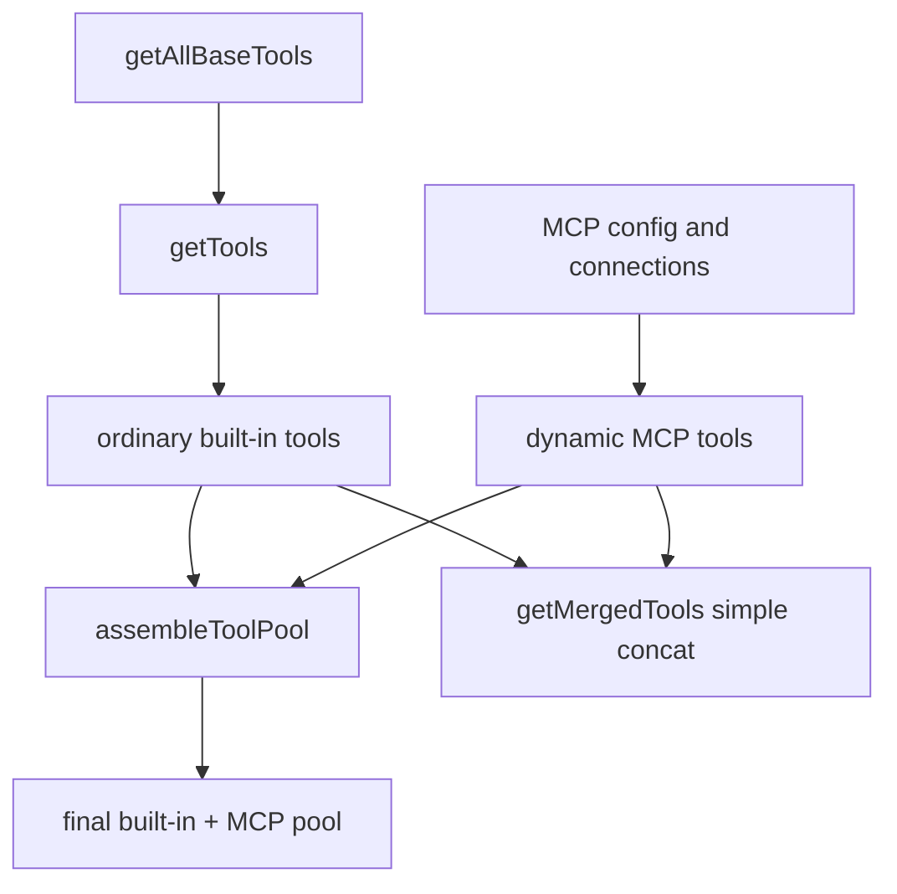

# 深度拆解：Tools, MCP, Skills, And Plugins

这一章最容易被写乱，因为 `tools`、`MCP`、`skills`、`plugins` 这四层都和“扩展能力”有关。

但在源码里，它们其实分得很清楚：

- `Tool.ts / tools.ts`：工具协议与工具池
- `services/mcp/`：外部 server 接入与动态实例化
- `skills/ + commands.ts`：把 skill 资产生产成 `Command(type:'prompt')`
- `plugins/ + utils/plugins/`：插件打包边界与 runtime 装配

## 这部分负责什么

这一层主要负责四件事：

1. 定义工具协议和运行时上下文
2. 组装 built-in tool pool，并把它和 MCP tool pool 合并
3. 把外部 MCP server 变成动态 tools / commands / resources
4. 把 skill 资产和 plugin 边界接入命令层

## 关键文件

### 工具协议与工具池

- `restored-src/src/Tool.ts`
  - `ToolUseContext` 与统一 tool contract
- `restored-src/src/tools.ts`
  - `getAllBaseTools()`、`getTools()`、`assembleToolPool()`、`getMergedTools()`

### MCP 客户端链路

- `restored-src/src/services/mcp/types.ts`
  - transport/config union、连接状态
- `restored-src/src/services/mcp/config.ts`
  - scope 合并、策略过滤、`.mcp.json` 解析、变量展开
- `restored-src/src/services/mcp/client.ts`
  - 建连、能力抓取、动态实例化、调用、结果处理
- `restored-src/src/services/mcp/auth.ts`
  - OAuth / XAA / step-up
- `restored-src/src/services/mcp/headersHelper.ts`
  - 动态请求头 helper
- `restored-src/src/services/mcp/useManageMCPConnections.ts`
  - 交互期状态维护、重连、`list_changed`
- `restored-src/src/tools/MCPTool/MCPTool.ts`
  - 远端 tool 的本地模板
- `restored-src/src/tools/McpAuthTool/McpAuthTool.ts`
  - `needs-auth` 伪工具
- `restored-src/src/tools/ListMcpResourcesTool/`
- `restored-src/src/tools/ReadMcpResourceTool/`
  - MCP 资源辅助工具

### Skills 与命令层

- `restored-src/src/skills/loadSkillsDir.ts`
  - 本地 `SKILL.md` / legacy commands -> `Command`
- `restored-src/src/skills/bundledSkills.ts`
  - bundled skills 注册表
- `restored-src/src/skills/bundled/index.ts`
  - 启动期 bundled skill 注册
- `restored-src/src/commands.ts`
  - 统一命令装配与 `getSkillToolCommands()`
- `restored-src/src/tools/SkillTool/SkillTool.ts`
  - SkillTool 执行壳
- `restored-src/src/utils/processUserInput/processSlashCommand.tsx`
  - prompt command 展开与消息注入

### Plugins 与 runtime plugin root

- `restored-src/src/plugins/builtinPlugins.ts`
  - builtin plugin registry
- `restored-src/src/plugins/bundled/index.ts`
  - builtin plugin scaffold
- `restored-src/src/utils/plugins/pluginLoader.ts`
  - runtime plugin root 边界、manifest 解析、组件路径装配
- `restored-src/src/utils/plugins/loadPluginCommands.ts`
  - plugin commands / plugin skills 的 markdown 装配

## 执行流

### 1. `Tool.ts` 先定义统一协议

`Tool.ts` 在这里的角色不是“某一个工具实现”，而是：

- 把工具的输入/输出、权限、交互、MCP 身份、渲染方式放进同一个协议

当前能直接看到的重要元数据包括：

- `requiresUserInteraction`
- `isMcp`
- `shouldDefer`
- `alwaysLoad`
- `mcpInfo`

也就是说，工具在 Claude Code 里是一等运行时对象，不是一个简单函数表。

### 2. `tools.ts` 负责四种不同语义的工具集合

这里一定要分清四个函数：

- `getAllBaseTools()`
  - exhaustive source of truth，列出所有 base tools
- `getTools()`
  - 普通 built-in 可见集合
- `assembleToolPool()`
  - built-in + MCP 的正式合并、deny 过滤和去重入口
- `getMergedTools()`
  - 只是简单拼接 built-in 与 MCP，不做去重

这个区别非常关键，因为很多文档会把 `getTools()` 误写成“最终工具池”。

### 3. MCP helper tools 不是普通 built-in

`ListMcpResourcesTool` 和 `ReadMcpResourceTool` 虽然出现在 exhaustive base list 里，但在 `getTools()` 阶段会被当成 special/helper tools 排除。

只有当：

- 某个已连接 server 声明了 `resources` capability

这些工具才会真正被注入到 MCP 运行时集合里。

所以它们不能被简单写成“普通内建工具”。

### 4. MCP 是完整客户端链路，不是几个固定工具

`services/mcp/` 这条链至少包含：

1. 配置汇总
2. transport 建连
3. capability 抓取
4. `tools/list` / `prompts/list` / `resources/list`
5. 动态实例化本地 `Tool / Command / Resource`
6. 运行时状态维护
7. 调用、鉴权、重连与结果治理

配置层会从多种 scope 汇总：

- enterprise
- user
- project
- local
- plugin
- dynamic
- claude.ai connectors

然后再按策略过滤和优先级覆盖。

### 5. MCP tool 是运行时动态包装出来的

这点非常关键。

真正的 `mcp__<server>__<tool>` 不是静态写在 `src/tools/` 里的，而是：

- 先拿到远端 `tools/list`
- 再基于 `MCPTool` 模板动态实例化

包装时还会把远端 `tool.annotations` 映射到本地行为属性，例如：

- read-only
- destructive
- open-world
- concurrency-safe
- search hint
- always-load

所以文档应该描述“客户端包装与调度行为”，而不是把这些属性写成服务端原生保证。

### 6. `needs-auth` 会暴露伪工具，而不是真工具

当某个远端 server 被判定成 `needs-auth` 时，系统不会先把真实工具交给模型，而是暴露一个：

- `mcp__<server>__authenticate`

调用这个伪工具后，客户端才去发起 OAuth / XAA 流程；成功后再把真实 `tools / commands / resources` 写回 `appState.mcp`。

因此，`needs-auth` 不是一个纯状态标签，而是一条明确的运行时行为。

### 7. resources 与 prompts 也是 MCP 运行时的一部分

MCP 不只产出 tool。

当前这份源码还能确认：

- `resources/list` / `resources/read`
  - 文本直接返回
  - blob 落盘后回传路径说明
- `prompts/list`
  - 会被包装成 command
  - 返回的 text/image/audio/resource/resource_link 会被转成 Claude 可消费 block

这就是为什么 MCP 在 Claude Code 里更像“外部能力层”，而不是“额外几个工具”。

### 8. `skills/` 的核心是 `Command` 生产

`skills/` 目录真正做的事，是把 skill 资产统一转成 `Command(type:'prompt')`。

入口是：

- `loadSkillsDir.ts`

它会处理：

- 本地 `skills/<name>/SKILL.md`
- legacy `commands/`
- frontmatter
- allowed tools / model / effort / hooks / context

然后统一交给命令层。

这就是为什么更准确的说法应该是：

- `skills/` 是 Command production layer
- 不是技能执行器

### 9. `SkillTool` 是执行壳，不做 discovery

`SkillTool` 拿到 skill 名称之后做的事情是：

- 从已经装配好的 command inventory 里查找
- 做输入校验
- 做权限校验
- 决定 inline / fork / remote canonical skill 分支

真正把 skill markdown 变成会话消息的是：

- `processPromptSlashCommand()`

所以 `SkillTool` 不负责扫目录，也不负责发现 skill 来源。

### 10. `src/plugins/` 不是完整插件加载器

这部分也很容易写错。

当前快照里：

- `src/plugins/` 只提供 builtin plugin registry 与 scaffold
- 真正的 runtime plugin root 装配逻辑在 `src/utils/plugins/`

而且当前这份镜像还能确认一个更强的事实：

- builtin plugin 机制虽然预留了
- 但没有任何实际 builtin plugin 注册代码

因为：

- `initBuiltinPlugins()` 目前是空函数
- 源码里也没有其它 `registerBuiltinPlugin()` 调用点

所以文档里不能写成“builtin plugin 已经在当前镜像里落地”。

### 11. plugin skill 来源是 runtime plugin root，不是 `src/plugins/`

plugin skill 的来源边界是：

- runtime plugin root 下的 `skills/`
- manifest 的 `skills` / `skillsPaths`

并且最终会统一命名成：

- `pluginName:skillName`

这和 `src/plugins/` 源码目录本身没有直接对应关系。

## 一张图看工具池合并

## 一张图看 skill 命令链

## 为什么这个设计重要

这套分层的价值，在于它把“扩展能力”拆成了不同粒度：

- 协议层：tool contract
- 池层：built-in / MCP tool pool
- 资产层：skills
- 打包层：plugins

这样一来，一个能力可以：

- 只是 built-in tool
- 由 MCP server 动态提供
- 被 skill 包成 prompt command
- 再由 plugin 打包成可启停单元

这比“只有插件系统”或者“只有工具调用”都更灵活。

## 推荐阅读顺序

1. `restored-src/src/Tool.ts`
2. `restored-src/src/tools.ts`
3. `restored-src/src/services/mcp/types.ts`
4. `restored-src/src/services/mcp/config.ts`
5. `restored-src/src/services/mcp/client.ts`
6. `restored-src/src/services/mcp/useManageMCPConnections.ts`
7. `restored-src/src/tools/MCPTool/MCPTool.ts`
8. `restored-src/src/tools/McpAuthTool/McpAuthTool.ts`
9. `restored-src/src/skills/loadSkillsDir.ts`
10. `restored-src/src/commands.ts`
11. `restored-src/src/tools/SkillTool/SkillTool.ts`
12. `restored-src/src/plugins/builtinPlugins.ts`
13. `restored-src/src/utils/plugins/pluginLoader.ts`
14. `restored-src/src/utils/plugins/loadPluginCommands.ts`

## 仍待确认

- 某些 MCP server 在线上到底会产出哪些具体 MCP skills，当前只能确认客户端如何接收 `loadedFrom === 'mcp'` 的 command。
- experimental remote skill search 的线上开关状态与后端内容，这份静态源码不能直接证明。
- builtin plugin 虽然当前快照里没有实际注册，但未来运行构建是否会注入额外生成代码，这份镜像也不能完全否定。
