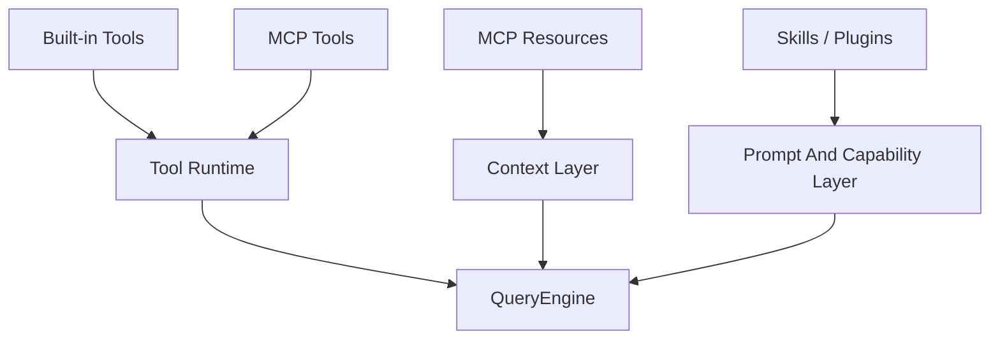

[简体中文](./README.md) | [English](./README.en.md)

# Tools, MCP, Skills, And Plugins In One Minute

Keep one line in mind first:

tools, resources, skills, and plugins are not the same layer.

## Three Takeaways

- tools and resources belong to different layers
- MCP affects both tool execution and context access
- skills and plugins serve different roles

## Read Next

- overview: [README.en.md](../README.en.md)
- deep dive: [DEEP/README.en.md](../DEEP/README.en.md)
