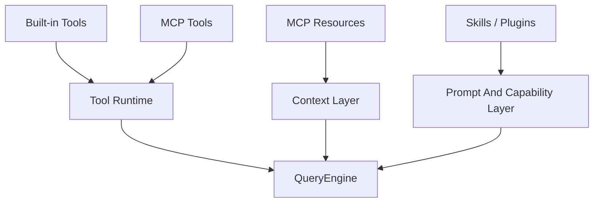

[简体中文](./README.md) | [English](./README.en.md)

# 1 分钟看懂 Tools, MCP, Skills, And Plugins

这一章最适合先记住一句话：

工具、资源、技能、插件不是一回事。

## 三个要点

- tool 和 resource 分属不同层
- MCP 会同时影响工具与上下文读取
- skill 和 plugin 的职责也不同

## 下一步去哪里

- 总览：[README.md](../README.md)
- 深读：[DEEP/README.md](../DEEP/README.md)
