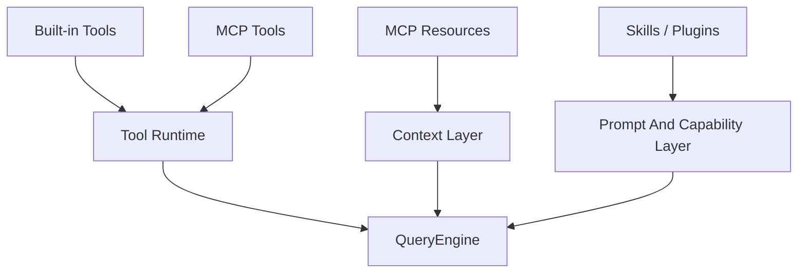

# 1 分钟看懂 Tools, MCP, Skills, And Plugins

Claude Code 的扩展面可以先这样理解：

这一章最容易被混着看，所以第一步只需要先记住：工具、资源、技能、插件不是一回事。

## 核心理解

- tool 不等于 resource
- MCP 不只是多一个协议，它还影响上下文读取方式
- skill 更像工作流资产
- plugin 更像打包和分发单位

## 下一步去哪里

- 想先看结构总览：读 `README.md`
- 想继续拆这四层：读 `DEEP/README.md`
