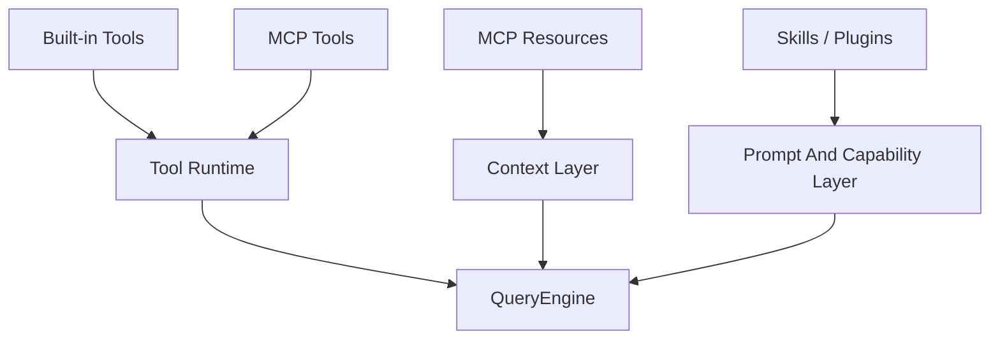

# 1 分钟看懂 Tools, MCP, Skills, And Plugins

Claude Code 的扩展面可以先这样理解：

```mermaid
flowchart TD
    A[Built-in Tools] --> E[Tool Runtime]
    B[MCP Tools] --> E
    C[MCP Resources] --> F[Context Layer]
    D[Skills / Plugins] --> G[Prompt And Capability Layer]
    E --> H[QueryEngine]
    F --> H
    G --> H
```

## 核心理解

- tool 不等于 resource
- MCP 不只是多一个协议，它还影响上下文读取方式
- skill 更像工作流资产
- plugin 更像打包和分发单位

