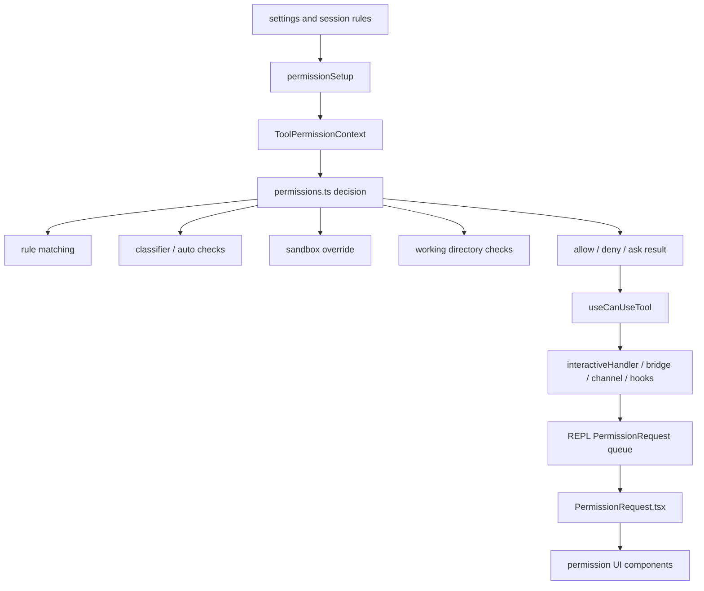

# 深度拆解：Permissions, Sandbox, And Trust

这一章要回答的核心问题是：**Claude Code 的权限系统为什么看起来像一层独立运行时。**

从公开镜像来看，这套系统更适合拆成三层：

- `utils/permissions/` 判定与上下文层
- `useCanUseTool / interactiveHandler / REPL` 交互编排层
- `components/permissions/*` 展示与提交编排层

## 这部分负责什么

这部分主要负责：

1. 根据来源合并 permission rules
2. 决定当前会话处于哪种 permission mode
3. 在 auto mode、plan mode、sandbox override 等分支中给出不同决策
4. 把需要确认的动作渲染成不同类型的审批 UI

## 关键文件

- `restored-src/src/utils/permissions/permissionSetup.ts`
- `restored-src/src/utils/permissions/permissions.ts`
- `restored-src/src/utils/permissions/permissionRuleParser.ts`
- `restored-src/src/utils/permissions/filesystem.ts`
- `restored-src/src/utils/permissions/pathValidation.ts`
- `restored-src/src/utils/permissions/yoloClassifier.ts`
- `restored-src/src/utils/permissions/bashClassifier.ts`
- `restored-src/src/components/permissions/PermissionRequest.tsx`
- `restored-src/src/components/permissions/PermissionPrompt.tsx`
- `restored-src/src/components/permissions/BashPermissionRequest/`
- `restored-src/src/components/permissions/FileEditPermissionRequest/`
- `restored-src/src/components/permissions/EnterPlanModePermissionRequest/`
- `restored-src/src/components/permissions/SandboxPermissionRequest.tsx`

## 执行流

### 1. `permissionSetup.ts` 先准备 permission context

`restored-src/src/utils/permissions/permissionSetup.ts` 不是简单读配置。

从源码里能直接确认：

- 它会读取 settings 中的 permission 相关配置
- 会把规则来源折叠进 `ToolPermissionContext`
- 会处理 auto mode、plan mode 的迁移
- 会识别危险的 Bash / PowerShell / Agent 规则

这意味着 permission context 是先被“准备好”，后面的 tool permission check 才能运行。

### 2. `permissions.ts` 负责真正的决策

`restored-src/src/utils/permissions/permissions.ts` 负责把当前上下文和规则变成具体结果。

从文件头部和前段逻辑能确认：

- allow / deny / ask 规则是按来源合并的
- tool 匹配不仅支持内建工具，也支持 `mcp__server__tool` 这样的 MCP 工具名
- decision reason 会带不同类型：
  - `rule`
  - `mode`
  - `hook`
  - `classifier`
  - `sandboxOverride`
  - `workingDir`

也就是说，这里的 permission 决策不是单一布尔值，而是一份可解释的结构化结果。

### 3. `PermissionRequest.tsx` 是分发入口，不是判定入口

这轮重新核读后，一个很值得单独写明的边界是：

- `PermissionRequest.tsx` 不负责算 allow / ask / deny
- 它负责把已经算好的 `ToolUseConfirm` 分发到具体权限组件

更完整的链路是：

- `useCanUseTool` 调 `permissions.ts`
- `interactiveHandler` 把 ask 结果接成桥接、channel、hook、classifier 与本地对话框之间的编排链
- `REPL.tsx` 渲染 `<PermissionRequest />`
- `PermissionRequest.tsx` 再按 tool 类型分发给具体组件

所以它更适合写成：

- 通用交互入口

而不是：

- 权限判定器

### 4. classifier 是这层的一部分，不是外挂

从 `permissions.ts`、`permissionSetup.ts`、`yoloClassifier.ts`、`bashClassifier.ts` 之间的引用关系可以确认：

- classifier 会参与自动模式下的安全判断
- denial tracking 也在同一层维护
- dangerous patterns 会被单独识别

这说明 auto mode 的安全边界不是只靠规则表，而是规则加 classifier 一起工作。

这一层还有一个很实用的实现细节：

- `useCanUseTool.tsx` 里先统一拿到 `allow / deny / ask`
- 只有进入 `ask` 分支后，才会继续走 coordinator、swarm worker、interactiveHandler 这些交互路径

### 5. plan mode 会影响 permission mode

这一点和上一章是连起来的。

从 `permissionSetup.ts` 与 `EnterPlanModeTool` / `ExitPlanModeV2Tool` 的配合可以确认：

- 进入 plan mode 时，permission context 会切到 `plan`
- 退出时会尝试恢复 `prePlanMode`
- 某些 auto-like 模式在 plan mode 退出时还有额外保护逻辑

这说明 Plan Mode 不是独立于 permissions 的，它本来就是权限状态机的一部分。

### 6. 审批 UI 不是一个统一弹窗

`restored-src/src/components/permissions/` 的结构已经足够说明问题。

它至少包含这些专门组件：

- Bash
- FileEdit
- FileWrite
- NotebookEdit
- EnterPlanMode
- ExitPlanMode
- Sandbox
- Skill
- WebFetch
- AskUserQuestion

这意味着 UI 层也知道不同工具请求需要不同展示方式，而不是一律“允许 / 拒绝”。

这里还要再补一个例外：

- 大部分组件偏展示层
- 但 `ExitPlanModePermissionRequest` 属于“展示层里的厚编排组件”

因为它除了渲染界面，还会直接参与：

- `setAppState`
- plan exit attachment
- clear-context initial message
- auto resume / fallback 选择

## 一张图看权限决策链

## 为什么这个设计重要

这套设计真正重要的地方，是它把“是否允许调用工具”变成了一条可解释、可恢复、可展示的链路。

这样带来的结果是：

- 模式切换可以直接影响权限语义
- 不同来源的规则可以叠加
- 自动模式下还有 classifier 兜底
- ask 结果先经过交互编排层，再进入具体 UI
- UI 可以针对具体工具做差异化展示

所以它不像“一个安全弹窗”，更像一层独立的 trust runtime。

## 推荐阅读顺序

1. `restored-src/src/utils/permissions/permissionSetup.ts`
2. `restored-src/src/utils/permissions/permissions.ts`
3. `restored-src/src/utils/permissions/permissionRuleParser.ts`
4. `restored-src/src/utils/permissions/filesystem.ts`
5. `restored-src/src/utils/permissions/pathValidation.ts`
6. `restored-src/src/utils/permissions/yoloClassifier.ts`
7. `restored-src/src/hooks/useCanUseTool.tsx`
8. `restored-src/src/hooks/toolPermission/handlers/interactiveHandler.ts`
9. `restored-src/src/components/permissions/PermissionRequest.tsx`
10. `restored-src/src/components/permissions/BashPermissionRequest/`

## 仍待确认

- 某些 classifier gate 在公开构建中的完整默认行为
- 某些 Computer Use 相关审批组件在不同构建里的完整可达路径
- `ExitPlanModePermissionRequest` 之外，是否还有更多权限组件承担较重的提交编排逻辑，这一页没有继续逐个展开。

这些点可以继续观察，但当前已经足够说明权限系统本身是成体系的。
